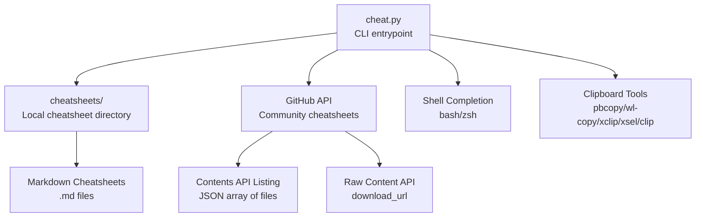
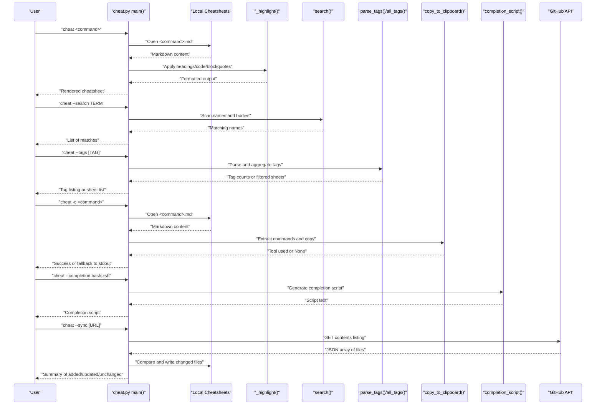
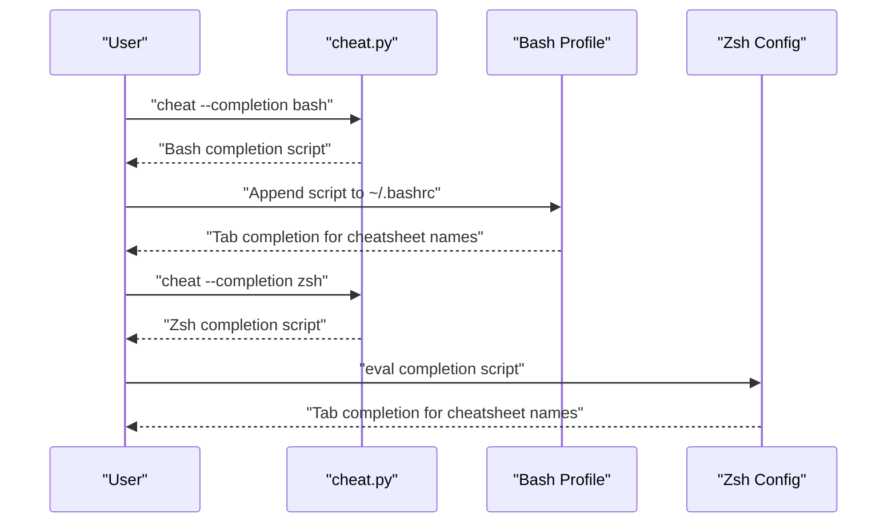
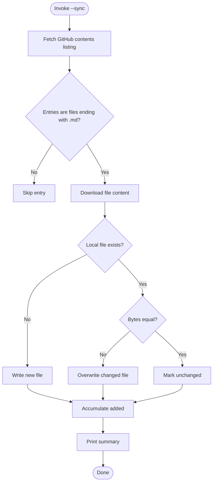
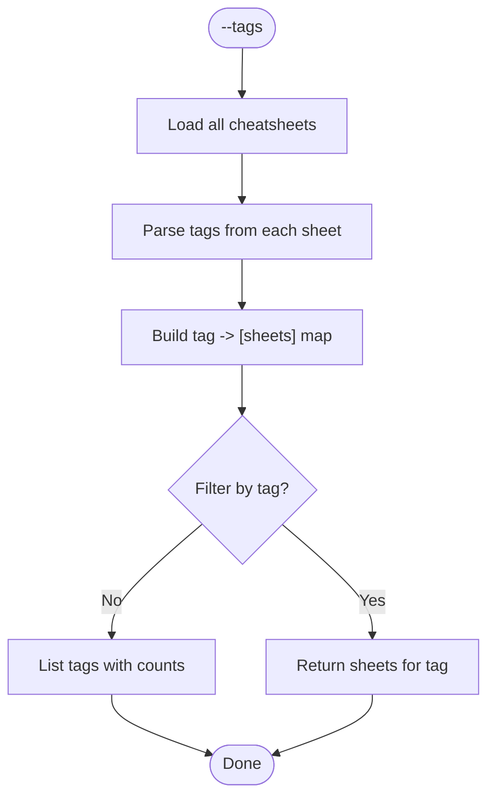
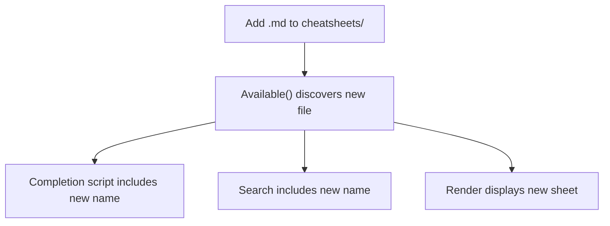
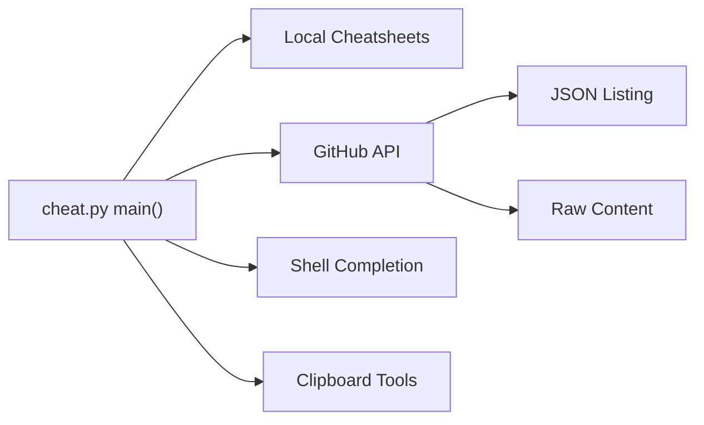

# Advanced Usage

<cite>
**Referenced Files in This Document**
- [cheat.py](file://cheat.py)
- [README.md](file://README.md)
- [tests/test_cheat.py](file://tests/test_cheat.py)
- [cheatsheets/docker.md](file://cheatsheets/docker.md)
- [cheatsheets/kubectl.md](file://cheatsheets/kubectl.md)
- [cheatsheets/grep.md](file://cheatsheets/grep.md)
- [cheatsheets/tmux.md](file://cheatsheets/tmux.md)
- [cheatsheets/find.md](file://cheatsheets/find.md)
- [IDEAS.md](file://IDEAS.md)
- [ROADMAP.md](file://ROADMAP.md)
</cite>

## Table of Contents
1. [Introduction](#introduction)
2. [Project Structure](#project-structure)
3. [Core Components](#core-components)
4. [Architecture Overview](#architecture-overview)
5. [Detailed Component Analysis](#detailed-component-analysis)
6. [Dependency Analysis](#dependency-analysis)
7. [Performance Considerations](#performance-considerations)
8. [Troubleshooting Guide](#troubleshooting-guide)
9. [Conclusion](#conclusion)
10. [Appendices](#appendices)

## Introduction
This document focuses on advanced usage scenarios of the cheat CLI tool. It covers:
- Shell completion setup for bash and zsh, including automatic script generation and dynamic updates
- Community cheatsheet synchronization via GitHub API, including conflict resolution and custom repository targeting
- Tag-based organization and advanced filtering
- Plugin-free architecture enabling custom cheatsheets through simple file placement
- Power-user workflows combining multiple features, automation scripts, and integration with other CLI tools
- Performance optimization techniques and strategies for managing large-scale cheatsheet collections

## Project Structure
The project is organized around a single Python script that powers a zero-dependency CLI, with a dedicated directory for user cheatsheets. The README provides usage examples and installation guidance.

**Diagram sources**
- [cheat.py:29-33](file://cheat.py#L29-L33)
- [cheat.py:177-198](file://cheat.py#L177-L198)
- [cheat.py:201-289](file://cheat.py#L201-L289)
- [README.md:61-97](file://README.md#L61-L97)

**Section sources**
- [README.md:17-97](file://README.md#L17-L97)
- [cheat.py:29-33](file://cheat.py#L29-L33)

## Core Components
- CLI argument parsing and routing to subcommands
- Cheatsheet discovery and rendering with syntax highlighting
- Search across names and content bodies
- Tag extraction and filtering
- Clipboard copy functionality with platform-specific tools
- Shell completion script generation for bash and zsh
- Community cheatsheet synchronization via GitHub API
- Local cheatsheet directory management

Key implementation references:
- Argument parsing and dispatch: [cheat.py:292-411](file://cheat.py#L292-L411)
- Available cheatsheets discovery: [cheat.py:43-49](file://cheat.py#L43-L49)
- Rendering and highlighting: [cheat.py:56-86](file://cheat.py#L56-L86)
- Search logic: [cheat.py:89-100](file://cheat.py#L89-L100)
- Tag parsing and aggregation: [cheat.py:103-122](file://cheat.py#L103-L122)
- Clipboard copy: [cheat.py:148-161](file://cheat.py#L148-L161)
- Completion script generation: [cheat.py:177-198](file://cheat.py#L177-L198)
- Sync via GitHub API: [cheat.py:212-289](file://cheat.py#L212-L289)

**Section sources**
- [cheat.py:292-411](file://cheat.py#L292-L411)
- [cheat.py:43-122](file://cheat.py#L43-L122)
- [cheat.py:148-198](file://cheat.py#L148-L198)
- [cheat.py:212-289](file://cheat.py#L212-L289)

## Architecture Overview
The CLI orchestrates multiple subsystems:
- Input parsing routes to rendering, search, tags, completion, or sync
- Rendering reads Markdown from the local cheatsheets directory and applies minimal highlighting
- Search scans filenames and content bodies for matches
- Tags are parsed from inline comment markers and aggregated per sheet
- Clipboard copy attempts platform-specific tools and falls back to stdout
- Completion scripts dynamically source available cheatsheet names
- Sync fetches a GitHub contents listing, compares byte-for-byte, and writes only changed files

**Diagram sources**
- [cheat.py:292-411](file://cheat.py#L292-L411)
- [cheat.py:56-86](file://cheat.py#L56-L86)
- [cheat.py:89-122](file://cheat.py#L89-L122)
- [cheat.py:148-161](file://cheat.py#L148-L161)
- [cheat.py:177-198](file://cheat.py#L177-L198)
- [cheat.py:212-289](file://cheat.py#L212-L289)

## Detailed Component Analysis

### Shell Completion Setup (bash and zsh)
- Automatic script generation: The CLI prints a completion script for bash or zsh when invoked with the completion flag.
- Dynamic updates: The completion list is generated by listing available cheatsheets, so adding or removing files keeps the completion list in sync.
- Installation:
  - Bash: Append the printed script to the user’s shell profile.
  - Zsh: Evaluate the printed script in the shell or add it to the user’s zsh configuration.

Implementation highlights:
- Script generation for bash and zsh: [cheat.py:177-198](file://cheat.py#L177-L198)
- CLI integration for completion: [cheat.py:306-314](file://cheat.py#L306-L314)
- README usage examples: [README.md:69-82](file://README.md#L69-L82)

**Diagram sources**
- [cheat.py:177-198](file://cheat.py#L177-L198)
- [README.md:69-82](file://README.md#L69-L82)

**Section sources**
- [cheat.py:177-198](file://cheat.py#L177-L198)
- [cheat.py:306-314](file://cheat.py#L306-L314)
- [README.md:69-82](file://README.md#L69-L82)

### Community Cheatsheet Synchronization (GitHub API)
- Purpose: Pull the latest community cheatsheets from a GitHub repository into the local cheatsheets directory.
- Behavior:
  - Fetches a JSON listing from the GitHub contents API.
  - Filters for files ending with .md.
  - Compares each remote file byte-for-byte with the local copy.
  - Writes only when new or changed; leaves identical files untouched.
  - Returns a summary of added, updated, and unchanged files.
- Conflict resolution: Byte comparison ensures deterministic updates; no merge conflicts occur.
- Custom repository targeting: Pass a GitHub contents API URL to sync from a fork or another repository.

Implementation highlights:
- Fetch helper with User-Agent and timeout: [cheat.py:201-209](file://cheat.py#L201-L209)
- Sync logic and result reporting: [cheat.py:212-289](file://cheat.py#L212-L289)
- CLI integration for sync: [cheat.py:316-330](file://cheat.py#L316-L330)
- README usage and customization: [README.md:83-97](file://README.md#L83-L97)

**Diagram sources**
- [cheat.py:201-289](file://cheat.py#L201-L289)

**Section sources**
- [cheat.py:201-289](file://cheat.py#L201-L289)
- [cheat.py:316-330](file://cheat.py#L316-L330)
- [README.md:83-97](file://README.md#L83-L97)

### Tag-Based Organization and Advanced Filtering
- Tag declaration: Tags are declared inline in Markdown using a comment line format.
- Parsing: Extracts comma-separated tags from comment lines and strips whitespace.
- Aggregation: Builds a dictionary mapping each tag to the list of cheatsheets that declare it.
- Filtering:
  - List all tags with counts
  - Filter cheatsheets by a specific tag
  - Nonexistent tags produce an error

Examples of tag declarations in existing cheatsheets:
- Docker: [cheatsheets/docker.md:2](file://cheatsheets/docker.md#L2)
- Kubectl: [cheatsheets/kubectl.md:2](file://cheatsheets/kubectl.md#L2)
- Grep: [cheatsheets/grep.md:2](file://cheatsheets/grep.md#L2)
- Tmux: [cheatsheets/tmux.md:2](file://cheatsheets/tmux.md#L2)
- Find: [cheatsheets/find.md:2](file://cheatsheets/find.md#L2)

Implementation highlights:
- Tag parsing: [cheat.py:103-112](file://cheat.py#L103-L112)
- Tag aggregation: [cheat.py:115-122](file://cheat.py#L115-L122)
- CLI integration for tags: [cheat.py:332-346](file://cheat.py#L332-L346)
- Tests validating tag behavior: [tests/test_cheat.py:265-349](file://tests/test_cheat.py#L265-L349)

**Diagram sources**
- [cheat.py:103-122](file://cheat.py#L103-L122)
- [cheat.py:332-346](file://cheat.py#L332-L346)

**Section sources**
- [cheat.py:103-122](file://cheat.py#L103-L122)
- [cheat.py:332-346](file://cheat.py#L332-L346)
- [tests/test_cheat.py:265-349](file://tests/test_cheat.py#L265-L349)
- [cheatsheets/docker.md:2](file://cheatsheets/docker.md#L2)
- [cheatsheets/kubectl.md:2](file://cheatsheets/kubectl.md#L2)
- [cheatsheets/grep.md:2](file://cheatsheets/grep.md#L2)
- [cheatsheets/tmux.md:2](file://cheatsheets/tmux.md#L2)
- [cheatsheets/find.md:2](file://cheatsheets/find.md#L2)

### Plugin-Free Architecture for Custom Cheatsheets
- Philosophy: Zero dependencies and zero registration—anyone can add a cheatsheet by placing a Markdown file in the local cheatsheets directory.
- Discovery: Filenames without the .md extension become lookup names.
- Integration: The completion script and search logic automatically include newly added files.

Implementation highlights:
- Cheatsheet discovery: [cheat.py:43-49](file://cheat.py#L43-L49)
- README guidance: [README.md:48-59](file://README.md#L48-L59)
- IDEAS and ROADMAP context: [IDEAS.md:11-19](file://IDEAS.md#L11-L19), [ROADMAP.md:18-29](file://ROADMAP.md#L18-L29)

**Diagram sources**
- [cheat.py:43-49](file://cheat.py#L43-L49)
- [README.md:48-59](file://README.md#L48-L59)

**Section sources**
- [cheat.py:43-49](file://cheat.py#L43-L49)
- [README.md:48-59](file://README.md#L48-L59)
- [IDEAS.md:11-19](file://IDEAS.md#L11-L19)
- [ROADMAP.md:18-29](file://ROADMAP.md#L18-L29)

### Clipboard Copy and Integration
- Command extraction: Parses fenced code blocks to extract command lines.
- Platform tools: Attempts pbcopy (macOS), wl-copy (Wayland), xclip/xsel (X11), clip (Windows).
- Fallback: Prints commands to stdout if no clipboard tool is available.
- Integration: Works seamlessly with other CLI tools by piping raw Markdown output.

Implementation highlights:
- Command extraction: [cheat.py:134-145](file://cheat.py#L134-L145)
- Clipboard tool selection: [cheat.py:125-131](file://cheat.py#L125-L131)
- Copy logic: [cheat.py:148-161](file://cheat.py#L148-L161)
- README usage: [README.md:36-38](file://README.md#L36-L38)

**Section sources**
- [cheat.py:125-161](file://cheat.py#L125-L161)
- [README.md:36-38](file://README.md#L36-L38)

### Power-User Workflows and Automation
- Workflow 1: Sync, filter, and copy
  - Sync community cheatsheets, filter by tag, and copy commands to clipboard for immediate use.
  - Steps: [cheat.py:316-330](file://cheat.py#L316-L330), [cheat.py:332-346](file://cheat.py#L332-L346), [cheat.py:379-401](file://cheat.py#L379-L401)
- Workflow 2: Shell completion plus custom cheatsheets
  - Install completion, add personal cheatsheets, and rely on dynamic completion updates.
  - Steps: [cheat.py:177-198](file://cheat.py#L177-L198), [cheat.py:43-49](file://cheat.py#L43-L49)
- Workflow 3: Raw Markdown pipeline
  - Use raw output to pipe into other tools for further processing.
  - Step: [cheat.py:368-377](file://cheat.py#L368-L377)
- Workflow 4: Large collection management
  - Use tags to organize and search efficiently; rely on byte-for-byte sync to minimize churn.
  - Steps: [cheat.py:103-122](file://cheat.py#L103-L122), [cheat.py:212-289](file://cheat.py#L212-L289)

[No sources needed since this section synthesizes workflows from previously cited sections]

## Dependency Analysis
- Internal dependencies:
  - CLI depends on filesystem for cheatsheets, on GitHub API for syncing, on platform tools for clipboard, and on shell completion generation.
- External dependencies:
  - Zero runtime dependencies; relies on Python standard library for networking, subprocess, and argument parsing.
- Coupling:
  - Low coupling between features; each subcommand is largely self-contained.
  - Sync logic is isolated and injectable via a fetch callback for testing.

**Diagram sources**
- [cheat.py:292-411](file://cheat.py#L292-L411)
- [cheat.py:201-289](file://cheat.py#L201-L289)

**Section sources**
- [cheat.py:292-411](file://cheat.py#L292-L411)
- [cheat.py:201-289](file://cheat.py#L201-L289)

## Performance Considerations
- Rendering:
  - Minimal highlighting avoids heavy processing; linear scan of lines with simple state tracking.
  - Complexity: O(N) per sheet where N is the number of lines.
- Search:
  - Scans filenames and reads each sheet’s content to lowercase for case-insensitive matching.
  - Complexity: O(F + C) where F is the number of files and C is total content length scanned.
- Tags:
  - Parses all sheets to build the tag map; efficient for typical sizes.
  - Complexity: O(S + T) where S is sheets and T is total tag tokens.
- Clipboard:
  - Extracts commands from fenced blocks; overhead proportional to content lines.
- Sync:
  - Byte-for-byte comparison prevents unnecessary writes; minimizes network and disk I/O.
  - Complexity: O(R) where R is the number of remote files processed.
- Recommendations:
  - Keep cheatsheets focused and concise to reduce rendering and search costs.
  - Use tags to narrow searches and avoid scanning unrelated content.
  - Periodically prune unused sheets to keep the directory manageable.

[No sources needed since this section provides general guidance]

## Troubleshooting Guide
- No cheatsheets found:
  - Ensure the cheatsheets directory exists and contains .md files; the CLI lists available sheets.
  - Reference: [cheat.py:43-49](file://cheat.py#L43-L49), [cheat.py:348-354](file://cheat.py#L348-L354)
- Unknown command:
  - The CLI suggests close matches; verify spelling or add a new cheatsheet.
  - Reference: [cheat.py:61-66](file://cheat.py#L61-L66), [cheat.py:364-410](file://cheat.py#L364-L410)
- Clipboard copy fails:
  - Install a supported clipboard tool or rely on stdout fallback.
  - Reference: [cheat.py:125-131](file://cheat.py#L125-L131), [cheat.py:148-161](file://cheat.py#L148-L161)
- Sync errors:
  - Network issues or invalid API URL; confirm connectivity and repository permissions.
  - Reference: [cheat.py:201-209](file://cheat.py#L201-L209), [cheat.py:240-245](file://cheat.py#L240-L245)
- Completion not working:
  - Verify completion script is sourced and that the cheatsheets directory is discoverable.
  - Reference: [cheat.py:177-198](file://cheat.py#L177-L198), [README.md:69-82](file://README.md#L69-L82)

**Section sources**
- [cheat.py:43-49](file://cheat.py#L43-L49)
- [cheat.py:61-66](file://cheat.py#L61-L66)
- [cheat.py:125-161](file://cheat.py#L125-L161)
- [cheat.py:201-245](file://cheat.py#L201-L245)
- [README.md:69-82](file://README.md#L69-L82)

## Conclusion
The cheat CLI offers a powerful, zero-dependency foundation for managing command cheatsheets. Its advanced features—shell completion, community sync, tag-based organization, and clipboard integration—enable efficient workflows and seamless automation. The plugin-free architecture and robust sync mechanism make it suitable for both individual and team use, scalable to large cheatsheet collections.

[No sources needed since this section summarizes without analyzing specific files]

## Appendices

### Appendix A: CLI Reference
- Show a cheatsheet: [cheat.py:292-411](file://cheat.py#L292-L411)
- List all cheatsheets: [cheat.py:348-354](file://cheat.py#L348-L354)
- Search cheatsheets: [cheat.py:356-362](file://cheat.py#L356-L362)
- Raw Markdown output: [cheat.py:368-377](file://cheat.py#L368-L377)
- Copy commands to clipboard: [cheat.py:379-401](file://cheat.py#L379-L401)
- Shell completion: [cheat.py:177-198](file://cheat.py#L177-L198)
- Tags listing/filtering: [cheat.py:332-346](file://cheat.py#L332-L346)
- Sync community cheatsheets: [cheat.py:316-330](file://cheat.py#L316-L330)

**Section sources**
- [cheat.py:292-411](file://cheat.py#L292-L411)
- [cheat.py:177-198](file://cheat.py#L177-L198)
- [cheat.py:316-346](file://cheat.py#L316-L346)