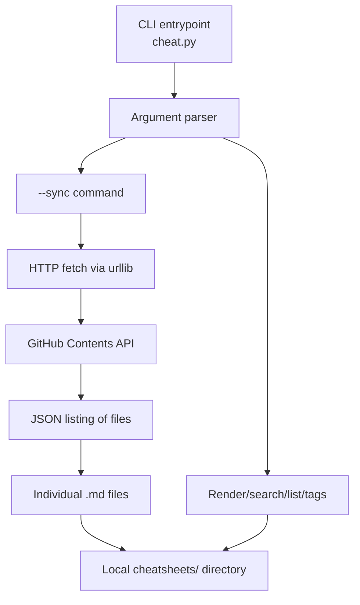
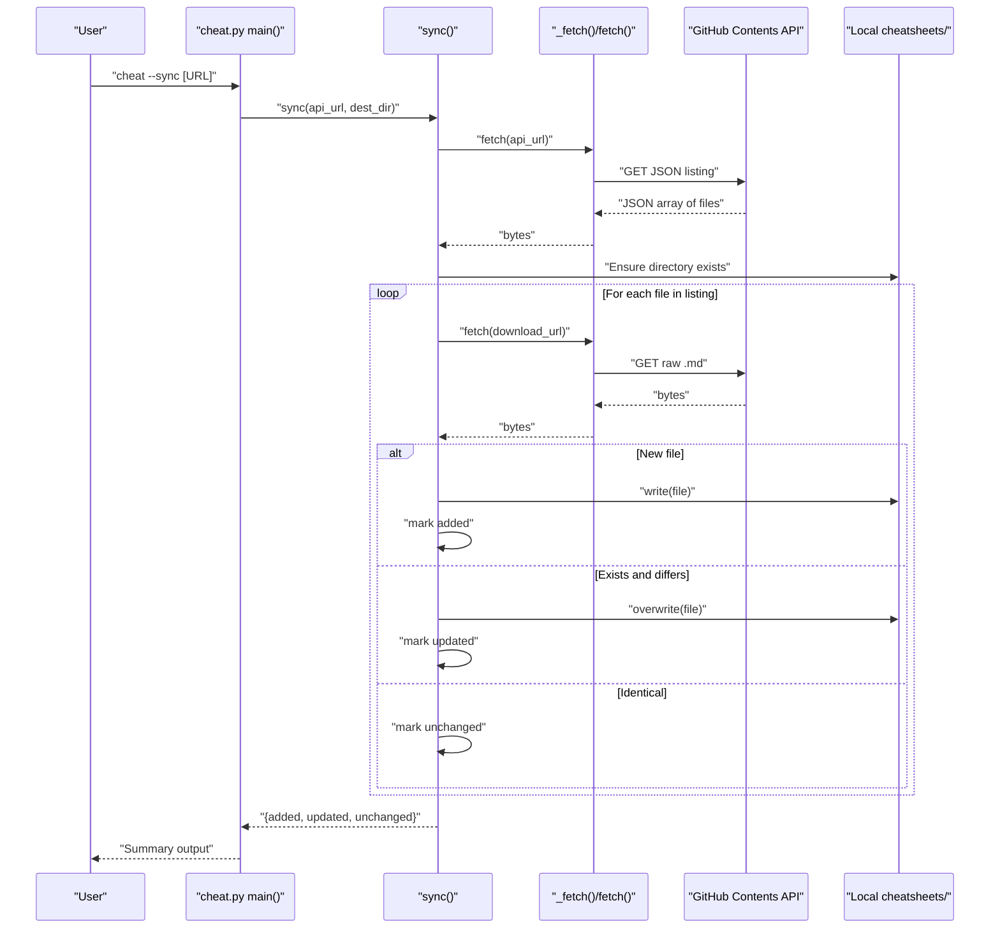
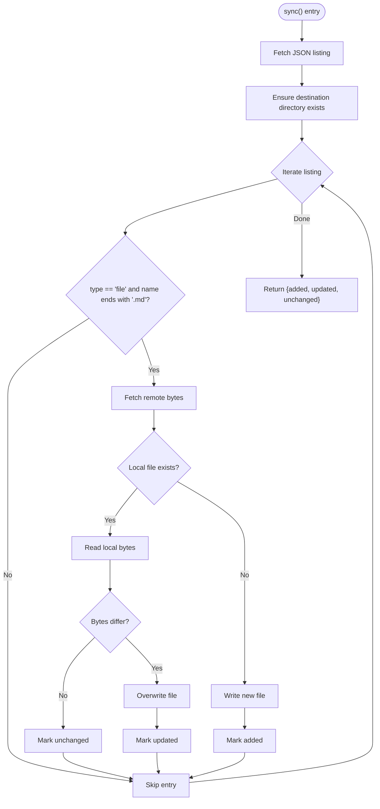
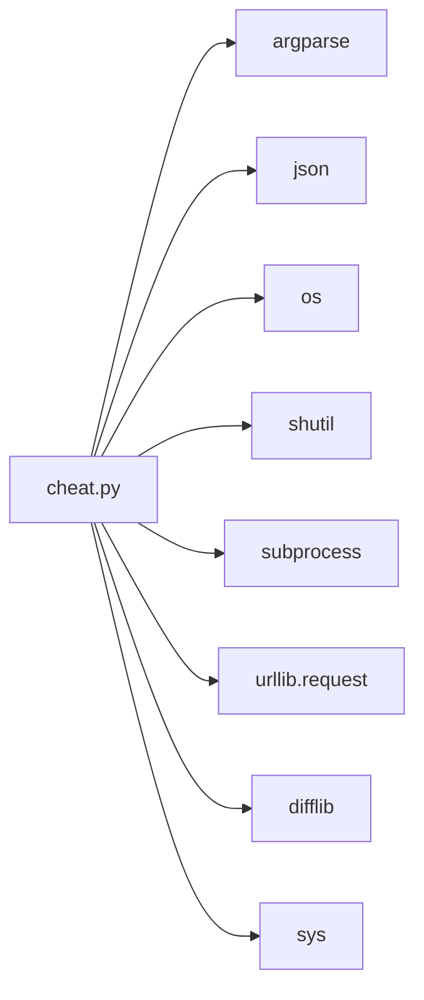

# Community Synchronization

<cite>
**Referenced Files in This Document**
- [cheat.py](file://cheat.py)
- [README.md](file://README.md)
- [tests/test_cheat.py](file://tests/test_cheat.py)
- [cheatsheets/tar.md](file://cheatsheets/tar.md)
- [cheatsheets/docker.md](file://cheatsheets/docker.md)
- [cheatsheets/kubectl.md](file://cheatsheets/kubectl.md)
- [IDEAS.md](file://IDEAS.md)
- [ROADMAP.md](file://ROADMAP.md)
</cite>

## Table of Contents
1. [Introduction](#introduction)
2. [Project Structure](#project-structure)
3. [Core Components](#core-components)
4. [Architecture Overview](#architecture-overview)
5. [Detailed Component Analysis](#detailed-component-analysis)
6. [Dependency Analysis](#dependency-analysis)
7. [Performance Considerations](#performance-considerations)
8. [Troubleshooting Guide](#troubleshooting-guide)
9. [Conclusion](#conclusion)
10. [Appendices](#appendices)

## Introduction
This document explains the community cheatsheet synchronization system implemented by the CLI tool. It focuses on the --sync command, GitHub API integration, automatic conflict resolution, update tracking, and local cheatsheet management. It also documents repository structure requirements, file naming conventions, contribution guidelines, and troubleshooting steps for common issues such as network connectivity, authentication, and synchronization conflicts. Finally, it provides examples for custom repository targeting and offline synchronization workflows.

## Project Structure
The project is a single-file CLI tool with a dedicated directory for community cheatsheets. The tool’s primary responsibilities include:
- Local cheatsheet rendering and search
- Clipboard extraction
- Tag parsing and listing
- Community cheatsheet synchronization from a GitHub repository via the GitHub Contents API
- Shell completion scripts

**Diagram sources**
- [cheat.py:292-411](file://cheat.py#L292-L411)
- [cheat.py:201-210](file://cheat.py#L201-L210)
- [cheat.py:212-289](file://cheat.py#L212-L289)

**Section sources**
- [cheat.py:1-50](file://cheat.py#L1-L50)
- [README.md:17-111](file://README.md#L17-L111)

## Core Components
- CLI entrypoint and argument parsing
- Synchronization engine that fetches GitHub Contents API listings and downloads files
- Local cheatsheet management (create/update/leave unchanged)
- Rendering, search, tag parsing, and clipboard extraction utilities
- Shell completion script generation

Key responsibilities:
- --sync: Downloads community cheatsheets from a GitHub repository’s contents API and writes them to the local cheatsheets directory
- Local directory management: Ensures the directory exists and only updates files when content differs
- Error reporting: Provides human-readable messages for network and JSON errors

**Section sources**
- [cheat.py:292-411](file://cheat.py#L292-L411)
- [cheat.py:212-289](file://cheat.py#L212-L289)
- [cheat.py:201-210](file://cheat.py#L201-L210)

## Architecture Overview
The synchronization architecture integrates the CLI with the GitHub Contents API. The process:
- Parse arguments and detect --sync
- Build a GitHub Contents API URL (default or custom)
- Fetch the JSON listing of files
- Iterate over files, filtering for .md files
- Download each file’s raw content
- Compare byte-for-byte with the local file
- Write only when new or changed
- Report added, updated, and unchanged files

**Diagram sources**
- [cheat.py:292-330](file://cheat.py#L292-L330)
- [cheat.py:212-289](file://cheat.py#L212-L289)
- [cheat.py:201-210](file://cheat.py#L201-L210)

## Detailed Component Analysis

### Synchronization Engine
The sync function orchestrates fetching and writing:
- Validates entries: only files ending with .md and having a download_url are processed
- Compares remote bytes with local bytes to decide whether to write
- Returns a dictionary with counts and lists of added, updated, and unchanged files
- Uses a configurable fetch function for testing and customization

**Diagram sources**
- [cheat.py:212-289](file://cheat.py#L212-L289)

**Section sources**
- [cheat.py:212-289](file://cheat.py#L212-L289)
- [tests/test_cheat.py:196-247](file://tests/test_cheat.py#L196-L247)

### HTTP Fetch and Timeout Behavior
- Uses urllib.request with a User-Agent header required by GitHub API
- Applies a 15-second timeout for network operations
- Raises runtime errors on any network or HTTP failure
- Exposed as an injectable fetch function for testing and customization

**Section sources**
- [cheat.py:201-210](file://cheat.py#L201-L210)

### Argument Parsing and CLI Integration
- Supports --sync with an optional URL argument
- Defaults to a predefined GitHub Contents API URL for the community repository
- Prints a summary of added, updated, and unchanged files upon completion
- Integrates with the rest of the CLI for rendering, search, tags, and completion

**Section sources**
- [cheat.py:292-330](file://cheat.py#L292-L330)
- [README.md:83-98](file://README.md#L83-L98)

### Local Cheatsheet Management
- Directory: cheatsheets/
- Naming convention: filename without .md extension becomes the lookup name
- Files are written only when new or changed (byte comparison)
- No registration or configuration required—drop a Markdown file into the directory to add a cheatsheet

**Section sources**
- [cheat.py:29-29](file://cheat.py#L29-L29)
- [README.md:48-60](file://README.md#L48-L60)

### Tagging and Search
- Tags are parsed from comment lines in Markdown files
- Tagged cheatsheets can be listed or filtered via the CLI
- Search includes both filenames and content bodies

**Section sources**
- [cheat.py:103-122](file://cheat.py#L103-L122)
- [cheat.py:89-100](file://cheat.py#L89-L100)

### Clipboard Extraction
- Extracts command lines from fenced code blocks
- Copies extracted commands to the system clipboard using platform-specific tools
- Falls back to printing commands to stdout if no clipboard tool is available

**Section sources**
- [cheat.py:134-161](file://cheat.py#L134-L161)

### Shell Completion
- Generates completion scripts for bash and zsh
- Completion lists dynamically reflect available cheatsheets

**Section sources**
- [cheat.py:177-198](file://cheat.py#L177-L198)

## Dependency Analysis
The CLI depends on Python standard library modules for networking, file I/O, and argument parsing. The synchronization logic is decoupled from the network layer via an injectable fetch function, enabling testing and customization.

**Diagram sources**
- [cheat.py:20-27](file://cheat.py#L20-L27)

**Section sources**
- [cheat.py:20-27](file://cheat.py#L20-L27)

## Performance Considerations
- Network timeout: 15 seconds per request; consider retry logic or caching for offline scenarios
- Byte-wise comparison ensures minimal I/O overhead
- JSON parsing and file writes occur per .md file; total time scales linearly with the number of files
- Consider rate limiting and authentication for high-frequency syncs

[No sources needed since this section provides general guidance]

## Troubleshooting Guide

Common issues and resolutions:
- Network connectivity failures
  - Symptom: Runtime error indicating failure to fetch listing or download a file
  - Resolution: Verify internet access, firewall/proxy settings, and DNS resolution
  - Reference: [cheat.py:242-245](file://cheat.py#L242-L245), [cheat.py:265-268](file://cheat.py#L265-L268)
- JSON parsing errors
  - Symptom: Runtime error indicating invalid JSON response from the API
  - Resolution: Confirm the provided GitHub Contents API URL is correct and accessible
  - Reference: [cheat.py:241-245](file://cheat.py#L241-L245)
- Authentication or rate-limiting
  - Symptom: HTTP 403 or 401 responses from GitHub API
  - Resolution: Use a custom URL pointing to a repository you have access to; consider adding an Authorization header via a custom fetch function
  - Reference: [cheat.py:207-209](file://cheat.py#L207-L209)
- Permission errors writing to cheatsheets directory
  - Symptom: Failure to create or overwrite files in the local directory
  - Resolution: Ensure the directory exists and is writable
  - Reference: [cheat.py:247-247](file://cheat.py#L247-L247)
- Conflicts or unexpected updates
  - Symptom: Files appear updated unexpectedly
  - Resolution: Confirm that the remote content differs from local content; the tool compares bytes and only writes when changed
  - Reference: [cheat.py:276-283](file://cheat.py#L276-L283)

**Section sources**
- [cheat.py:201-210](file://cheat.py#L201-L210)
- [cheat.py:212-289](file://cheat.py#L212-L289)

## Conclusion
The community synchronization system provides a robust, zero-dependency mechanism to keep local cheatsheets synchronized with a community repository via the GitHub Contents API. It offers automatic conflict resolution through byte-wise comparisons, clear update tracking, and flexible targeting of repositories. The design supports customization via an injectable fetch function and integrates seamlessly with the rest of the CLI’s capabilities.

[No sources needed since this section summarizes without analyzing specific files]

## Appendices

### Repository Structure Requirements
- Local cheatsheets directory: cheatsheets/
- Naming convention: filename without .md extension becomes the lookup name
- File type: Markdown (.md)
- Optional tagging: comment lines containing tags in the format used by the tool

Examples of existing cheatsheets demonstrate the structure and tagging:
- [cheatsheets/tar.md](file://cheatsheets/tar.md)
- [cheatsheets/docker.md](file://cheatsheets/docker.md)
- [cheatsheets/kubectl.md](file://cheatsheets/kubectl.md)

**Section sources**
- [README.md:48-60](file://README.md#L48-L60)
- [cheatsheets/tar.md:1-31](file://cheatsheets/tar.md#L1-L31)
- [cheatsheets/docker.md:1-43](file://cheatsheets/docker.md#L1-L43)
- [cheatsheets/kubectl.md:1-58](file://cheatsheets/kubectl.md#L1-L58)

### Contribution Guidelines for Community Cheatsheets
- Add your own cheatsheets by placing a Markdown file in the cheatsheets/ directory
- The filename (without .md) becomes the lookup name
- Use fenced code blocks to include commands
- Optionally add tags via comment lines to improve discoverability

**Section sources**
- [README.md:48-60](file://README.md#L48-L60)
- [cheat.py:103-122](file://cheat.py#L103-L122)

### Custom Repository Targeting
- Use --sync with a custom GitHub Contents API URL to pull from a fork or a different repository
- Example usage is documented in the project’s README

**Section sources**
- [README.md:93-97](file://README.md#L93-L97)

### Offline Synchronization Workflows
- The synchronization logic supports injecting a custom fetch function for testing and offline scenarios
- Tests demonstrate constructing a fake fetch that returns canned JSON listings and file contents
- Use this pattern to run sync without external network calls

**Section sources**
- [tests/test_cheat.py:156-169](file://tests/test_cheat.py#L156-L169)
- [tests/test_cheat.py:196-247](file://tests/test_cheat.py#L196-L247)

### CLI Commands Related to Synchronization
- Show usage and sync command details in the project’s README
- The --sync command prints a summary of added, updated, and unchanged files

**Section sources**
- [README.md:23-34](file://README.md#L23-L34)
- [README.md:83-98](file://README.md#L83-L98)
- [cheat.py:316-330](file://cheat.py#L316-L330)