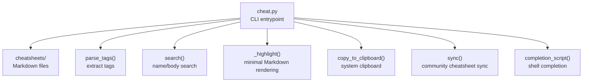
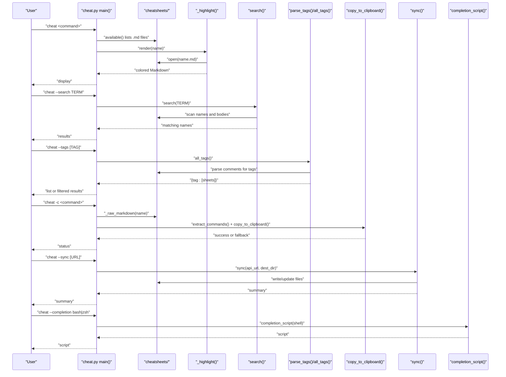
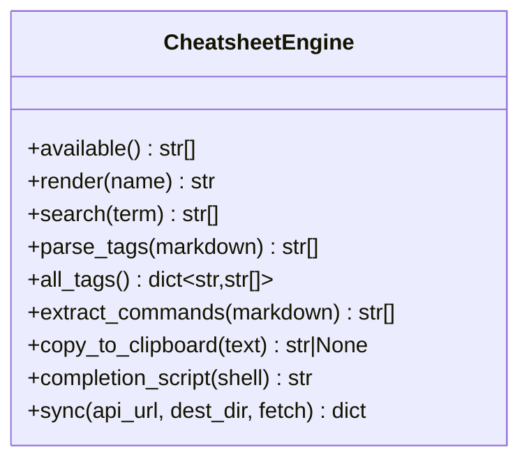
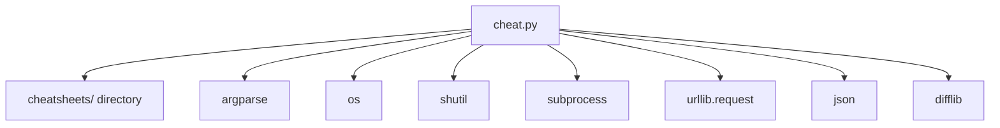

# Plugin Architecture

<cite>
**Referenced Files in This Document**
- [cheat.py](file://cheat.py)
- [README.md](file://README.md)
- [tests/test_cheat.py](file://tests/test_cheat.py)
- [cheatsheets/tar.md](file://cheatsheets/tar.md)
- [cheatsheets/grep.md](file://cheatsheets/grep.md)
- [cheatsheets/docker.md](file://cheatsheets/docker.md)
- [cheatsheets/kubectl.md](file://cheatsheets/kubectl.md)
- [cheatsheets/awk.md](file://cheatsheets/awk.md)
</cite>

## Table of Contents
1. [Introduction](#introduction)
2. [Project Structure](#project-structure)
3. [Core Components](#core-components)
4. [Architecture Overview](#architecture-overview)
5. [Detailed Component Analysis](#detailed-component-analysis)
6. [Dependency Analysis](#dependency-analysis)
7. [Performance Considerations](#performance-considerations)
8. [Troubleshooting Guide](#troubleshooting-guide)
9. [Conclusion](#conclusion)
10. [Appendices](#appendices)

## Introduction
This document explains the plugin-free architecture that powers the CLI cheatsheet tool. The system enables unlimited customization by allowing users to add new cheatsheets simply by placing Markdown files into a dedicated directory. There is no registration, configuration, or plugin installation required—only a single convention: place a Markdown file named after the command in the cheatsheets directory. The tool discovers these files automatically, renders them with minimal highlighting, and integrates seamlessly with search, completion, tagging, and clipboard copy features.

## Project Structure
The repository is organized around a single executable Python script and a directory of Markdown cheatsheets. The script defines the runtime behavior and integrates with the filesystem to discover and render cheatsheets.

**Diagram sources**
- [cheat.py:29-416](file://cheat.py#L29-L416)

**Section sources**
- [cheat.py:29-416](file://cheat.py#L29-L416)
- [README.md:17-98](file://README.md#L17-L98)

## Core Components
- Automatic discovery: The tool enumerates Markdown files in the cheatsheets directory and derives lookup names from filenames (without the .md extension).
- Minimal rendering: Headings, code blocks, and blockquotes are highlighted for readability.
- Search: Searches both the filename and the body content of cheatsheets.
- Tags: Supports a simple metadata format embedded in comments to categorize cheatsheets.
- Clipboard copy: Extracts commands from code blocks and copies them to the system clipboard.
- Community sync: Pulls cheatsheets from a GitHub contents API and updates local files.
- Shell completion: Generates completion scripts for bash and zsh.

**Section sources**
- [cheat.py:43-100](file://cheat.py#L43-L100)
- [cheat.py:103-122](file://cheat.py#L103-L122)
- [cheat.py:134-161](file://cheat.py#L134-L161)
- [cheat.py:212-289](file://cheat.py#L212-L289)
- [cheat.py:177-198](file://cheat.py#L177-L198)

## Architecture Overview
The architecture is intentionally simple and file-system driven. The CLI orchestrates operations, delegates discovery and rendering to internal functions, and integrates with external systems for clipboard and network operations.

**Diagram sources**
- [cheat.py:292-411](file://cheat.py#L292-L411)
- [cheat.py:43-100](file://cheat.py#L43-L100)
- [cheat.py:103-122](file://cheat.py#L103-L122)
- [cheat.py:134-161](file://cheat.py#L134-L161)
- [cheat.py:212-289](file://cheat.py#L212-L289)
- [cheat.py:177-198](file://cheat.py#L177-L198)

## Detailed Component Analysis

### Automatic Discovery Mechanism
- Directory scanning: The tool enumerates the cheatsheets directory and filters for files ending with .md.
- Lookup names: The filename without the .md extension becomes the lookup name.
- Sorting: Names are returned in sorted order for consistent presentation.

Implementation highlights:
- Directory resolution and existence checks.
- Filename filtering and normalization.

**Section sources**
- [cheat.py:29](file://cheat.py#L29)
- [cheat.py:43-49](file://cheat.py#L43-L49)

### File Validation and Rendering
- Validation: Unknown names trigger a fuzzy suggestion mechanism to guide corrections.
- Rendering: Minimal highlighting for headings, code blocks, and blockquotes; preserves original Markdown for raw output.
- Error handling: Provides helpful messages and suggestions when a cheatsheet is not found.

Rendering specifics:
- Headings are emphasized.
- Code blocks are colored for readability.
- Blockquotes are dimmed for contextual notes.

**Section sources**
- [cheat.py:56-66](file://cheat.py#L56-L66)
- [cheat.py:69-86](file://cheat.py#L69-L86)
- [cheat.py:368-410](file://cheat.py#L368-L410)

### Metadata Specification: Tags
- Format: Tags are declared inline using a comment line with a specific prefix and comma-separated values.
- Extraction: The parser scans lines for the tag declaration pattern and builds a list of normalized tags.
- Aggregation: A function collects all tags and maps each tag to the list of cheatsheets that declare it.

Example patterns observed in the repository:
- Single-line declarations with multiple categories.
- Whitespace trimming and empty-value handling.

**Section sources**
- [cheat.py:103-122](file://cheat.py#L103-L122)
- [cheatsheets/tar.md:1-2](file://cheatsheets/tar.md#L1-L2)
- [cheatsheets/grep.md:1-2](file://cheatsheets/grep.md#L1-L2)
- [cheatsheets/docker.md:1-2](file://cheatsheets/docker.md#L1-L2)
- [cheatsheets/kubectl.md:1-2](file://cheatsheets/kubectl.md#L1-L2)
- [cheatsheets/awk.md:1-2](file://cheatsheets/awk.md#L1-L2)

### Search Integration
- Name search: Case-insensitive substring matching against the lookup names.
- Body search: Scans the full body of each cheatsheet for the search term.
- Combined results: Returns a deduplicated list of matching names.

Search behavior:
- Term normalization to lowercase.
- Early termination for name matches to optimize performance.

**Section sources**
- [cheat.py:89-100](file://cheat.py#L89-L100)
- [tests/test_cheat.py:35-43](file://tests/test_cheat.py#L35-L43)

### Clipboard Copy Integration
- Command extraction: Parses fenced code blocks to collect command lines.
- Clipboard tools: Attempts platform-appropriate tools in a predefined order.
- Fallback: Prints commands to stdout if no clipboard tool is available.

Supported platforms:
- macOS, Linux Wayland, Linux X11, Windows.

**Section sources**
- [cheat.py:134-161](file://cheat.py#L134-L161)
- [tests/test_cheat.py:59-127](file://tests/test_cheat.py#L59-L127)

### Community Cheatsheet Sync
- API: Fetches a GitHub contents API listing of the cheatsheets directory.
- Filtering: Processes only entries where type equals file and name ends with .md.
- Update strategy: Creates new files or updates changed files; leaves unchanged files untouched.
- Reporting: Returns counts and lists for added, updated, and unchanged files.

Network behavior:
- Uses a User-Agent header and enforces a timeout.
- Allows injection of a fetch function for testing.

**Section sources**
- [cheat.py:212-289](file://cheat.py#L212-L289)
- [tests/test_cheat.py:196-263](file://tests/test_cheat.py#L196-L263)

### Shell Completion Integration
- Bash: Generates a completion script using compgen to list available cheatsheet names.
- Zsh: Generates a completion script using compadd.
- Error handling: Raises a ValueError for unsupported shells.

Completion behavior:
- Dynamically reflects changes to the cheatsheets directory.

**Section sources**
- [cheat.py:177-198](file://cheat.py#L177-L198)
- [tests/test_cheat.py:129-147](file://tests/test_cheat.py#L129-L147)

### Class Model of Core Functions

**Diagram sources**
- [cheat.py:43-122](file://cheat.py#L43-L122)
- [cheat.py:134-161](file://cheat.py#L134-L161)
- [cheat.py:177-198](file://cheat.py#L177-L198)
- [cheat.py:212-289](file://cheat.py#L212-L289)

## Dependency Analysis
The CLI depends on the filesystem for cheatsheet discovery and on external systems for clipboard and network operations. The design avoids third-party dependencies, relying on the Python standard library for core functionality.

**Diagram sources**
- [cheat.py:20-27](file://cheat.py#L20-L27)
- [cheat.py:29-416](file://cheat.py#L29-L416)

**Section sources**
- [cheat.py:20-27](file://cheat.py#L20-L27)
- [cheat.py:29-416](file://cheat.py#L29-L416)

## Performance Considerations
- Discovery: O(n) enumeration of files in the directory plus O(n) filtering by extension.
- Rendering: Linear scan of lines with constant-time operations per line.
- Search: O(n) over available names plus O(m) per body read, where m is the number of lines in the file.
- Clipboard copy: O(k) over extracted commands, where k is the number of lines in code blocks.
- Sync: O(p) over the number of remote entries plus O(q) over the number of local files, with byte-wise comparison for updates.

Optimization opportunities:
- Indexing: Maintain an in-memory index of names and tags for frequent lookups.
- Caching: Cache rendered outputs to avoid repeated highlighting.
- Parallelization: Parallelize network fetches during sync and file reads during search.

[No sources needed since this section provides general guidance]

## Troubleshooting Guide
Common issues and resolutions:
- Unknown command: The tool suggests the closest match using fuzzy matching. Verify the spelling and confirm the file exists in the cheatsheets directory.
- No commands found: Ensure the cheatsheet contains fenced code blocks; otherwise, extraction will return an empty list.
- Clipboard tool not found: The tool falls back to printing commands to stdout. Install a supported clipboard tool or run without the copy flag.
- Network errors during sync: Confirm connectivity and the correctness of the API URL. The tool raises a runtime error with a descriptive message.
- Tag listing empty: Ensure at least one cheatsheet declares tags using the comment format.

**Section sources**
- [cheat.py:368-410](file://cheat.py#L368-L410)
- [cheat.py:148-161](file://cheat.py#L148-L161)
- [cheat.py:240-245](file://cheat.py#L240-L245)
- [tests/test_cheat.py:24-33](file://tests/test_cheat.py#L24-L33)
- [tests/test_cheat.py:359-363](file://tests/test_cheat.py#L359-L363)

## Conclusion
The plugin-free architecture achieves simplicity and extensibility by leveraging a straightforward file placement convention. Users can add unlimited custom cheatsheets without configuration, while the tool provides robust search, tagging, completion, clipboard copy, and community sync capabilities. This design aligns with the project’s philosophy of zero dependencies and practical utility.

[No sources needed since this section summarizes without analyzing specific files]

## Appendices

### How to Create a Custom Cheatsheet
- Place a Markdown file in the cheatsheets directory with a name that corresponds to the command you want to document.
- Use headings to organize sections and fenced code blocks to present commands.
- Optionally add a tags declaration to enable categorization and filtering.

Naming conventions:
- Use the command name as the filename (without .md).
- Hyphens are allowed and encouraged for compound commands.

File structure requirements:
- Headings for sections.
- Fenced code blocks for commands.
- Optional tags declaration in a comment line.

Metadata specification:
- Declare tags using a comment line with a specific prefix and comma-separated values.

Integration with existing functionality:
- Automatic discovery: No registration required.
- Search: Name and body search include your cheatsheet.
- Tags: Use the --tags option to list or filter by category.
- Clipboard copy: Commands are extracted from code blocks.
- Community sync: Share your cheatsheet by contributing to the community repository.

**Section sources**
- [README.md:48-60](file://README.md#L48-L60)
- [cheat.py:43-49](file://cheat.py#L43-L49)
- [cheat.py:89-100](file://cheat.py#L89-L100)
- [cheat.py:103-122](file://cheat.py#L103-L122)
- [cheat.py:134-161](file://cheat.py#L134-L161)
- [cheat.py:212-289](file://cheat.py#L212-L289)

### Advanced Markdown Formatting Techniques
- Use headings to separate functional areas (e.g., Create, Extract, Inspect).
- Use blockquotes for mnemonics and tips.
- Combine multiple code blocks to demonstrate variations and flags.
- Leverage tags to group related commands under categories like text-processing, devops, containers, orchestration, and terminal.

Examples from the repository:
- Mnemonics and tips in blockquotes.
- Multi-section organization with headings.
- Tagging for categorization.

**Section sources**
- [cheatsheets/tar.md:1-31](file://cheatsheets/tar.md#L1-L31)
- [cheatsheets/grep.md:1-43](file://cheatsheets/grep.md#L1-L43)
- [cheatsheets/docker.md:1-43](file://cheatsheets/docker.md#L1-L43)
- [cheatsheets/kubectl.md:1-58](file://cheatsheets/kubectl.md#L1-L58)
- [cheatsheets/awk.md:1-47](file://cheatsheets/awk.md#L1-L47)

### Best Practices for Organizing Personal Cheatsheets
- Choose descriptive filenames that match the command names.
- Use consistent section headings across cheatsheets for familiarity.
- Keep commands in code blocks; add brief explanations as needed.
- Use tags to classify cheatsheets for easier discovery.
- Keep cheatsheets focused on a single command or closely related tasks.

Sharing with the Community
- Submit contributions to the community repository via the sync mechanism.
- Ensure your cheatsheet adheres to the naming and formatting conventions.
- Include helpful tips and mnemonics to improve usability.

**Section sources**
- [README.md:83-98](file://README.md#L83-L98)
- [cheat.py:212-289](file://cheat.py#L212-L289)