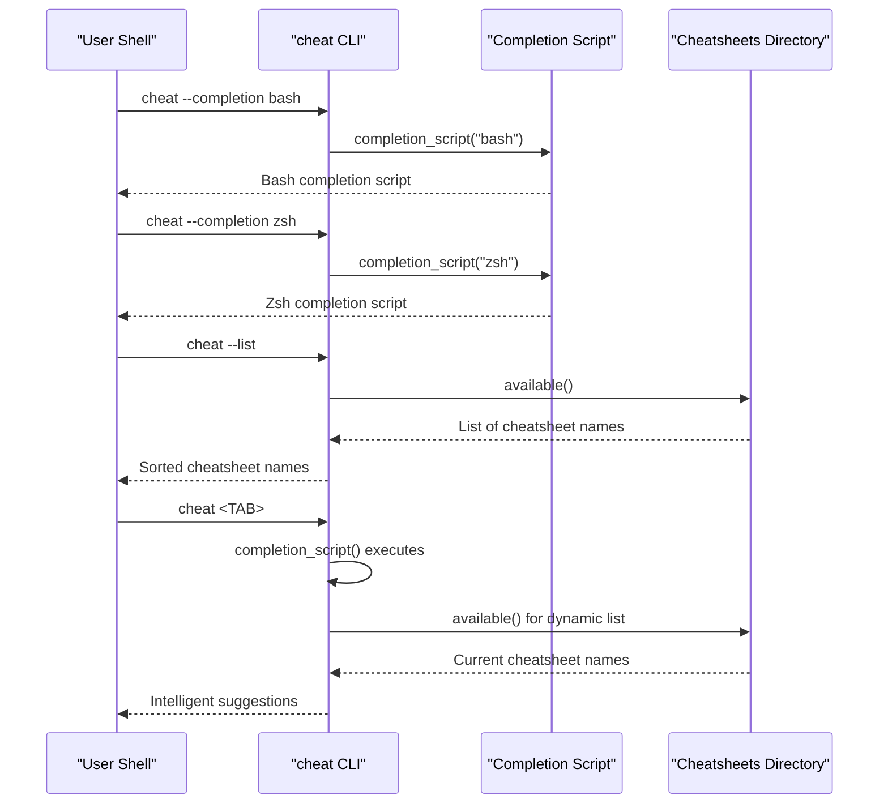
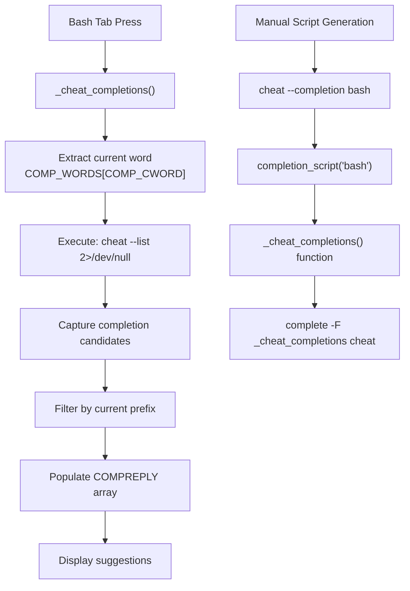
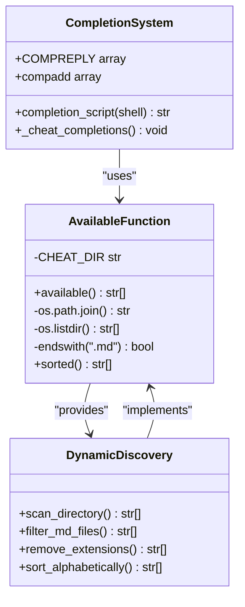

# Shell Completion

<cite>
**Referenced Files in This Document**
- [cheat.py](file://cheat.py)
- [README.md](file://README.md)
- [test_cheat.py](file://tests/test_cheat.py)
</cite>

## Table of Contents
1. [Introduction](#introduction)
2. [Project Structure](#project-structure)
3. [Core Components](#core-components)
4. [Architecture Overview](#architecture-overview)
5. [Detailed Component Analysis](#detailed-component-analysis)
6. [Dependency Analysis](#dependency-analysis)
7. [Performance Considerations](#performance-considerations)
8. [Troubleshooting Guide](#troubleshooting-guide)
9. [Conclusion](#conclusion)

## Introduction
This document provides comprehensive documentation for the shell completion functionality in the cheat CLI tool. The completion system enables intelligent tab completion for cheatsheet names across bash and zsh shells. It dynamically scans available cheatsheets and provides real-time suggestions that stay synchronized as you add or remove cheatsheets.

The completion system is implemented through built-in script generation that produces shell-specific completion scripts. These scripts integrate seamlessly with existing shell configurations and leverage the cheat tool's own `--list` functionality to maintain up-to-date suggestions.

## Project Structure
The shell completion functionality is implemented entirely within the main cheat.py module, with supporting documentation in README.md and comprehensive test coverage in test_cheat.py.

```mermaid
graph TB
subgraph "Main Module"
A[cheat.py<br/>Main CLI Implementation]
B[completion_script()<br/>Shell Script Generator]
C[available()<br/>Cheatsheet Discovery]
end
subgraph "Documentation"
D[README.md<br/>Usage Instructions]
E[test_cheat.py<br/>Completion Tests]
end
subgraph "Shell Integration"
F[Bash Completion<br/>--completion bash]
G[Zsh Completion<br/>--completion zsh]
H[Dynamic Suggestions<br/>cheat --list]
end
A --> B
B --> F
B --> G
C --> H
D --> F
D --> G
E --> B
```

**Diagram sources**
- [cheat.py:177-198](file://cheat.py#L177-L198)
- [cheat.py:43-49](file://cheat.py#L43-L49)
- [README.md:69-82](file://README.md#L69-L82)

**Section sources**
- [cheat.py:177-198](file://cheat.py#L177-L198)
- [README.md:69-82](file://README.md#L69-L82)

## Core Components
The shell completion system consists of three primary components:

### Completion Script Generator
The `completion_script()` function generates shell-specific completion scripts for both bash and zsh. It creates intelligent completion that dynamically discovers available cheatsheets.

### Dynamic Cheatsheet Discovery
The `available()` function scans the cheatsheets directory and returns sorted list of available cheatsheet names without file extensions. This provides the foundation for dynamic completion suggestions.

### Shell-Specific Integration
The system supports both bash and zsh completion through dedicated script generation that follows each shell's completion framework conventions.

**Section sources**
- [cheat.py:177-198](file://cheat.py#L177-L198)
- [cheat.py:43-49](file://cheat.py#L43-L49)

## Architecture Overview
The completion system operates through a clean separation of concerns between script generation, dynamic discovery, and shell integration.



**Diagram sources**
- [cheat.py:177-198](file://cheat.py#L177-L198)
- [cheat.py:43-49](file://cheat.py#L43-L49)
- [cheat.py:312-314](file://cheat.py#L312-L314)

## Detailed Component Analysis

### Bash Completion Implementation
Bash completion is implemented through a sophisticated completion function that integrates with bash's programmable completion system.



**Diagram sources**
- [cheat.py:182-190](file://cheat.py#L182-L190)

#### Key Features
- **Dynamic Discovery**: Uses `cheat --list` to get current cheatsheet names
- **Intelligent Filtering**: Leverages bash's `compgen` for efficient prefix matching
- **Error Handling**: Redirects stderr to prevent completion failures
- **Integration**: Registers completion function with the `complete` command

### Zsh Completion Implementation
Zsh completion uses the modern zsh completion system with automatic function registration.

```mermaid
flowchart TD
A["Zsh Tab Press"] --> B["_cheat_completions()"]
B --> C["Execute: cheat --list 2>/dev/null"]
C --> D["Capture completion candidates"]
D --> E["Add to completion list"]
E --> F["Display suggestions"]
G["Manual Script Generation"] --> H["cheat --completion zsh"]
H --> I["completion_script('zsh')"]
I --> J["_cheat_completions() function"]
J --> K["compdef _cheat_completions cheat"]
L["Eval Integration"] --> M["eval \"$(cheat --completion zsh)\""]
M --> N["Immediate completion activation"]
```

**Diagram sources**
- [cheat.py:191-197](file://cheat.py#L191-L197)

#### Key Features
- **Automatic Registration**: Uses `compdef` for seamless function binding
- **Direct Integration**: Supports immediate evaluation with `eval`
- **Simple Architecture**: Minimal overhead with direct completion addition

### Dynamic Completion Engine
The completion system relies on the `available()` function for real-time cheatsheet discovery.



**Diagram sources**
- [cheat.py:43-49](file://cheat.py#L43-L49)
- [cheat.py:177-198](file://cheat.py#L177-L198)

**Section sources**
- [cheat.py:177-198](file://cheat.py#L177-L198)
- [cheat.py:43-49](file://cheat.py#L43-L49)

## Dependency Analysis
The completion system has minimal external dependencies and maintains clean integration with the core cheat functionality.

```mermaid
graph LR
subgraph "Internal Dependencies"
A[cheat.py] --> B[available()]
A --> C[completion_script()]
B --> D[os.path.join]
B --> E[os.listdir]
C --> F[cheat --list]
end
subgraph "Shell Integration"
G[Bash] --> H[complete command]
I[Zsh] --> J[compdef command]
F --> K[Dynamic Execution]
end
subgraph "File System"
L[cheatsheets/] --> M[*.md files]
M --> N[Name extraction]
N --> O[Completion candidates]
end
B --> L
C --> G
C --> I
```

**Diagram sources**
- [cheat.py:29-29](file://cheat.py#L29-L29)
- [cheat.py:43-49](file://cheat.py#L43-L49)
- [cheat.py:177-198](file://cheat.py#L177-L198)

### Integration Points
- **File System Scanning**: Direct filesystem access to cheatsheets directory
- **Command Execution**: Dynamic execution of `cheat --list` for current state
- **Shell APIs**: Integration with bash and zsh completion frameworks
- **Error Handling**: Graceful fallback when filesystem or shell integration fails

**Section sources**
- [cheat.py:29-29](file://cheat.py#L29-L29)
- [cheat.py:177-198](file://cheat.py#L177-L198)

## Performance Considerations
The completion system is designed for optimal performance with minimal overhead:

### Execution Efficiency
- **Lazy Loading**: Completion scripts are generated on-demand via `--completion` flag
- **Minimal Processing**: Direct filesystem scanning with simple filtering
- **Cached Results**: Shell completion caches results during interactive sessions

### Memory Usage
- **Streaming Output**: Completion candidates are streamed rather than buffered
- **Efficient Filtering**: Shell-level filtering reduces Python processing overhead
- **Minimal State**: No persistent state maintained between completions

### Scalability
- **Linear Scaling**: Performance scales linearly with number of cheatsheets
- **Directory Access**: Efficient filesystem access patterns
- **Network Independence**: Local completion generation eliminates network dependencies

## Troubleshooting Guide

### Common Installation Issues

#### Bash Completion Not Working
**Symptoms**: Tab completion returns no suggestions or errors
**Solutions**:
1. Verify bash completion is enabled: `shopt -s completion-ignore-case`
2. Check if completion function is registered: `complete -p cheat`
3. Ensure `cheat` command is in PATH
4. Test manual script generation: `cheat --completion bash`

#### Zsh Completion Issues
**Symptoms**: Completion function not recognized or not loading
**Solutions**:
1. Verify zsh completion system is active: `autoload -Uz compinit && compinit`
2. Check completion function registration: `compctl -C cheat`
3. Ensure proper evaluation: `eval "$(cheat --completion zsh)"`
4. Verify zsh version compatibility (5.0+ required)

#### Permission Problems
**Symptoms**: Cannot write completion scripts to configuration files
**Solutions**:
1. Check file permissions on shell configuration files
2. Use `sudo` for system-wide installations (not recommended)
3. Install in user-specific directories (`~/.bashrc`, `~/.zshrc`)
4. Verify write permissions to home directory

### Dynamic Completion Problems

#### Missing Cheatsheets in Completion
**Symptoms**: Newly added cheatsheets don't appear in completion
**Causes and Solutions**:
1. **File Extension Issue**: Ensure `.md` extension is present
2. **File Location**: Verify cheatsheets are in correct directory
3. **File Permissions**: Check read permissions on cheatsheet files
4. **Reload Shell**: Restart shell or reload configuration

#### Completion Too Slow
**Symptoms**: Delayed response during tab completion
**Solutions**:
1. **Reduce Cheatsheets**: Remove unused cheatsheets to minimize scanning
2. **Optimize File System**: Move cheatsheets to SSD storage
3. **Shell Configuration**: Disable unnecessary shell extensions
4. **Debug Timing**: Use `time cheat --list` to measure filesystem performance

### Platform-Specific Issues

#### macOS Specific Problems
**Common Issues**:
- **Homebrew Python**: Ensure Homebrew Python is in PATH
- **zsh vs bash**: Default shell differences between systems
- **Permission Issues**: SIP restrictions affecting file system access

**Solutions**:
1. Use `which python3` to verify Python path
2. Check default shell: `echo $SHELL`
3. Verify cheatsheets directory accessibility

#### Linux Distribution Differences
**Common Issues**:
- **Package Management**: Different completion system locations
- **File Permissions**: Varying default permissions across distributions
- **Shell Variants**: Different bash/zsh versions

**Solutions**:
1. Check distribution-specific completion documentation
2. Verify shell version compatibility
3. Use distribution-specific package managers when available

### Debugging Completion Scripts

#### Verifying Script Generation
```bash
# Test bash completion script
cheat --completion bash > /tmp/bash_completion.sh
cat /tmp/bash_completion.sh

# Test zsh completion script  
cheat --completion zsh > /tmp/zsh_completion.sh
cat /tmp/zsh_completion.sh
```

#### Manual Completion Testing
```bash
# Test dynamic discovery
cheat --list

# Test completion function manually
_cheat_completions
```

#### Shell-Specific Debugging
```bash
# Bash debugging
set -x
cheat <TAB>
set +x

# Zsh debugging  
PS4='%N:%i> '
BASH_XTRACEFD=7
cheat <TAB>
```

**Section sources**
- [README.md:69-82](file://README.md#L69-L82)
- [test_cheat.py:129-147](file://tests/test_cheat.py#L129-L147)

## Conclusion
The cheat CLI tool's shell completion system provides a robust, dynamic, and platform-independent solution for intelligent cheatsheet name completion. Its architecture ensures seamless integration with existing shell configurations while maintaining excellent performance characteristics.

Key strengths include:
- **Dynamic Intelligence**: Automatic adaptation to changes in cheatsheet collections
- **Platform Compatibility**: Native support for both bash and zsh environments
- **Minimal Overhead**: Lightweight implementation with efficient filesystem access
- **Easy Integration**: Simple installation process with comprehensive documentation

The system successfully bridges the gap between static completion solutions and dynamic content discovery, providing users with accurate, up-to-date suggestions that evolve alongside their cheatsheet collections.

Future enhancements could include:
- **Fish Shell Support**: Extending completion to Fish shell users
- **Customizable Patterns**: Allowing users to configure completion behavior
- **Performance Optimization**: Implementing caching mechanisms for large cheatsheet collections
- **Advanced Filtering**: Adding support for cheatsheet categories and tags in completion