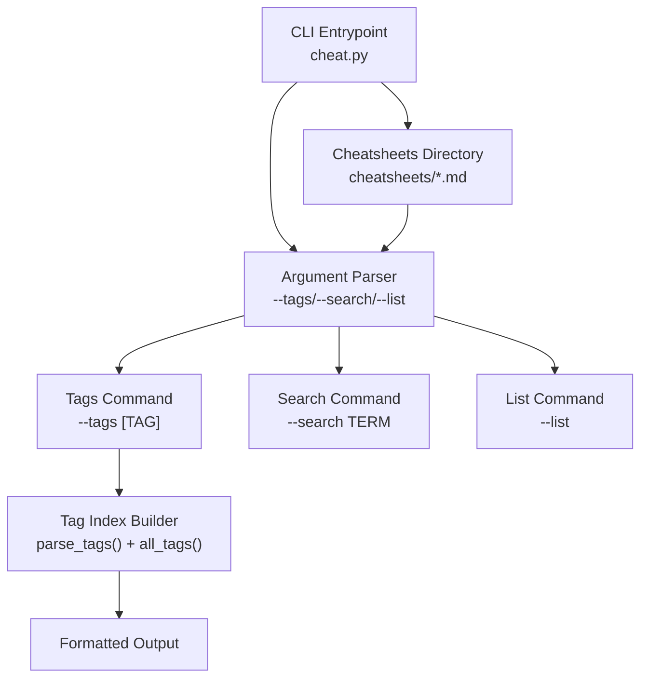
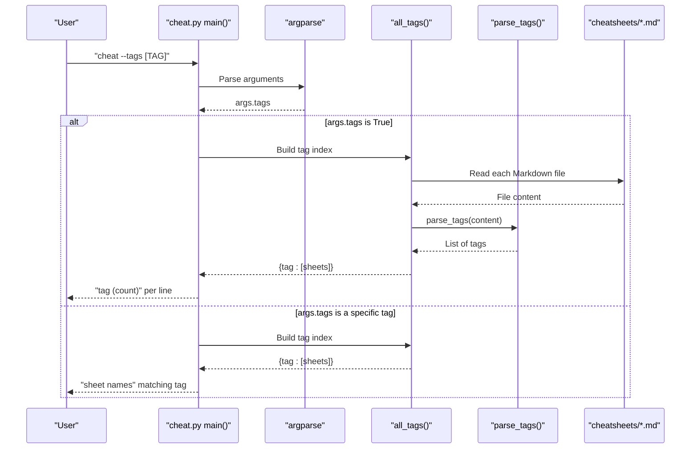
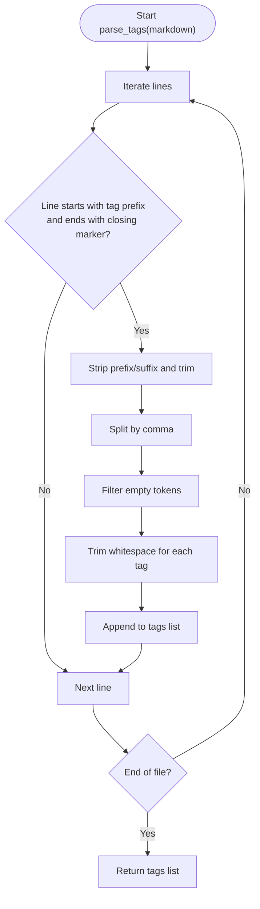
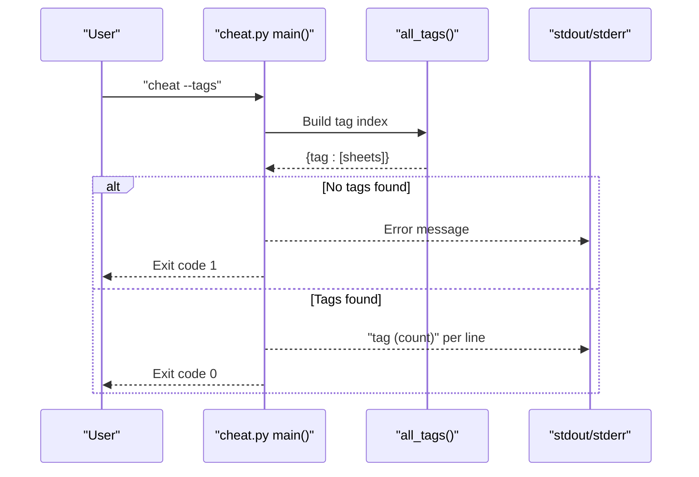
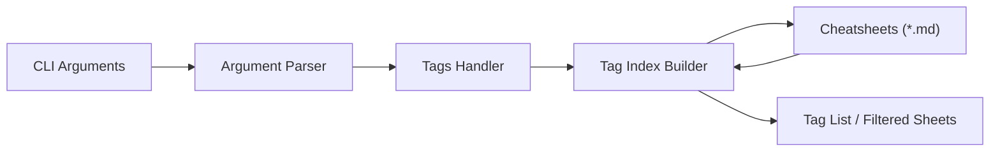

# Tag Management

<cite>
**Referenced Files in This Document**
- [cheat.py](file://cheat.py)
- [README.md](file://README.md)
- [tests/test_cheat.py](file://tests/test_cheat.py)
- [cheatsheets/git-rebase.md](file://cheatsheets/git-rebase.md)
- [cheatsheets/docker.md](file://cheatsheets/docker.md)
- [cheatsheets/find.md](file://cheatsheets/find.md)
- [cheatsheets/grep.md](file://cheatsheets/grep.md)
- [cheatsheets/kubectl.md](file://cheatsheets/kubectl.md)
- [cheatsheets/make.md](file://cheatsheets/make.md)
- [cheatsheets/systemctl.md](file://cheatsheets/systemctl.md)
- [cheatsheets/tmux.md](file://cheatsheets/tmux.md)
</cite>

## Table of Contents
1. [Introduction](#introduction)
2. [Project Structure](#project-structure)
3. [Core Components](#core-components)
4. [Architecture Overview](#architecture-overview)
5. [Detailed Component Analysis](#detailed-component-analysis)
6. [Dependency Analysis](#dependency-analysis)
7. [Performance Considerations](#performance-considerations)
8. [Troubleshooting Guide](#troubleshooting-guide)
9. [Conclusion](#conclusion)
10. [Appendices](#appendices)

## Introduction
This document explains the tag-based organization system in the cheat CLI. Tags are metadata embedded in cheatsheet Markdown files using a comment syntax. They enable powerful discovery and navigation beyond traditional search, allowing users to filter cheatsheets by category, technology, or task type. The system supports listing all tags with counts, filtering cheatsheets by a specific tag, and integrating tags into the broader CLI workflow.

## Project Structure
The cheat CLI organizes cheatsheets as Markdown files in a dedicated directory. Each cheatsheet can declare tags via a comment line near the top. The CLI exposes commands to list all cheatsheets, search by text, copy commands to the clipboard, and manage tags.

**Diagram sources**
- [cheat.py:292-411](file://cheat.py#L292-L411)
- [cheat.py:103-122](file://cheat.py#L103-L122)

**Section sources**
- [README.md:17-98](file://README.md#L17-L98)
- [cheat.py:29-29](file://cheat.py#L29-L29)

## Core Components
- Tag parsing: Extracts tags from comment lines in Markdown.
- Tag indexing: Builds a dictionary mapping each tag to the list of cheatsheets that declare it.
- Tag commands: Lists all tags with counts or filters cheatsheets by a specific tag.
- Integration: Works alongside existing commands like list, search, and raw output.

Key implementation locations:
- Tag parsing and indexing: [cheat.py:103-122](file://cheat.py#L103-L122)
- Tag command logic: [cheat.py:332-346](file://cheat.py#L332-L346)
- Example tag declarations in cheatsheets: [cheatsheets/git-rebase.md:2](file://cheatsheets/git-rebase.md#L2), [cheatsheets/docker.md:2](file://cheatsheets/docker.md#L2), [cheatsheets/find.md:2](file://cheatsheets/find.md#L2), [cheatsheets/grep.md:2](file://cheatsheets/grep.md#L2), [cheatsheets/kubectl.md:2](file://cheatsheets/kubectl.md#L2), [cheatsheets/make.md:2](file://cheatsheets/make.md#L2), [cheatsheets/systemctl.md:2](file://cheatsheets/systemctl.md#L2), [cheatsheets/tmux.md:2](file://cheatsheets/tmux.md#L2)

**Section sources**
- [cheat.py:103-122](file://cheat.py#L103-L122)
- [cheat.py:332-346](file://cheat.py#L332-L346)

## Architecture Overview
The tag system is implemented as a lightweight metadata extraction and indexing pipeline integrated into the CLI’s argument parsing. When the user requests tags, the CLI scans all cheatsheets, parses tag lines, and either prints a tag list with counts or filters the sheet list by a given tag.

**Diagram sources**
- [cheat.py:292-411](file://cheat.py#L292-L411)
- [cheat.py:103-122](file://cheat.py#L103-L122)

## Detailed Component Analysis

### Tag Parsing and Indexing
- Tag declaration syntax: A comment line starting with a specific prefix and ending with a closing marker, containing comma-separated tag values.
- Parsing behavior:
  - Detects lines that start with the tag prefix and end with the closing marker.
  - Strips whitespace and splits by commas.
  - Ignores empty tokens and trims whitespace around each tag.
  - Supports multiple tag lines in a single file.
- Indexing behavior:
  - Iterates all cheatsheets.
  - For each file, collects tags via parsing.
  - Builds a dictionary mapping each tag to a list of sheet names.

Implementation references:
- Tag parsing: [cheat.py:103-112](file://cheat.py#L103-L112)
- Tag indexing: [cheat.py:115-122](file://cheat.py#L115-L122)

**Diagram sources**
- [cheat.py:103-112](file://cheat.py#L103-L112)

**Section sources**
- [cheat.py:103-112](file://cheat.py#L103-L112)
- [cheat.py:115-122](file://cheat.py#L115-L122)

### Tag Listing and Filtering Commands
- Listing all tags:
  - Invoked with “cheat --tags”.
  - Prints each tag followed by the number of associated cheatsheets.
- Filtering by a specific tag:
  - Invoked with “cheat --tags <tag>”.
  - Prints the names of cheatsheets that declare the given tag.
- Error handling:
  - If no tags are found, prints a message and exits with a non-zero status.
  - If a requested tag has no matching cheatsheets, prints a message and exits with a non-zero status.

Command logic references:
- Argument parsing for tags: [cheat.py:304-305](file://cheat.py#L304-L305)
- Tag command handler: [cheat.py:332-346](file://cheat.py#L332-L346)

**Diagram sources**
- [cheat.py:332-346](file://cheat.py#L332-L346)

**Section sources**
- [cheat.py:332-346](file://cheat.py#L332-L346)

### Tag Syntax in Markdown Files
- Syntax: A comment line near the top of the file declaring tags.
- Example patterns:
  - Single tag category: [cheatsheets/find.md:2](file://cheatsheets/find.md#L2)
  - Multiple categories: [cheatsheets/git-rebase.md:2](file://cheatsheets/git-rebase.md#L2), [cheatsheets/docker.md:2](file://cheatsheets/docker.md#L2), [cheatsheets/kubectl.md:2](file://cheatsheets/kubectl.md#L2), [cheatsheets/make.md:2](file://cheatsheets/make.md#L2), [cheatsheets/systemctl.md:2](file://cheatsheets/systemctl.md#L2), [cheatsheets/tmux.md:2](file://cheatsheets/tmux.md#L2), [cheatsheets/grep.md:2](file://cheatsheets/grep.md#L2)

Best practices observed in the repository:
- Place the tag line immediately after the title line.
- Use lowercase, hyphenated, or underscored names consistently.
- Keep tags short and meaningful.
- Use multiple tags to reflect cross-cutting concerns (e.g., devops + containers).

**Section sources**
- [cheatsheets/git-rebase.md:2](file://cheatsheets/git-rebase.md#L2)
- [cheatsheets/docker.md:2](file://cheatsheets/docker.md#L2)
- [cheatsheets/find.md:2](file://cheatsheets/find.md#L2)
- [cheatsheets/grep.md:2](file://cheatsheets/grep.md#L2)
- [cheatsheets/kubectl.md:2](file://cheatsheets/kubectl.md#L2)
- [cheatsheets/make.md:2](file://cheatsheets/make.md#L2)
- [cheatsheets/systemctl.md:2](file://cheatsheets/systemctl.md#L2)
- [cheatsheets/tmux.md:2](file://cheatsheets/tmux.md#L2)

### Tag Categories Used in the Community
Common categories present in the repository’s cheatsheets:
- Version control: git
- Text processing/search: text-processing, search
- Files and search: files, search
- DevOps and infrastructure: devops, system, services
- Containers and orchestration: containers, orchestration
- Terminal and productivity: terminal, productivity
- Build and automation: build, automation, scripting

These categories demonstrate how tags can group cheatsheets by domain, toolchain, or task type, enabling targeted discovery.

**Section sources**
- [cheatsheets/git-rebase.md:2](file://cheatsheets/git-rebase.md#L2)
- [cheatsheets/grep.md:2](file://cheatsheets/grep.md#L2)
- [cheatsheets/find.md:2](file://cheatsheets/find.md#L2)
- [cheatsheets/docker.md:2](file://cheatsheets/docker.md#L2)
- [cheatsheets/kubectl.md:2](file://cheatsheets/kubectl.md#L2)
- [cheatsheets/systemctl.md:2](file://cheatsheets/systemctl.md#L2)
- [cheatsheets/tmux.md:2](file://cheatsheets/tmux.md#L2)
- [cheatsheets/make.md:2](file://cheatsheets/make.md#L2)

### Tag-Based Organization and Discoverability
- Alternative navigation:
  - Instead of relying solely on textual search, users can filter by known categories (e.g., “devops”, “containers”).
  - Users can browse all tags to explore related topics and discover cheatsheets they did not know existed.
- Integration with CLI:
  - Tag listing complements existing “--list” and “--search” commands.
  - Tag filtering can be combined with copying commands to clipboard for quick adoption.

**Section sources**
- [cheat.py:332-346](file://cheat.py#L332-L346)
- [README.md:23-34](file://README.md#L23-L34)

## Dependency Analysis
The tag system depends on:
- The Markdown file format and the comment line convention.
- The CLI argument parser to route tag-related commands.
- Filesystem access to read cheatsheet content.

**Diagram sources**
- [cheat.py:292-411](file://cheat.py#L292-L411)
- [cheat.py:103-122](file://cheat.py#L103-L122)

**Section sources**
- [cheat.py:292-411](file://cheat.py#L292-L411)
- [cheat.py:103-122](file://cheat.py#L103-L122)

## Performance Considerations
- Parsing overhead: Tag parsing occurs once per cheatsheet during index construction. With a modest number of cheatsheets, this is negligible.
- Memory footprint: The tag index is a dictionary mapping tag names to lists of sheet names. Memory usage scales linearly with the number of tag occurrences.
- I/O characteristics: Reading all Markdown files is O(n) with respect to the number of files. For large repositories, consider caching or lazy evaluation if performance becomes a concern.

[No sources needed since this section provides general guidance]

## Troubleshooting Guide
- No tags found:
  - Cause: No cheatsheets declare tags or the tag lines are malformed.
  - Resolution: Ensure tag lines follow the expected comment format and contain at least one non-empty tag.
- Unknown tag requested:
  - Cause: The tag does not appear in any cheatsheet.
  - Resolution: Verify spelling and capitalization; use “--tags” to list available tags.
- Malformed tag lines:
  - Cause: Extra spaces, missing closing marker, or incorrect prefix.
  - Resolution: Align with the documented syntax and ensure the line starts with the tag prefix and ends with the closing marker.

Validation references:
- Tag parsing tests: [tests/test_cheat.py:265-287](file://tests/test_cheat.py#L265-L287)
- Tag listing and filtering tests: [tests/test_cheat.py:310-339](file://tests/test_cheat.py#L310-L339)

**Section sources**
- [tests/test_cheat.py:265-287](file://tests/test_cheat.py#L265-L287)
- [tests/test_cheat.py:310-339](file://tests/test_cheat.py#L310-L339)

## Conclusion
The tag-based organization system in the cheat CLI provides a simple yet powerful way to categorize and discover cheatsheets. By embedding tags in Markdown files and exposing commands to list and filter by tags, users gain an alternative navigation path beyond traditional search. The implementation is robust, tested, and integrates seamlessly with existing CLI features.

[No sources needed since this section summarizes without analyzing specific files]

## Appendices

### Tag Syntax Reference
- Syntax: A comment line near the top of the file declaring tags.
- Example: [cheatsheets/git-rebase.md:2](file://cheatsheets/git-rebase.md#L2)
- Behavior: Whitespace is trimmed, empty tokens are ignored, and multiple lines are supported.

**Section sources**
- [cheatsheets/git-rebase.md:2](file://cheatsheets/git-rebase.md#L2)
- [cheat.py:103-112](file://cheat.py#L103-L112)

### Command Reference
- List all tags: “cheat --tags”
- Filter by tag: “cheat --tags <tag>”
- Combine with other commands: “cheat --tags” can be used alongside “--list” and “--search”.

**Section sources**
- [cheat.py:304-305](file://cheat.py#L304-L305)
- [cheat.py:332-346](file://cheat.py#L332-L346)