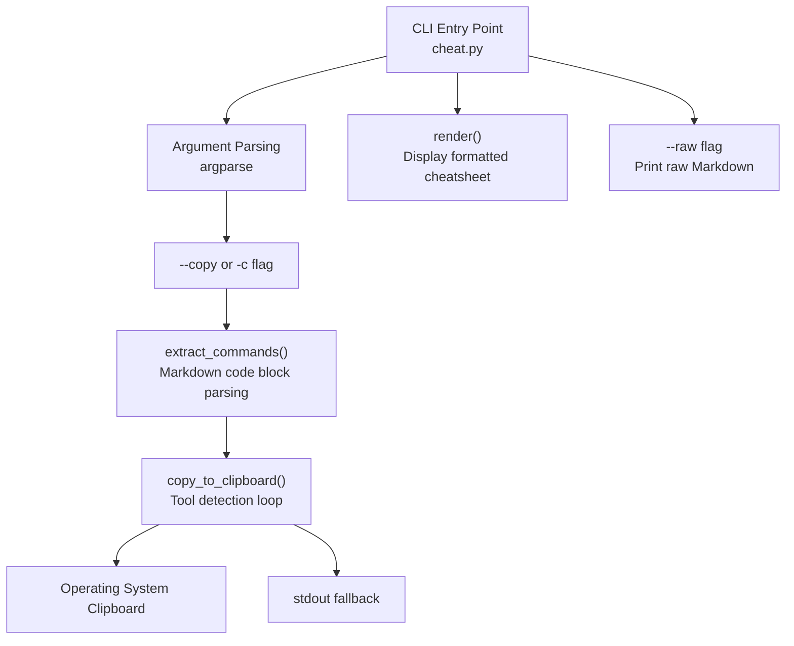
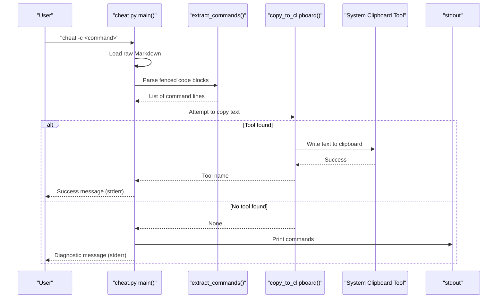
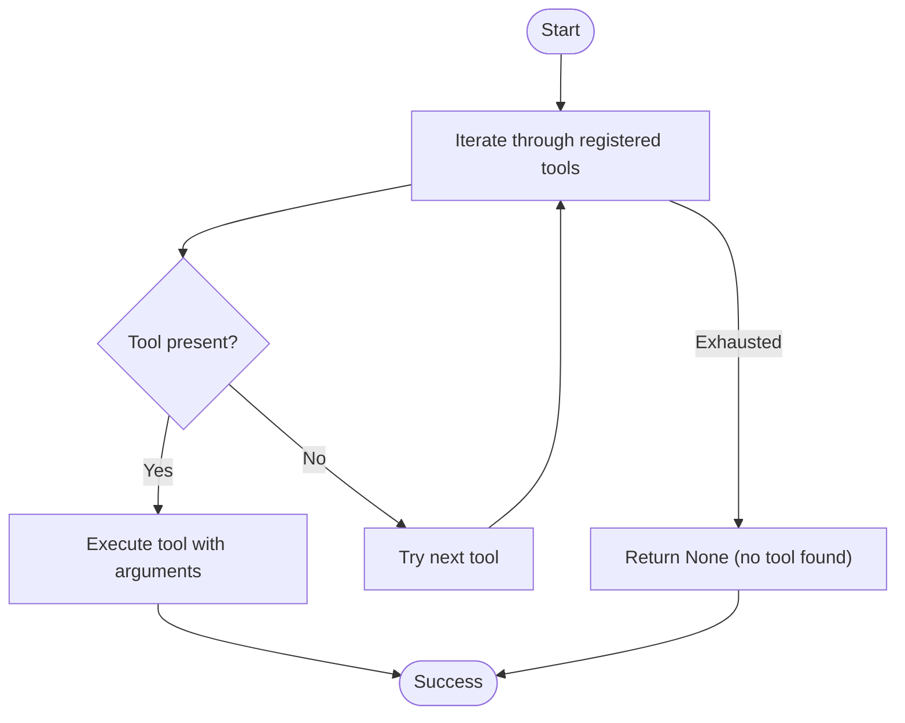
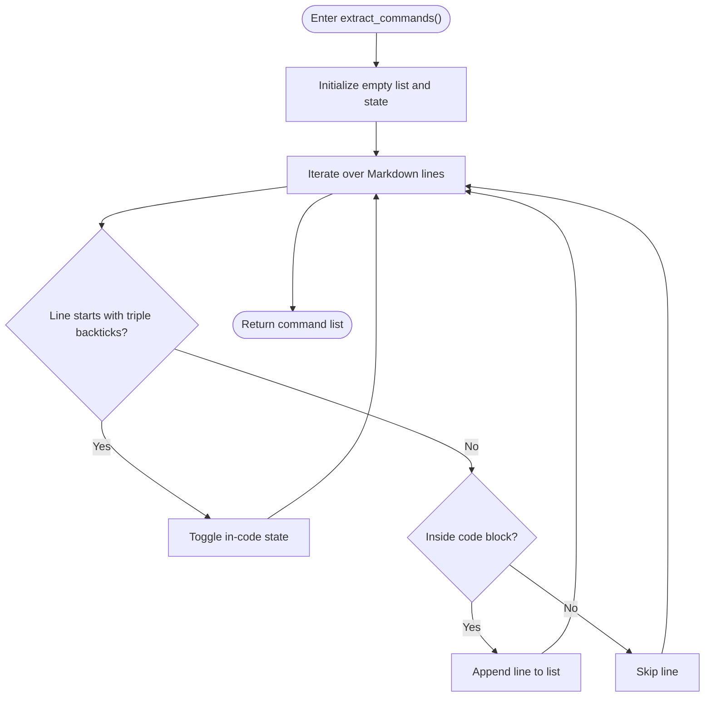
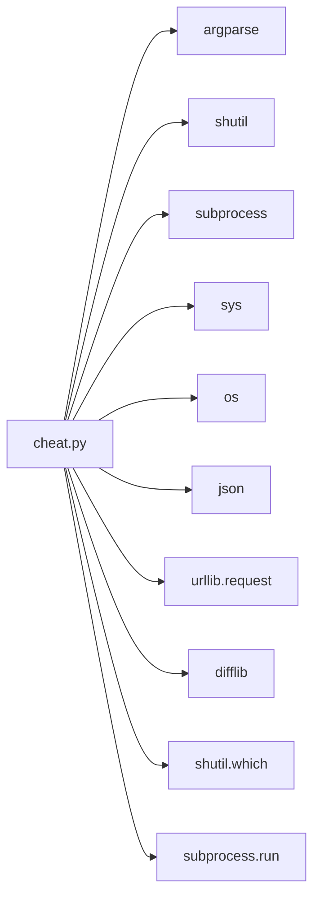

# Clipboard Integration

<cite>
**Referenced Files in This Document**
- [cheat.py](file://cheat.py)
- [README.md](file://README.md)
- [tests/test_cheat.py](file://tests/test_cheat.py)
- [cheatsheets/tar.md](file://cheatsheets/tar.md)
- [cheatsheets/grep.md](file://cheatsheets/grep.md)
- [cheatsheets/docker.md](file://cheatsheets/docker.md)
</cite>

## Table of Contents
1. [Introduction](#introduction)
2. [Project Structure](#project-structure)
3. [Core Components](#core-components)
4. [Architecture Overview](#architecture-overview)
5. [Detailed Component Analysis](#detailed-component-analysis)
6. [Dependency Analysis](#dependency-analysis)
7. [Performance Considerations](#performance-considerations)
8. [Troubleshooting Guide](#troubleshooting-guide)
9. [Conclusion](#conclusion)

## Introduction
This document explains the clipboard integration feature that enables copying commands from cheatsheets to the system clipboard across macOS, Linux, and Windows. It covers:
- Cross-platform clipboard tool support and detection order
- Command extraction from Markdown code blocks
- Fallback behavior when no clipboard tool is available
- Practical examples from real cheatsheets
- Common issues and resolutions

## Project Structure
The clipboard feature is implemented in a single Python module with a small set of Markdown cheatsheets for demonstration.

**Diagram sources**
- [cheat.py:292-411](file://cheat.py#L292-L411)
- [cheat.py:134-161](file://cheat.py#L134-L161)

**Section sources**
- [cheat.py:125-161](file://cheat.py#L125-L161)
- [README.md:36-38](file://README.md#L36-L38)

## Core Components
- Clipboard tool registry and detection
- Command extraction from Markdown
- Copy-to-clipboard operation
- Fallback to stdout when no tool is available
- Integration with the main CLI flow

Key implementation locations:
- Clipboard tool registry and detection: [cheat.py:125-161](file://cheat.py#L125-L161)
- Command extraction: [cheat.py:134-145](file://cheat.py#L134-L145)
- CLI integration for copy mode: [cheat.py:379-401](file://cheat.py#L379-L401)

**Section sources**
- [cheat.py:125-161](file://cheat.py#L125-L161)
- [cheat.py:134-145](file://cheat.py#L134-L145)
- [cheat.py:379-401](file://cheat.py#L379-L401)

## Architecture Overview
The clipboard integration follows a deterministic detection-and-execute pattern:
- Detect available clipboard tools in a predefined order
- Use the first available tool to write text to the system clipboard
- If none are found, print the extracted commands to stdout and emit a diagnostic message

**Diagram sources**
- [cheat.py:379-401](file://cheat.py#L379-L401)
- [cheat.py:134-145](file://cheat.py#L134-L145)
- [cheat.py:148-161](file://cheat.py#L148-L161)

## Detailed Component Analysis

### Cross-Platform Clipboard Tool Detection
The system maintains a prioritized list of clipboard tools and checks for their presence using a platform-aware discovery mechanism. The detection order ensures optimal compatibility across platforms.

Detection order and tool arguments:
- macOS: pbcopy (no extra arguments)
- Linux Wayland: wl-copy (no extra arguments)
- Linux X11: xclip with explicit selection argument
- Linux X11: xsel with explicit clipboard and input arguments
- Windows: clip (no extra arguments)

**Diagram sources**
- [cheat.py:125-161](file://cheat.py#L125-L161)

Implementation highlights:
- Tool registry: [cheat.py:125-131](file://cheat.py#L125-L131)
- Detection loop: [cheat.py:153-160](file://cheat.py#L153-L160)
- Platform coverage: [README.md:36-38](file://README.md#L36-L38)

**Section sources**
- [cheat.py:125-161](file://cheat.py#L125-L161)
- [README.md:36-38](file://README.md#L36-L38)

### Command Extraction from Markdown
Commands are extracted from fenced code blocks in Markdown documents. The extractor ignores headings, paragraphs, and blockquotes, focusing solely on command lines.

Extraction behavior:
- Recognizes fenced code blocks delimited by triple backticks
- Captures all lines between opening and closing fences
- Preserves leading whitespace for commands that rely on indentation
- Ignores non-code content

**Diagram sources**
- [cheat.py:134-145](file://cheat.py#L134-L145)

Examples from real cheatsheets:
- tar commands: [cheatsheets/tar.md:5-28](file://cheatsheets/tar.md#L5-L28)
- grep commands: [cheatsheets/grep.md:5-40](file://cheatsheets/grep.md#L5-L40)
- docker commands: [cheatsheets/docker.md:5-40](file://cheatsheets/docker.md#L5-L40)

**Section sources**
- [cheat.py:134-145](file://cheat.py#L134-L145)
- [cheatsheets/tar.md:5-28](file://cheatsheets/tar.md#L5-L28)
- [cheatsheets/grep.md:5-40](file://cheatsheets/grep.md#L5-L40)
- [cheatsheets/docker.md:5-40](file://cheatsheets/docker.md#L5-L40)

### Copy-to-Clipboard Operation
Once commands are extracted, the system attempts to copy them to the clipboard using the first available tool. If none are found, it falls back to printing to stdout and emits a diagnostic message.

Behavior:
- Encode text and pipe it to the selected tool’s stdin
- On success, return the tool name
- On failure, return None

Integration points:
- CLI copy mode: [cheat.py:379-401](file://cheat.py#L379-L401)
- Tool execution: [cheat.py:153-160](file://cheat.py#L153-L160)

**Section sources**
- [cheat.py:379-401](file://cheat.py#L379-L401)
- [cheat.py:148-161](file://cheat.py#L148-L161)

### Fallback Behavior
When no clipboard tool is detected, the system prints the extracted commands to stdout and writes a diagnostic message to stderr. This ensures users still receive the commands even without a clipboard tool.

Fallback flow:
- Extract commands from Markdown
- Attempt to copy to clipboard
- If copy fails (returns None), print commands to stdout
- Print a diagnostic message to stderr indicating the fallback

**Section sources**
- [cheat.py:394-398](file://cheat.py#L394-L398)

## Dependency Analysis
The clipboard integration relies on a small set of external dependencies and standard library modules.

**Diagram sources**
- [cheat.py:20-27](file://cheat.py#L20-L27)
- [cheat.py:125-161](file://cheat.py#L125-L161)

Key dependencies:
- shutil.which: Tool discovery
- subprocess.run: Executing clipboard tools
- argparse: CLI argument parsing
- sys/os/json/urllib/difflib: Supporting utilities

**Section sources**
- [cheat.py:20-27](file://cheat.py#L20-L27)
- [cheat.py:125-161](file://cheat.py#L125-L161)

## Performance Considerations
- Tool detection cost: O(n) over the fixed-size tool list; negligible overhead
- Command extraction cost: O(m) over the length of the Markdown content
- Clipboard write cost: Depends on the underlying tool and OS; generally fast
- Fallback cost: Printing to stdout is efficient and avoids blocking

## Troubleshooting Guide

Common issues and resolutions:
- No clipboard tool found
  - Symptom: Commands printed to stdout with a diagnostic message
  - Resolution: Install a clipboard tool appropriate for your platform
    - macOS: pbcopy (installed by default)
    - Linux Wayland: wl-copy (part of wlroots)
    - Linux X11: xclip or xsel (commonly available)
    - Windows: clip (installed by default)
  - Verification: Confirm tool availability in PATH and executable permissions

- Wrong tool selected on Linux
  - Symptom: Unexpected clipboard behavior
  - Resolution: Ensure the intended tool is installed and available earlier in PATH than others

- Permission errors when writing to clipboard
  - Symptom: Tool exits with permission error
  - Resolution: Verify desktop session support (Wayland vs X11) and install the correct tool

- Commands not copied as expected
  - Symptom: Nothing in clipboard despite successful copy
  - Resolution: Test the clipboard tool directly in a terminal to confirm it works

Validation and testing:
- Unit tests verify:
  - Tool selection order and execution
  - Fallback behavior when no tool is available
  - Command extraction correctness across multiple code blocks

References:
- Tool detection and fallback tests: [tests/test_cheat.py:79-126](file://tests/test_cheat.py#L79-L126)
- Command extraction tests: [tests/test_cheat.py:59-76](file://tests/test_cheat.py#L59-L76)

**Section sources**
- [tests/test_cheat.py:79-126](file://tests/test_cheat.py#L79-L126)
- [tests/test_cheat.py:59-76](file://tests/test_cheat.py#L59-L76)

## Conclusion
The clipboard integration provides seamless cross-platform command copying by:
- Detecting and using the first available clipboard tool in a prioritized order
- Extracting commands from Markdown code blocks with fidelity
- Falling back to stdout when no tool is available
- Integrating cleanly with the existing CLI interface

This design ensures reliable command retrieval across diverse environments while maintaining simplicity and portability.