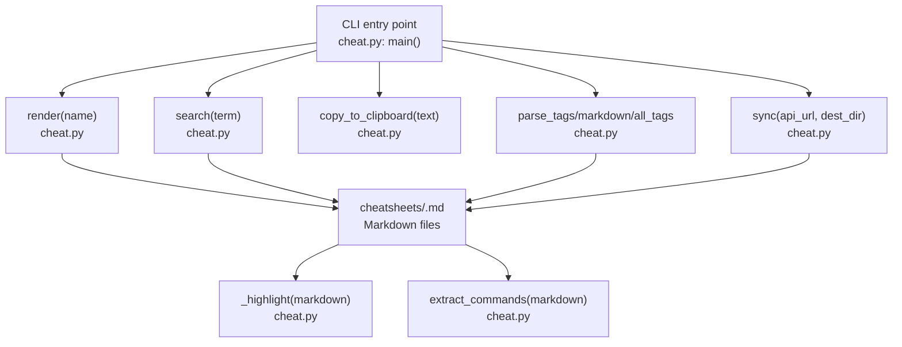
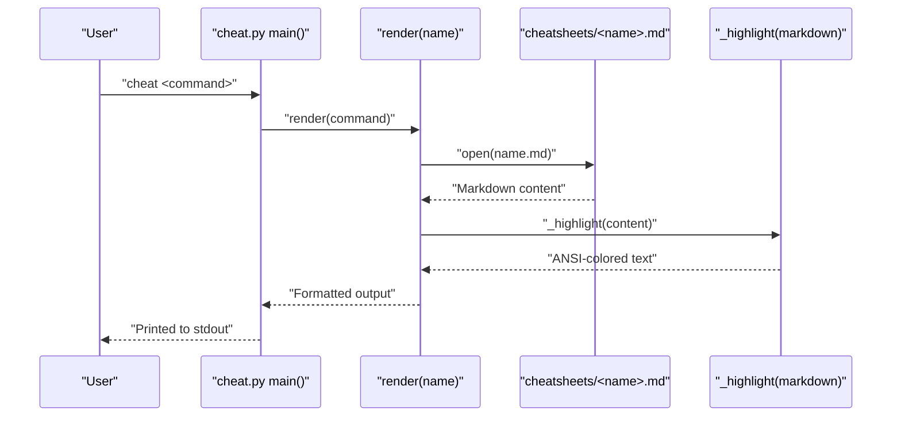
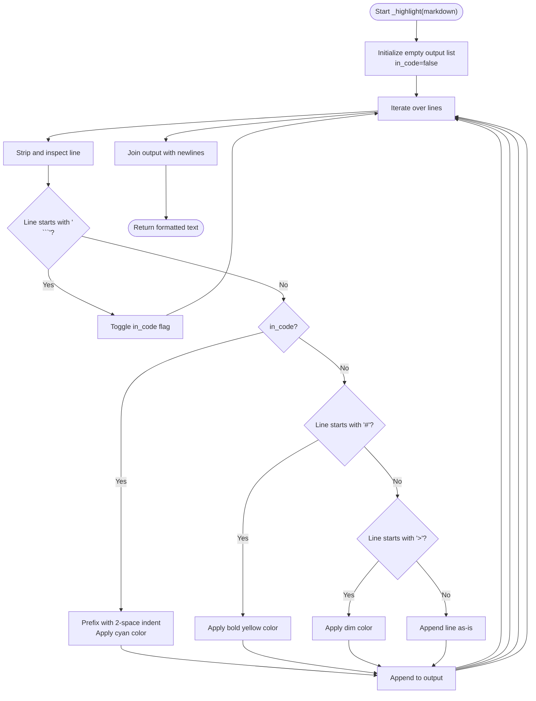
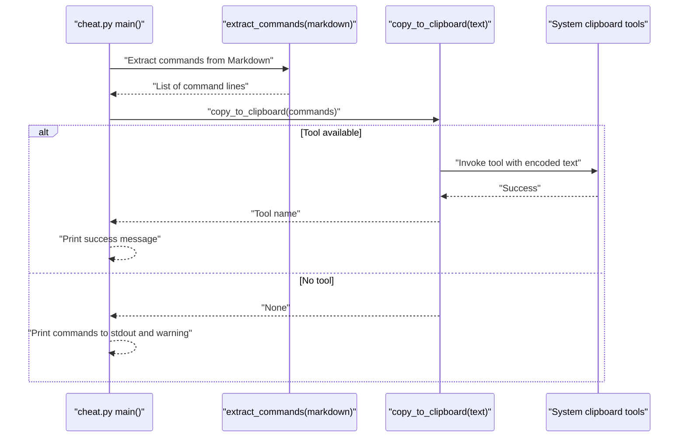
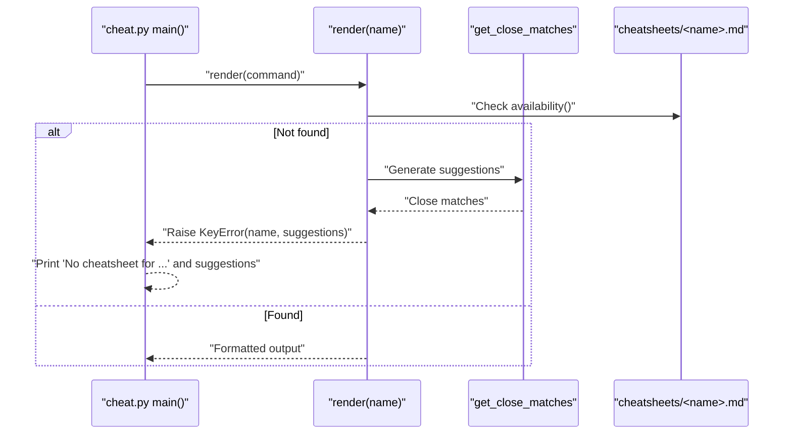
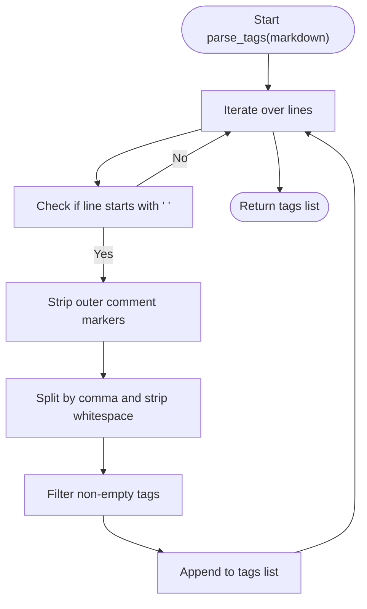
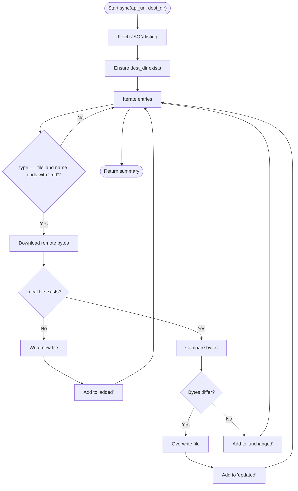
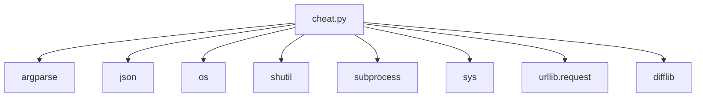

# Command Lookup

<cite>
**Referenced Files in This Document**
- [cheat.py](file://cheat.py)
- [README.md](file://README.md)
- [tests/test_cheat.py](file://tests/test_cheat.py)
- [cheatsheets/tar.md](file://cheatsheets/tar.md)
- [cheatsheets/git-rebase.md](file://cheatsheets/git-rebase.md)
- [cheatsheets/ssh.md](file://cheatsheets/ssh.md)
- [cheatsheets/docker.md](file://cheatsheets/docker.md)
- [cheatsheets/grep.md](file://cheatsheets/grep.md)
- [cheatsheets/sed.md](file://cheatsheets/sed.md)
- [cheatsheets/find.md](file://cheatsheets/find.md)
</cite>

## Table of Contents
1. [Introduction](#introduction)
2. [Project Structure](#project-structure)
3. [Core Components](#core-components)
4. [Architecture Overview](#architecture-overview)
5. [Detailed Component Analysis](#detailed-component-analysis)
6. [Dependency Analysis](#dependency-analysis)
7. [Performance Considerations](#performance-considerations)
8. [Troubleshooting Guide](#troubleshooting-guide)
9. [Conclusion](#conclusion)
10. [Appendices](#appendices)

## Introduction
This document explains the command lookup functionality that powers the offline, example-first cheatsheet tool. It covers how the tool discovers and displays cheatsheets for specific commands, how the cheatsheets directory is organized, how command names map to Markdown filenames, and how the minimal Markdown highlighting system renders formatted terminal output. It also documents error handling for missing commands, fuzzy suggestions, and the pretty-print formatting with ANSI colors. Finally, it includes examples from actual cheatsheets to illustrate proper Markdown formatting, command blocks, and comment sections.

## Project Structure
The project consists of a single executable Python module and a directory of Markdown cheatsheets. The module exposes a CLI interface and internal APIs for listing, searching, rendering, copying, tagging, and syncing cheatsheets.



**Diagram sources**
- [cheat.py:292-411](file://cheat.py#L292-L411)
- [cheat.py:56-86](file://cheat.py#L56-L86)
- [cheat.py:134-145](file://cheat.py#L134-L145)
- [cheat.py:212-289](file://cheat.py#L212-L289)

**Section sources**
- [cheat.py:18-17](file://cheat.py#L18-L17)
- [README.md:17-34](file://README.md#L17-L34)

## Core Components
- Command discovery and listing:
  - The tool enumerates Markdown files in the cheatsheets directory and derives command names by removing the .md extension. Names are sorted and returned for display and completion.
- Rendering:
  - For a given command, the tool loads the corresponding Markdown file and applies a minimal highlighter that styles headings, code blocks, and blockquotes with ANSI colors when output goes to a terminal.
- Searching:
  - The tool searches both command names and the body content of cheatsheets for a case-insensitive match.
- Tagging:
  - Tags are parsed from comment lines embedded in the Markdown and exposed via APIs and CLI flags.
- Clipboard copy:
  - The tool extracts command lines from fenced code blocks and copies them to the system clipboard using platform-appropriate tools.
- Sync:
  - The tool pulls community cheatsheets from a GitHub contents API, comparing local and remote content byte-for-byte and updating only changed files.

**Section sources**
- [cheat.py:43-49](file://cheat.py#L43-L49)
- [cheat.py:56-86](file://cheat.py#L56-L86)
- [cheat.py:89-100](file://cheat.py#L89-L100)
- [cheat.py:103-122](file://cheat.py#L103-L122)
- [cheat.py:134-161](file://cheat.py#L134-L161)
- [cheat.py:212-289](file://cheat.py#L212-L289)

## Architecture Overview
The CLI orchestrates operations by delegating to internal functions. Rendering and searching operate on the local cheatsheets directory, while syncing interacts with a remote GitHub API. The highlighter applies ANSI color codes conditionally based on whether the output is a terminal.



**Diagram sources**
- [cheat.py:292-411](file://cheat.py#L292-L411)
- [cheat.py:56-86](file://cheat.py#L56-L86)
- [cheat.py:69-86](file://cheat.py#L69-L86)

## Detailed Component Analysis

### File System Organization and Naming
- Directory: The cheatsheets directory contains one Markdown file per command.
- Naming convention: The command name equals the filename minus the .md extension. Hyphens in filenames map to spaces in command names (e.g., git-rebase.md corresponds to the “git rebase” command).
- Discovery: The available() function lists all .md files and strips the extension to produce a sorted list of command names.

Examples of filenames and their corresponding commands:
- tar.md → tar
- git-rebase.md → git rebase
- ssh.md → ssh
- docker.md → docker
- grep.md → grep
- sed.md → sed
- find.md → find

**Section sources**
- [cheat.py:43-49](file://cheat.py#L43-L49)
- [README.md:48-59](file://README.md#L48-L59)

### Markdown Parsing and Highlighting
The highlighter performs minimal Markdown formatting tailored for terminal output:
- Headings: Lines starting with # are treated as headings and rendered with bold yellow text.
- Code blocks: Lines enclosed by fences (```) are treated as command blocks and rendered with cyan text. Leading indentation is preserved.
- Blockquotes: Lines starting with > are rendered with dimmed text.
- Other lines: Printed verbatim.

The highlighter toggles between inside-code and outside-code modes when encountering fence markers. It preserves leading whitespace within code blocks.



**Diagram sources**
- [cheat.py:69-86](file://cheat.py#L69-L86)

**Section sources**
- [cheat.py:69-86](file://cheat.py#L69-L86)

### Command Extraction and Clipboard Copy
The extract_commands function scans Markdown content and collects lines inside fenced code blocks. These extracted commands are then copied to the system clipboard using platform-specific tools when available.

Supported clipboard tools (in order of preference):
- pbcopy (macOS)
- wl-copy (Linux Wayland)
- xclip (Linux X11)
- xsel (Linux X11)
- clip (Windows)

If none are found, the function returns None, and the caller falls back to printing the commands to stdout.



**Diagram sources**
- [cheat.py:134-161](file://cheat.py#L134-L161)

**Section sources**
- [cheat.py:134-161](file://cheat.py#L134-L161)

### Error Handling and Fuzzy Suggestions
When a command is not found:
- The render and raw Markdown functions raise a KeyError containing the requested name and a list of close suggestions generated via fuzzy matching.
- The CLI catches these exceptions and prints a helpful message suggesting the closest matches.

The fuzzy matching uses a threshold and limits the number of suggestions returned.



**Diagram sources**
- [cheat.py:56-66](file://cheat.py#L56-L66)
- [cheat.py:403-410](file://cheat.py#L403-L410)

**Section sources**
- [cheat.py:56-66](file://cheat.py#L56-L66)
- [cheat.py:403-410](file://cheat.py#L403-L410)

### Tagging System
Tags are declared inline in Markdown using a comment line format and parsed into a structured dictionary keyed by tag name.

Tag declaration format:
- <!-- tags: tag1, tag2 -->

Parsing behavior:
- Lines starting with <!-- tags: and ending with --> are recognized.
- Inner content is split by commas and stripped of surrounding whitespace.
- Empty tags are ignored.

The all_tags function aggregates tag-to-sheet mappings across all cheatsheets.



**Diagram sources**
- [cheat.py:103-112](file://cheat.py#L103-L112)

**Section sources**
- [cheat.py:103-112](file://cheat.py#L103-L112)
- [cheat.py:115-122](file://cheat.py#L115-L122)

### Syncing Community Cheatsheets
The sync function pulls cheatsheets from a GitHub contents API, compares local and remote content byte-for-byte, and updates only changed files. It returns a summary of added, updated, and unchanged files.

Key steps:
- Fetch the API listing JSON.
- Ensure destination directory exists.
- For each entry:
  - Skip non-files or non-Markdown entries.
  - Download remote content.
  - Compare with local content and write if new or changed.
- Return a summary dictionary.



**Diagram sources**
- [cheat.py:212-289](file://cheat.py#L212-L289)

**Section sources**
- [cheat.py:212-289](file://cheat.py#L212-L289)

### Examples from Actual Cheatsheets
Below are representative examples of Markdown formatting used across the cheatsheets. These demonstrate headings, fenced code blocks, and blockquotes.

- Example: tar.md
  - Headings: Level 1 and level 2 headings introduce sections.
  - Code blocks: Fenced code blocks contain example commands.
  - Blockquote: A mnemonic note is presented as a blockquote.
  - Tags: Inline tags declare categories.

- Example: git-rebase.md
  - Headings: Sections for basic rebase, interactive rebase, and conflict handling.
  - Code blocks: Commands for rebasing and editor actions.
  - Blockquote: A golden rule note.
  - Tags: Inline tags declare categories.

- Example: ssh.md
  - Headings: Connect, keys, port forwarding, and remote command execution.
  - Code blocks: Connection and tunneling commands.
  - Blockquote: A tip about SSH config.
  - Tags: Inline tags declare categories.

- Example: docker.md
  - Headings: Containers, images, Docker Compose, and cleanup.
  - Code blocks: Commands for managing containers and images.
  - Blockquote: A practical reminder.
  - Tags: Inline tags declare categories.

- Example: grep.md
  - Headings: Basic search, recursive search, context, invert/count/quiet, and piping.
  - Code blocks: Pattern matching and pipeline examples.
  - Blockquote: A helpful tip.
  - Tags: Inline tags declare categories.

- Example: sed.md
  - Headings: Substitute, in-place editing, delete lines, print specific lines, and transform text.
  - Code blocks: Stream editing commands.
  - Blockquote: A practical tip.
  - Tags: Inline tags declare categories.

- Example: find.md
  - Headings: By name, by type, by size/time, and acting on results.
  - Code blocks: File search and action commands.
  - Blockquote: A performance tip.
  - Tags: Inline tags declare categories.

These examples illustrate the consistent structure used across the cheatsheets: descriptive headings, fenced code blocks for commands, optional blockquotes for tips, and inline tags for categorization.

**Section sources**
- [cheatsheets/tar.md:1-31](file://cheatsheets/tar.md#L1-L31)
- [cheatsheets/git-rebase.md:1-33](file://cheatsheets/git-rebase.md#L1-L33)
- [cheatsheets/ssh.md:1-32](file://cheatsheets/ssh.md#L1-L32)
- [cheatsheets/docker.md:1-43](file://cheatsheets/docker.md#L1-L43)
- [cheatsheets/grep.md:1-43](file://cheatsheets/grep.md#L1-L43)
- [cheatsheets/sed.md:1-43](file://cheatsheets/sed.md#L1-L43)
- [cheatsheets/find.md:1-34](file://cheatsheets/find.md#L1-L34)

## Dependency Analysis
The module relies on the Python standard library for all operations:
- argparse: CLI argument parsing and help text.
- json: Parsing GitHub API responses.
- os: Path manipulation and directory traversal.
- shutil: Tool detection for clipboard utilities.
- subprocess: Invoking external clipboard tools.
- sys: Standard streams and runtime checks.
- urllib.request: Network requests to GitHub API.
- difflib: Fuzzy suggestion generation.



**Diagram sources**
- [cheat.py:20-27](file://cheat.py#L20-L27)

**Section sources**
- [cheat.py:20-27](file://cheat.py#L20-L27)

## Performance Considerations
- File I/O:
  - Listing and reading cheatsheets is linear in the number of files and the size of the Markdown content. For typical use, this is negligible.
- Highlighting:
  - The highlighter operates line-by-line and toggles a single boolean flag when encountering fences. Complexity is O(n) with respect to the number of lines.
- Searching:
  - The search function checks both the filename and the body content of each cheatsheet. For m cheatsheets, this is O(m) plus total body size.
- Clipboard copy:
  - The copy operation writes to external tools. Performance depends on the tool and platform.
- Sync:
  - Byte-for-byte comparison ensures minimal I/O overhead. Network latency dominates for large repositories.

[No sources needed since this section provides general guidance]

## Troubleshooting Guide
Common issues and resolutions:
- No cheatsheets found:
  - Ensure the cheatsheets directory exists and contains .md files. The available() function returns an empty list if the directory is missing or empty.
- Unknown command:
  - The CLI raises a KeyError with suggestions. Verify the spelling and hyphenation of the command name.
- No clipboard tool found:
  - The copy_to_clipboard function returns None when no supported tool is detected. Install a clipboard utility or run without the -c flag.
- Sync failures:
  - Network errors or invalid API responses cause a RuntimeError. Check connectivity and the API URL.
- Tag filtering yields no results:
  - The --tags flag filters by existing tags. If a tag has no associated cheatsheets, the CLI prints an error and exits with a non-zero status.

**Section sources**
- [cheat.py:43-49](file://cheat.py#L43-L49)
- [cheat.py:403-410](file://cheat.py#L403-L410)
- [cheat.py:148-161](file://cheat.py#L148-L161)
- [cheat.py:240-245](file://cheat.py#L240-L245)
- [cheat.py:332-346](file://cheat.py#L332-L346)

## Conclusion
The command lookup system is a compact, robust solution for discovering and rendering example-driven cheatsheets. It leverages a simple filesystem layout, minimal Markdown highlighting, and fuzzy suggestions to deliver a smooth user experience. The design emphasizes zero dependencies, terminal-friendly output, and extensibility through community-synced cheatsheets.

[No sources needed since this section summarizes without analyzing specific files]

## Appendices

### CLI Reference
- cheat <command>: Show the formatted cheatsheet for a command.
- cheat -c <command>: Copy command lines from a cheatsheet to the clipboard.
- cheat --list: List every available cheatsheet.
- cheat --search <term>: Find cheatsheets whose name or body mentions the term.
- cheat --raw <command>: Print the raw Markdown of a cheatsheet (no highlighting).
- cheat --completion bash|zsh: Print a shell completion script.
- cheat --tags: List all tags and their counts.
- cheat --tags <tag>: List sheets that have a specific tag.
- cheat --sync [URL]: Pull the latest community cheatsheets from GitHub.

**Section sources**
- [cheat.py:292-411](file://cheat.py#L292-L411)
- [README.md:23-34](file://README.md#L23-L34)