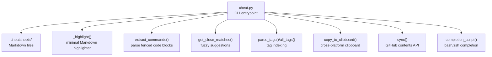
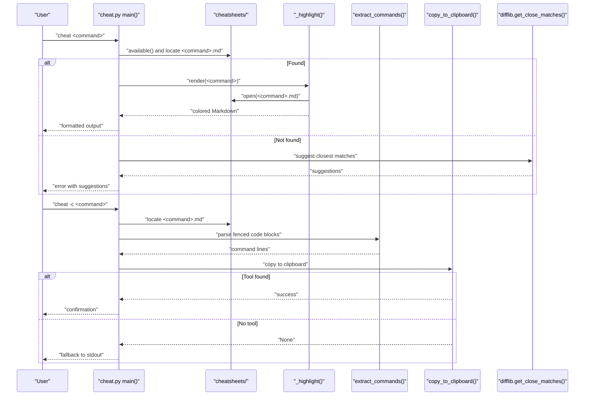
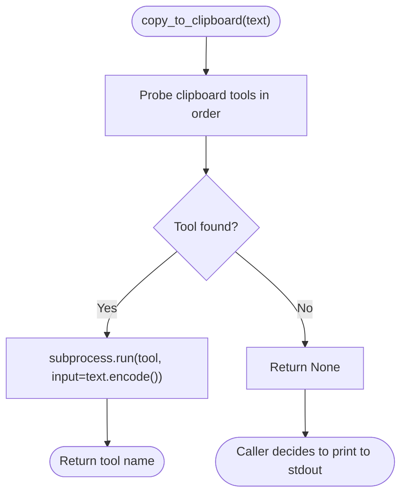
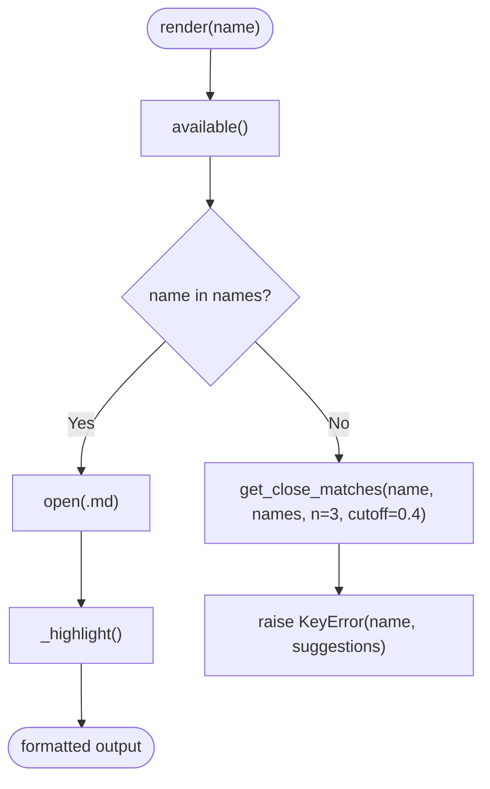
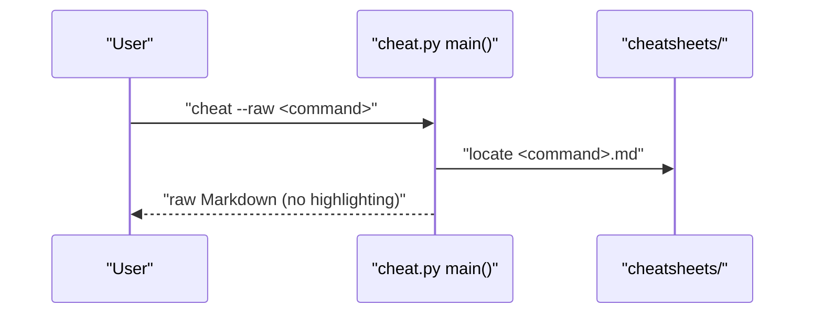
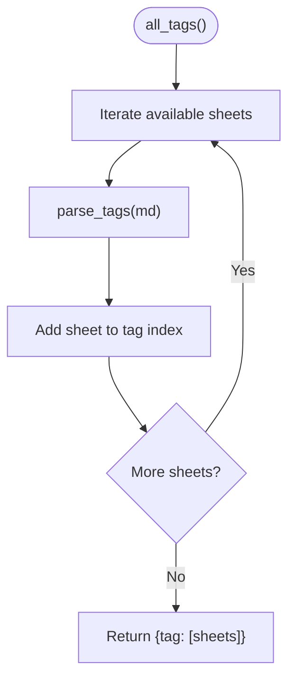
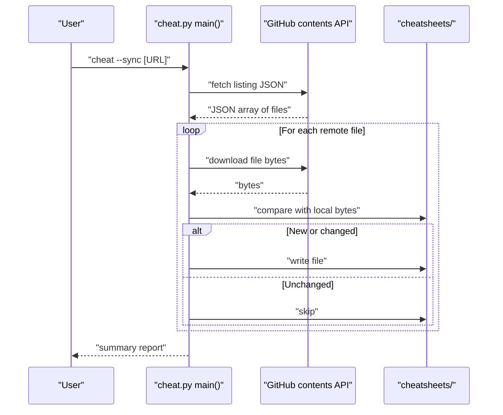
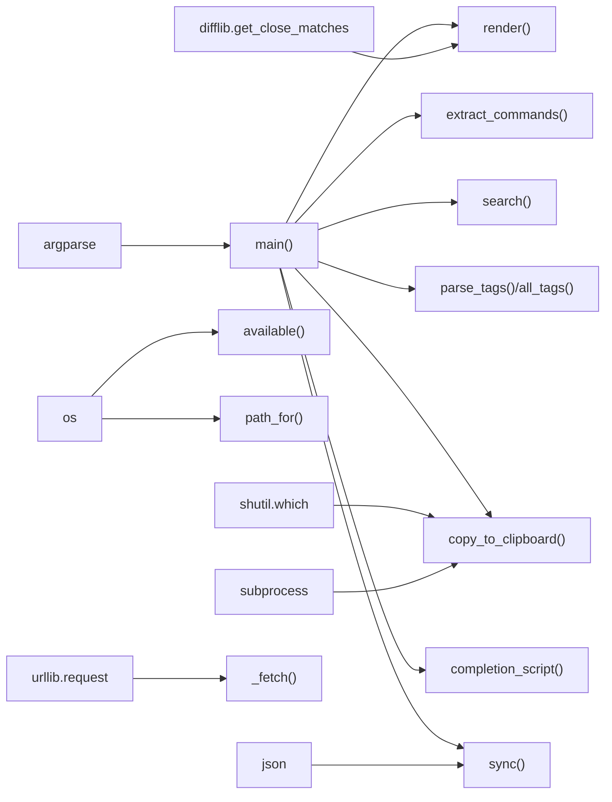

# Core Features

<cite>
**Referenced Files in This Document**
- [cheat.py](file://cheat.py)
- [README.md](file://README.md)
- [tests/test_cheat.py](file://tests/test_cheat.py)
- [cheatsheets/tar.md](file://cheatsheets/tar.md)
- [cheatsheets/git-rebase.md](file://cheatsheets/git-rebase.md)
- [cheatsheets/docker.md](file://cheatsheets/docker.md)
- [cheatsheets/kubectl.md](file://cheatsheets/kubectl.md)
- [cheatsheets/grep.md](file://cheatsheets/grep.md)
- [cheatsheets/find.md](file://cheatsheets/find.md)
- [cheatsheets/sed.md](file://cheatsheets/sed.md)
</cite>

## Table of Contents
1. [Introduction](#introduction)
2. [Project Structure](#project-structure)
3. [Core Components](#core-components)
4. [Architecture Overview](#architecture-overview)
5. [Detailed Component Analysis](#detailed-component-analysis)
6. [Dependency Analysis](#dependency-analysis)
7. [Performance Considerations](#performance-considerations)
8. [Troubleshooting Guide](#troubleshooting-guide)
9. [Conclusion](#conclusion)

## Introduction
This document focuses on the core features of the cheat CLI tool, emphasizing:
- Command lookup and discovery via the file-based cheatsheet system
- Example-first documentation using Markdown with fenced code blocks
- Clipboard integration with cross-platform support
- Fuzzy search and suggestion system for mistyped command names
- Raw output mode for piping and scripting
- Practical examples from real cheatsheets demonstrating Markdown formatting, command extraction, and presentation
- The relationship between filesystem organization and command discovery
- Performance characteristics and user experience benefits

## Project Structure
The cheat CLI tool is a single-file Python application with a companion directory of Markdown cheatsheets. The tool reads from a local directory of Markdown files and renders them with minimal highlighting. It supports:
- Listing available cheatsheets
- Searching by name or content
- Rendering formatted output
- Copying commands to the clipboard
- Printing raw Markdown for piping
- Tag-based filtering
- Shell completion scripts
- Syncing community cheatsheets from a GitHub repository

**Diagram sources**
- [cheat.py:43-49](file://cheat.py#L43-L49)
- [cheat.py:69-86](file://cheat.py#L69-L86)
- [cheat.py:134-145](file://cheat.py#L134-L145)
- [cheat.py:61-66](file://cheat.py#L61-L66)
- [cheat.py:103-122](file://cheat.py#L103-L122)
- [cheat.py:148-161](file://cheat.py#L148-L161)
- [cheat.py:212-289](file://cheat.py#L212-L289)
- [cheat.py:177-198](file://cheat.py#L177-L198)

**Section sources**
- [cheat.py:15-17](file://cheat.py#L15-L17)
- [cheat.py:29](file://cheat.py#L29)
- [README.md:23-34](file://README.md#L23-L34)

## Core Components
- Command lookup and discovery: The tool enumerates Markdown files in the cheatsheets directory and exposes their basenames (without .md) as lookup keys. See [available():43-49](file://cheat.py#L43-L49).
- Rendering engine: A minimal Markdown highlighter converts headings, code blocks, and blockquotes into colored terminal output. See [_highlight():69-86](file://cheat.py#L69-L86).
- Command extraction: Commands are extracted from fenced code blocks for clipboard operations. See [extract_commands():134-145](file://cheat.py#L134-L145).
- Fuzzy search and suggestions: When a command is not found, the tool suggests the closest matches using difflib. See [render():61-66](file://cheat.py#L61-L66) and [search():89-100](file://cheat.py#L89-L100).
- Tagging system: Tags are parsed from HTML-style comments and indexed for filtering. See [parse_tags():103-112](file://cheat.py#L103-L112) and [all_tags():115-122](file://cheat.py#L115-L122).
- Clipboard integration: Cross-platform clipboard tools are detected and used; falls back to stdout if none are found. See [copy_to_clipboard():148-161](file://cheat.py#L148-L161).
- Raw output mode: Prints unformatted Markdown for piping into other tools. See [main():368-377](file://cheat.py#L368-L377).
- Community sync: Downloads and updates cheatsheets from a GitHub contents API. See [sync():212-289](file://cheat.py#L212-L289).
- Shell completion: Generates bash/zsh completion scripts. See [completion_script():177-198](file://cheat.py#L177-L198).

**Section sources**
- [cheat.py:43-49](file://cheat.py#L43-L49)
- [cheat.py:69-86](file://cheat.py#L69-L86)
- [cheat.py:134-145](file://cheat.py#L134-L145)
- [cheat.py:61-66](file://cheat.py#L61-L66)
- [cheat.py:89-100](file://cheat.py#L89-L100)
- [cheat.py:103-122](file://cheat.py#L103-L122)
- [cheat.py:148-161](file://cheat.py#L148-L161)
- [cheat.py:368-377](file://cheat.py#L368-L377)
- [cheat.py:212-289](file://cheat.py#L212-L289)
- [cheat.py:177-198](file://cheat.py#L177-L198)

## Architecture Overview
The CLI orchestrates argument parsing, delegates to feature-specific functions, and handles errors with helpful suggestions. The filesystem organizes commands as Markdown files, enabling straightforward discovery and extensibility.

**Diagram sources**
- [cheat.py:292-411](file://cheat.py#L292-L411)
- [cheat.py:43-49](file://cheat.py#L43-L49)
- [cheat.py:69-86](file://cheat.py#L69-L86)
- [cheat.py:134-145](file://cheat.py#L134-L145)
- [cheat.py:148-161](file://cheat.py#L148-L161)
- [cheat.py:61-66](file://cheat.py#L61-L66)

## Detailed Component Analysis

### Command Lookup and File-Based Cheatsheet System
- Discovery: The tool lists all .md files in the cheatsheets directory and exposes their basenames as commands. Filenames become lookup keys; no registration or configuration is required.
- Presentation: Markdown is highlighted minimally—headings, code blocks, and blockquotes—with colorized output when stdout is a TTY.
- Relationship to filesystem: The cheatsheets directory mirrors the command taxonomy. Adding a new Markdown file immediately exposes a new command.

Practical examples from actual cheatsheets:
- tar: Demonstrates multiple sections with fenced code blocks and a mnemonic note. See [cheatsheets/tar.md:1-31](file://cheatsheets/tar.md#L1-L31).
- git-rebase: Shows basic, interactive, and conflict-handling workflows with fenced code blocks. See [cheatsheets/git-rebase.md:1-33](file://cheetsheets/git-rebase.md#L1-L33).
- docker: Covers containers, images, compose, and cleanup with fenced code blocks. See [cheatsheets/docker.md:1-43](file://cheatsheets/docker.md#L1-L43).
- kubectl: Provides cluster info, pods, deployments, services, and cleanup with fenced code blocks. See [cheatsheets/kubectl.md:1-58](file://cheatsheets/kubectl.md#L1-L58).

**Section sources**
- [cheat.py:43-49](file://cheat.py#L43-L49)
- [cheat.py:69-86](file://cheat.py#L69-L86)
- [cheatsheets/tar.md:1-31](file://cheatsheets/tar.md#L1-L31)
- [cheatsheets/git-rebase.md:1-33](file://cheatsheets/git-rebase.md#L1-L33)
- [cheatsheets/docker.md:1-43](file://cheatsheets/docker.md#L1-L43)
- [cheatsheets/kubectl.md:1-58](file://cheatsheets/kubectl.md#L1-L58)

### Example-First Documentation with Markdown Formatting
- Headings: Used to organize sections (e.g., “Create archives”, “Basic rebase”).
- Fenced code blocks: Contain commands and are extracted for clipboard operations.
- Blockquotes: Provide tips and mnemonics.
- Tags: Embedded as HTML-style comments for categorization.

Examples:
- grep: Demonstrates basic search, recursive search, context, invert/count/quiet, and pipe combinations. See [cheatsheets/grep.md:1-43](file://cheatsheets/grep.md#L1-L43).
- find: Shows name/type/size/time filters and actions like delete/exec. See [cheatsheets/find.md:1-34](file://cheatsheets/find.md#L1-L34).
- sed: Illustrates substitution, in-place editing, deletion, printing, and transformations. See [cheatsheets/sed.md:1-43](file://cheatsheets/sed.md#L1-L43).

**Section sources**
- [cheat.py:69-86](file://cheat.py#L69-L86)
- [cheatsheets/grep.md:1-43](file://cheatsheets/grep.md#L1-L43)
- [cheatsheets/find.md:1-34](file://cheatsheets/find.md#L1-L34)
- [cheatsheets/sed.md:1-43](file://cheatsheets/sed.md#L1-L43)

### Clipboard Integration and Cross-Platform Support
- Detection: The tool probes for platform-appropriate clipboard tools in order of preference.
- Platforms:
  - macOS: pbcopy
  - Linux Wayland: wl-copy
  - Linux X11: xclip or xsel
  - Windows: clip
- Behavior: If a tool is found, the extracted commands are piped to it; otherwise, the commands are printed to stdout and an error is emitted.

**Diagram sources**
- [cheat.py:125-131](file://cheat.py#L125-L131)
- [cheat.py:148-161](file://cheat.py#L148-L161)

**Section sources**
- [cheat.py:125-131](file://cheat.py#L125-L131)
- [cheat.py:148-161](file://cheat.py#L148-L161)
- [README.md:36-38](file://README.md#L36-L38)

### Fuzzy Search and Suggestion System
- Mechanism: When a command is not found, the tool computes close matches among available cheatsheet names using difflib with a configurable cutoff and top-N selection.
- UX: On failure, the tool prints an error and suggests alternatives, guiding users to the intended command.

**Diagram sources**
- [cheat.py:43-49](file://cheat.py#L43-L49)
- [cheat.py:61-66](file://cheat.py#L61-L66)
- [cheat.py:69-86](file://cheat.py#L69-L86)

**Section sources**
- [cheat.py:61-66](file://cheat.py#L61-L66)
- [cheat.py:89-100](file://cheat.py#L89-L100)
- [README.md:40-46](file://README.md#L40-L46)

### Raw Output Mode for Piping and Scripting
- Purpose: Print the raw Markdown of a cheatsheet without terminal highlighting, enabling downstream processing with other tools.
- Usage: The --raw flag bypasses rendering and prints the file contents directly.

**Diagram sources**
- [cheat.py:368-377](file://cheat.py#L368-L377)
- [cheat.py:164-174](file://cheat.py#L164-L174)

**Section sources**
- [cheat.py:368-377](file://cheat.py#L368-L377)
- [tests/test_cheat.py:351-357](file://tests/test_cheat.py#L351-L357)

### Tagging System and Filtering
- Parsing: Tags are extracted from HTML-style comments in the form “<!-- tags: ... -->”.
- Indexing: A dictionary maps each tag to the list of cheatsheets that declare it.
- Filtering: Users can list all tags or filter by a specific tag.

**Diagram sources**
- [cheat.py:115-122](file://cheat.py#L115-L122)
- [cheat.py:103-112](file://cheat.py#L103-L112)

**Section sources**
- [cheat.py:103-112](file://cheat.py#L103-L112)
- [cheat.py:115-122](file://cheat.py#L115-L122)
- [tests/test_cheat.py:265-282](file://tests/test_cheat.py#L265-L282)
- [tests/test_cheat.py:290-308](file://tests/test_cheat.py#L290-L308)

### Community Sync from GitHub
- Purpose: Pull the latest community cheatsheets into the local cheatsheets directory.
- Behavior: Compares remote files to local content byte-for-byte; adds or updates only when necessary.
- Output: Reports counts and names of added, updated, and unchanged files.

**Diagram sources**
- [cheat.py:212-289](file://cheat.py#L212-L289)
- [cheat.py:201-209](file://cheat.py#L201-L209)

**Section sources**
- [cheat.py:212-289](file://cheat.py#L212-L289)
- [README.md:83-97](file://README.md#L83-L97)

### Shell Completion Scripts
- Generation: Bash and zsh completion scripts are generated dynamically, sourcing the list of available cheatsheets.
- Integration: Users can append the bash script to their shell profile or eval the zsh script.

**Section sources**
- [cheat.py:177-198](file://cheat.py#L177-L198)
- [README.md:69-81](file://README.md#L69-L81)

## Dependency Analysis
The CLI’s core functions depend on:
- Standard library modules for argument parsing, subprocess, OS operations, and HTTP requests
- difflib for fuzzy suggestions
- Local filesystem for cheatsheet discovery and reading
- Optional external tools for clipboard operations

**Diagram sources**
- [cheat.py:20-27](file://cheat.py#L20-L27)
- [cheat.py:292-411](file://cheat.py#L292-L411)
- [cheat.py:43-49](file://cheat.py#L43-L49)
- [cheat.py:125-131](file://cheat.py#L125-L131)
- [cheat.py:201-209](file://cheat.py#L201-L209)
- [cheat.py:103-122](file://cheat.py#L103-L122)
- [cheat.py:212-289](file://cheat.py#L212-L289)
- [cheat.py:177-198](file://cheat.py#L177-L198)

**Section sources**
- [cheat.py:20-27](file://cheat.py#L20-L27)
- [cheat.py:292-411](file://cheat.py#L292-L411)

## Performance Considerations
- Filesystem scanning: Listing and filtering .md files is O(n) with n equal to the number of cheatsheets. This remains fast for typical collections.
- Rendering: Minimal highlighting scans lines once; complexity is linear in the size of the Markdown file.
- Command extraction: Single-pass parsing of fenced code blocks; linear in file size.
- Fuzzy suggestions: get_close_matches performs a ratio comparison against all available names; cost scales with the number of cheatsheets.
- Network sync: Byte-wise comparison avoids unnecessary writes; only changed files are updated.
- Terminal output: Colorization is disabled when stdout is not a TTY, reducing overhead.

User experience benefits:
- Instant availability of commands without network latency
- Immediate feedback with suggestions for typos
- Seamless clipboard integration across platforms
- Raw output enables efficient scripting and piping

[No sources needed since this section provides general guidance]

## Troubleshooting Guide
Common issues and resolutions:
- Unknown command: The tool raises an error and suggests the closest matches. See [render():61-66](file://cheat.py#L61-L66) and [tests/test_cheat.py:24-33](file://tests/test_cheat.py#L24-L33).
- No commands found in a sheet: When copying, if no fenced code blocks are present, the tool reports an error. See [main():379-401](file://cheat.py#L379-L401) and [tests/test_cheat.py:379-381](file://tests/test_cheat.py#L379-L381).
- No clipboard tool available: The tool falls back to printing commands to stdout and emits a diagnostic. See [copy_to_clipboard():148-161](file://cheat.py#L148-L161) and [tests/test_cheat.py:120-127](file://tests/test_cheat.py#L120-L127).
- Sync failures: Network or JSON errors are reported with a human-readable message. See [sync():212-289](file://cheat.py#L212-L289) and [tests/test_cheat.py:249-263](file://tests/test_cheat.py#L249-L263).

**Section sources**
- [cheat.py:61-66](file://cheat.py#L61-L66)
- [cheat.py:379-401](file://cheat.py#L379-L401)
- [cheat.py:148-161](file://cheat.py#L148-L161)
- [cheat.py:212-289](file://cheat.py#L212-L289)
- [tests/test_cheat.py:24-33](file://tests/test_cheat.py#L24-L33)
- [tests/test_cheat.py:120-127](file://tests/test_cheat.py#L120-L127)
- [tests/test_cheat.py:249-263](file://tests/test_cheat.py#L249-L263)

## Conclusion
The cheat CLI tool delivers a streamlined, example-first experience for discovering and using command-line utilities. Its file-based cheatsheet system, minimal rendering, fuzzy suggestions, cross-platform clipboard integration, raw output mode, tagging, and community sync collectively provide a fast, reliable, and extensible solution for offline command reference and automation.

[No sources needed since this section summarizes without analyzing specific files]