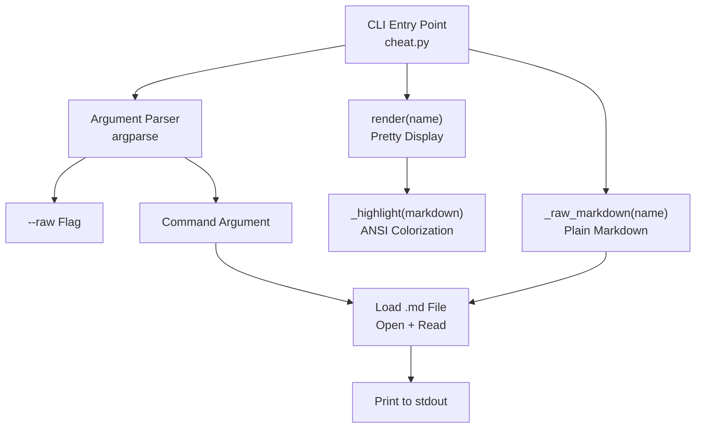
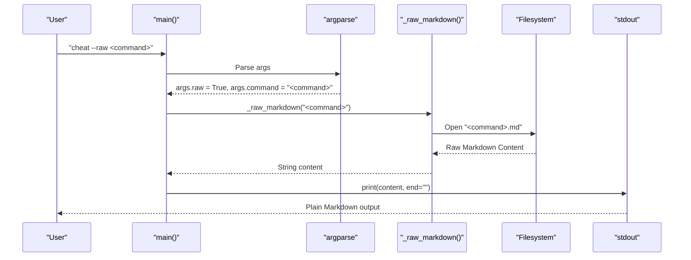
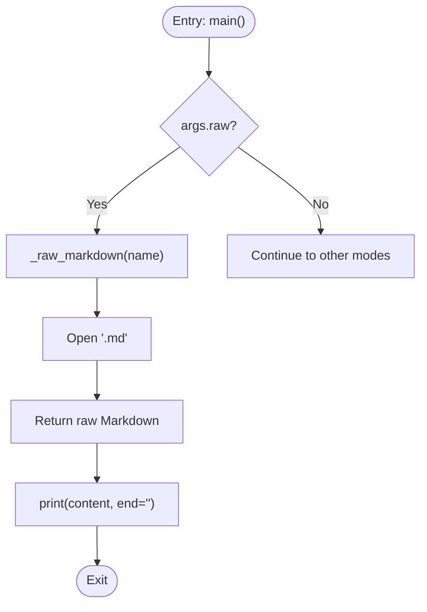

# Raw Output Mode

<cite>
**Referenced Files in This Document**
- [cheat.py](file://cheat.py)
- [README.md](file://README.md)
- [tests/test_cheat.py](file://tests/test_cheat.py)
- [cheatsheets/awk.md](file://cheatsheets/awk.md)
- [cheatsheets/curl.md](file://cheatsheets/curl.md)
- [cheatsheets/docker.md](file://cheatsheets/docker.md)
- [cheatsheets/find.md](file://cheatsheets/find.md)
- [cheatsheets/grep.md](file://cheatsheets/grep.md)
- [cheatsheets/sed.md](file://cheatsheets/sed.md)
</cite>

## Table of Contents
1. [Introduction](#introduction)
2. [Project Structure](#project-structure)
3. [Core Components](#core-components)
4. [Architecture Overview](#architecture-overview)
5. [Detailed Component Analysis](#detailed-component-analysis)
6. [Dependency Analysis](#dependency-analysis)
7. [Performance Considerations](#performance-considerations)
8. [Troubleshooting Guide](#troubleshooting-guide)
9. [Conclusion](#conclusion)

## Introduction
This document explains the raw output mode for piping and scripting workflows. The raw mode is enabled by the --raw flag and prints the original Markdown content of a cheatsheet without any terminal highlighting or colorization. This makes it ideal for shell scripting, automation, and integration with other command-line tools that expect plain text.

## Project Structure
The project consists of a single Python script that serves as both the CLI and the runtime engine, plus a directory of Markdown cheatsheets. The raw output mode is implemented within the CLI entry point and relies on the same cheatsheet loading mechanism used by the regular display mode.

**Diagram sources**
- [cheat.py:292-411](file://cheat.py#L292-L411)
- [cheat.py:56-67](file://cheat.py#L56-L67)
- [cheat.py:164-174](file://cheat.py#L164-L174)
- [cheat.py:69-86](file://cheat.py#L69-L86)

**Section sources**
- [cheat.py:1-17](file://cheat.py#L1-L17)
- [cheat.py:292-411](file://cheat.py#L292-L411)

## Core Components
- Raw output mode: Implemented by the --raw flag in the argument parser and the _raw_markdown() function. It bypasses the pretty-printing pipeline and prints the raw Markdown content directly.
- Pretty display mode: Implemented by render() and _highlight(). It applies ANSI colorization to headings, code blocks, and blockquotes.
- Cheatsheet loader: Both modes use the same file loading mechanism to read Markdown content from the cheatsheets/ directory.

Key differences:
- Raw mode: Prints the exact Markdown content as stored in the .md files.
- Pretty mode: Applies color and formatting to headings, code, and blockquotes.

**Section sources**
- [cheat.py:292-411](file://cheat.py#L292-L411)
- [cheat.py:56-67](file://cheat.py#L56-L67)
- [cheat.py:164-174](file://cheat.py#L164-L174)
- [cheat.py:69-86](file://cheat.py#L69-L86)

## Architecture Overview
The raw output mode sits alongside the existing display modes in the CLI. When --raw is present, the main() function routes directly to _raw_markdown() and prints the result without invoking the pretty-printing pipeline.

**Diagram sources**
- [cheat.py:292-411](file://cheat.py#L292-L411)
- [cheat.py:164-174](file://cheat.py#L164-L174)

## Detailed Component Analysis

### Raw Output Implementation
The raw output mode is implemented through a dedicated function that reads the Markdown file directly and prints it without any transformations.

**Diagram sources**
- [cheat.py:368-377](file://cheat.py#L368-L377)
- [cheat.py:164-174](file://cheat.py#L164-L174)

Key implementation details:
- The --raw flag is defined in the argument parser with a descriptive help message indicating it prints raw Markdown without highlighting.
- _raw_markdown() performs the same availability checks as render() but returns the file content verbatim.
- The function raises the same KeyError exceptions with suggestions for unknown commands.

Practical differences from pretty mode:
- No ANSI colorization is applied.
- No additional formatting is added to headings, code blocks, or blockquotes.
- The output preserves the exact Markdown syntax including code fences, headers, and blockquotes.

**Section sources**
- [cheat.py:292-411](file://cheat.py#L292-L411)
- [cheat.py:164-174](file://cheat.py#L164-L174)

### Comparison: Raw vs Pretty Display
To illustrate the difference, compare the output of a typical cheatsheet in both modes:

- Pretty mode highlights headings in bold yellow, code lines in cyan, and blockquotes in dim text.
- Raw mode prints the exact Markdown content with no colorization.

Examples from actual cheatsheets:
- awk.md contains headings, code blocks, and a blockquote. In raw mode, all Markdown syntax is preserved.
- curl.md demonstrates headers, code blocks, and a blockquote. In raw mode, the original Markdown structure remains intact.
- docker.md shows multiple sections with code blocks and a summary blockquote. Raw mode preserves all structural elements.

Benefits for developers:
- Enables programmatic processing of cheatsheet content.
- Allows integration with external tools that expect plain Markdown.
- Supports shell scripting workflows where colored output would interfere with parsing.

**Section sources**
- [cheatsheets/awk.md:1-47](file://cheatsheets/awk.md#L1-L47)
- [cheatsheets/curl.md:1-50](file://cheatsheets/curl.md#L1-L50)
- [cheatsheets/docker.md:1-43](file://cheatsheets/docker.md#L1-L43)

### Use Cases and Scripting Patterns
Common scenarios where raw output is beneficial:

1. Extracting commands for automation:
   - Pipe raw content to grep or sed to filter specific commands.
   - Use awk to parse and transform command examples.

2. Integration with external tools:
   - Feed raw Markdown to documentation generators.
   - Pass content to editors or processors that require plain text.

3. Shell scripting:
   - Store raw output in variables for later processing.
   - Combine with other CLI tools using standard Unix pipes.

Example patterns (conceptual):
- Extract commands from a cheatsheet and copy them to the clipboard.
- Filter commands by category or tag using external tools.
- Convert raw Markdown to HTML or other formats downstream.

These patterns leverage the fact that raw output preserves the original Markdown structure, making it suitable for downstream processing.

**Section sources**
- [README.md:23-34](file://README.md#L23-L34)
- [tests/test_cheat.py:351-364](file://tests/test_cheat.py#L351-L364)

### Testing Coverage
The test suite validates raw output behavior:
- Ensures raw mode returns zero exit code on success.
- Confirms that raw output contains Markdown markers like code fences and headers.
- Verifies error handling for unknown commands mirrors the behavior of other modes.

This testing confirms that raw output behaves consistently with the rest of the CLI and maintains the expected interface for scripting workflows.

**Section sources**
- [tests/test_cheat.py:351-364](file://tests/test_cheat.py#L351-L364)

## Dependency Analysis
The raw output mode depends on:
- Argument parser for detecting the --raw flag.
- Cheatsheet availability checking for consistent error handling.
- File system access for reading Markdown content.
- Standard output for printing results.

**Diagram sources**
- [cheat.py:292-411](file://cheat.py#L292-L411)
- [cheat.py:164-174](file://cheat.py#L164-L174)

**Section sources**
- [cheat.py:292-411](file://cheat.py#L292-L411)

## Performance Considerations
- Raw mode avoids the overhead of ANSI colorization and formatting, resulting in faster output for large cheatsheets.
- File I/O is straightforward and efficient, reading the entire content of the Markdown file.
- Memory usage scales linearly with the size of the cheatsheet content.

## Troubleshooting Guide
Common issues and resolutions:
- Unknown command: Both raw and pretty modes raise the same KeyError with suggestions for close matches.
- No cheatsheets found: The CLI prints a helpful message and exits with non-zero status.
- Terminal color interference: Use raw mode to disable colorization when piping to tools that cannot handle ANSI sequences.

Validation:
- Tests confirm that raw mode returns non-zero exit codes for invalid commands and prints appropriate error messages to stderr.

**Section sources**
- [cheat.py:368-377](file://cheat.py#L368-L377)
- [tests/test_cheat.py:359-364](file://tests/test_cheat.py#L359-L364)

## Conclusion
The raw output mode provides a clean, unformatted representation of cheatsheet content that is essential for scripting and automation workflows. By preserving the original Markdown structure and disabling terminal highlighting, it enables seamless integration with external tools and supports advanced processing patterns. The implementation is consistent with the rest of the CLI, maintaining the same error handling and availability checks while offering a specialized output format for developers who need programmatic access to cheatsheet content.