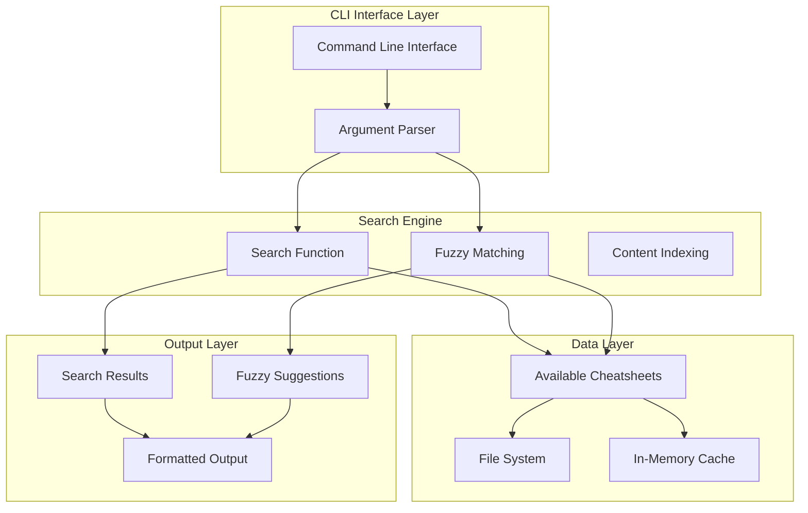
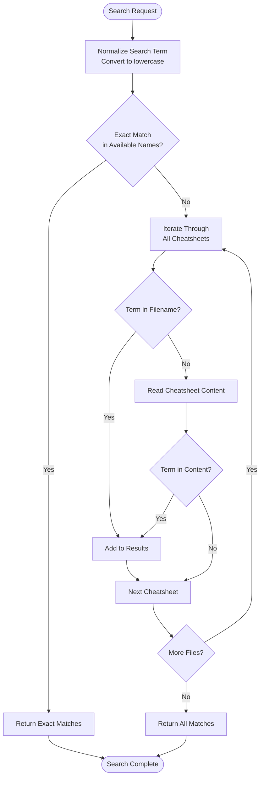
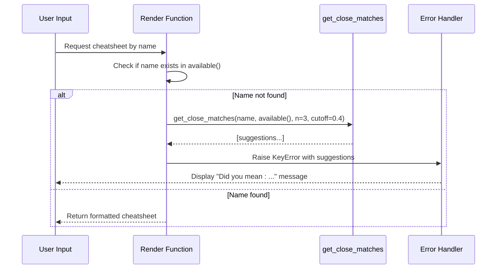
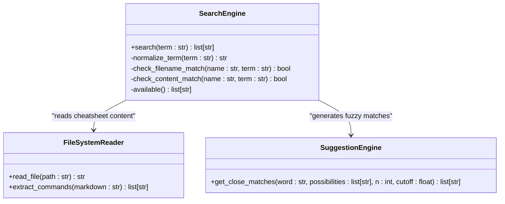
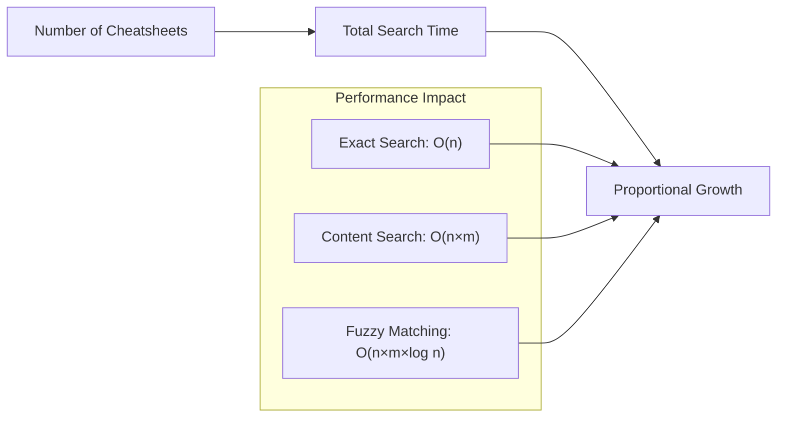

# Search and Suggestions

<cite>
**Referenced Files in This Document**
- [cheat.py](file://cheat.py)
- [README.md](file://README.md)
- [tests/test_cheat.py](file://tests/test_cheat.py)
- [cheatsheets/git-rebase.md](file://cheatsheets/git-rebase.md)
- [cheatsheets/tar.md](file://cheatsheets/tar.md)
- [cheatsheets/ssh.md](file://cheatsheets/ssh.md)
- [cheatsheets/grep.md](file://cheatsheets/grep.md)
</cite>

## Table of Contents
1. [Introduction](#introduction)
2. [System Architecture](#system-architecture)
3. [Search Functionality](#search-functionality)
4. [Fuzzy Suggestion System](#fuzzy-suggestion-system)
5. [Implementation Details](#implementation-details)
6. [Performance Analysis](#performance-analysis)
7. [Usage Examples](#usage-examples)
8. [Troubleshooting Guide](#troubleshooting-guide)
9. [Conclusion](#conclusion)

## Introduction

The search and fuzzy suggestion system in this cheatsheet application provides intelligent discovery capabilities for command-line utilities. The system enables users to find cheatsheets through exact command name matching, content-based searching, and intelligent fuzzy suggestions when commands are misspelled.

The application maintains a collection of command cheatsheets stored as Markdown files in the `cheatsheets/` directory. Each file's filename (without the `.md` extension) serves as the command identifier, allowing for straightforward lookup and discovery mechanisms.

## System Architecture

The search system consists of several interconnected components that work together to provide seamless command discovery:



**Diagram sources**
- [cheat.py:89-101](file://cheat.py#L89-L101)
- [cheat.py:61-66](file://cheat.py#L61-L66)
- [cheat.py:43-49](file://cheat.py#L43-L49)

The architecture follows a layered approach where the CLI interface handles user input, the search engine processes queries, and the data layer manages cheatsheet storage and retrieval.

**Section sources**
- [cheat.py:292-411](file://cheat.py#L292-L411)

## Search Functionality

The search functionality operates through a dual-mechanism approach that searches both command names and cheatsheet content:

### Exact Command Name Search

The system first checks if the requested command exists in the available cheatsheets list. This provides instant lookup for correctly spelled commands.

### Content-Based Search

When exact matches aren't found, the system performs content-based searching through the cheatsheet bodies. This allows users to discover commands by searching for keywords, phrases, or concepts described in the cheatsheets.

### Implementation Pattern



**Diagram sources**
- [cheat.py:89-101](file://cheat.py#L89-L101)

**Section sources**
- [cheat.py:89-101](file://cheat.py#L89-L101)
- [cheat.py:43-49](file://cheat.py#L43-L49)

## Fuzzy Suggestion System

The fuzzy suggestion system provides intelligent misspelling correction using Python's `difflib.get_close_matches` function. This system helps users recover from typos while maintaining the system's responsiveness.

### Fuzzy Matching Algorithm

The system employs `difflib.get_close_matches` with configurable parameters:

- **n=3**: Returns up to 3 closest matches
- **cutoff=0.4**: Minimum similarity threshold (0.0 to 1.0)
- **Is Case-Sensitive**: The algorithm considers case differences

### Suggestion Generation Process



**Diagram sources**
- [cheat.py:61-66](file://cheat.py#L61-L66)
- [cheat.py:169-174](file://cheat.py#L169-L174)

### Similarity Threshold Configuration

The cutoff parameter of 0.4 provides a balanced approach:
- **Higher values (0.6-0.8)**: More precise matches, fewer false positives
- **Lower values (0.2-0.4)**: More flexible matching, potential for more suggestions
- **Default (0.4)**: Good balance between precision and helpfulness

**Section sources**
- [cheat.py:63](file://cheat.py#L63)
- [cheat.py:171](file://cheat.py#L171)

## Implementation Details

### Core Search Functions

The search system implements several key functions that handle different aspects of the search and suggestion process:

#### Search Function (`search`)
The primary search function that implements the dual-search mechanism:



**Diagram sources**
- [cheat.py:89-101](file://cheat.py#L89-L101)
- [cheat.py:134-145](file://cheat.py#L134-L145)

#### Fuzzy Matching Functions (`render`, `_raw_markdown`)
Both rendering functions implement the same fuzzy suggestion pattern:

**Section sources**
- [cheat.py:89-101](file://cheat.py#L89-L101)
- [cheat.py:56-66](file://cheat.py#L56-L66)
- [cheat.py:164-174](file://cheat.py#L164-L174)

### Data Structure Management

The system maintains cheatsheets in a structured format:

| File Type | Purpose | Example |
|-----------|---------|---------|
| `.md` files | Command cheatsheets | `git-rebase.md`, `tar.md` |
| Directory | Storage location | `cheatsheets/` |
| Filenames | Command identifiers | `filename.md` → command name |

**Section sources**
- [cheat.py:29](file://cheat.py#L29)
- [cheat.py:52-53](file://cheat.py#L52-L53)

## Performance Analysis

### Time Complexity Analysis

The search system exhibits different performance characteristics depending on the operation:

#### Exact Name Search
- **Time Complexity**: O(n) where n = number of available cheatsheets
- **Space Complexity**: O(1)
- **Operation**: Linear scan through available names

#### Content Search
- **Time Complexity**: O(n × m) where n = number of cheatsheets, m = average content length
- **Space Complexity**: O(k) where k = number of matches found
- **Operation**: Full content scanning for each cheatsheet

#### Fuzzy Matching
- **Time Complexity**: O(n × m × log n) where n = number of possibilities, m = average string length
- **Space Complexity**: O(k) where k = number of suggestions
- **Operation**: Dynamic programming comparison for each possibility

### Scalability Characteristics

The system demonstrates linear scalability with the number of cheatsheets:



**Diagram sources**
- [cheat.py:89-101](file://cheat.py#L89-L101)

### Optimization Strategies

Several optimization opportunities exist for large-scale deployments:

1. **Index Creation**: Pre-build searchable indexes for faster lookups
2. **Caching**: Cache frequently accessed cheatsheets in memory
3. **Parallel Processing**: Utilize multiprocessing for content scanning
4. **Incremental Updates**: Track file system changes to avoid full rescans

**Section sources**
- [cheat.py:89-101](file://cheat.py#L89-L101)

## Usage Examples

### Exact Command Lookup

When users provide correctly spelled command names, the system performs immediate lookup:

**Example Commands:**
- `python3 cheat.py tar` → Returns tar cheatsheet
- `python3 cheat.py git-rebase` → Returns git-rebase cheatsheet

**Expected Behavior:**
- Instant response time
- No fuzzy suggestions generated
- Direct cheatsheet rendering

### Content-Based Search

Users can search for commands by keywords found in cheatsheet content:

**Example Commands:**
- `python3 cheat.py --search tunnel` → Returns ssh cheatsheet (contains "tunnel" examples)
- `python3 cheat.py --search compression` → Returns tar cheatsheet (contains compression examples)

**Expected Behavior:**
- Searches both filename and content
- Case-insensitive matching
- Returns all matching cheatsheets

### Fuzzy Suggestion Examples

When users mistype command names, the system provides intelligent suggestions:

**Example Scenarios:**

1. **Typo Recovery:**
   ```
   $ python3 cheat.py gti-rebase
   No cheatsheet for 'gti-rebase'.
   Did you mean: git-rebase?
   ```

2. **Multiple Suggestions:**
   ```
   $ python3 cheat.py tarr
   No cheatsheet for 'tarr'.
   Did you mean: tar, tar-gz, or tar.bz2?
   ```

3. **No Suggestions:**
   ```
   $ python3 cheat.py xyz123
   No cheatsheet for 'xyz123'.
   ```

**Section sources**
- [README.md:40-46](file://README.md#L40-L46)
- [tests/test_cheat.py:24-33](file://tests/test_cheat.py#L24-L33)
- [tests/test_cheat.py:35-39](file://tests/test_cheat.py#L35-L39)

## Troubleshooting Guide

### Common Issues and Solutions

#### Issue: No Cheatsheets Found
**Symptoms:** Empty search results or "No cheatsheets found" messages
**Causes:**
- Empty `cheatsheets/` directory
- Incorrect file permissions
- Missing `.md` extensions

**Solutions:**
1. Verify cheatsheet files exist in `cheatsheets/` directory
2. Check file permissions for read access
3. Ensure files have `.md` extensions

#### Issue: Fuzzy Suggestions Not Appearing
**Symptoms:** Direct error messages without suggestions
**Causes:**
- Very low similarity scores below cutoff threshold
- No close matches found
- Extremely misspelled commands

**Solutions:**
1. Try alternative spellings
2. Use content-based search with `--search` flag
3. Check spelling against available cheatsheet names

#### Issue: Slow Search Performance
**Symptoms:** Delays when searching or loading cheatsheets
**Causes:**
- Large number of cheatsheets
- Large cheatsheet content
- Slow file system access

**Solutions:**
1. Consider indexing strategies for large collections
2. Optimize cheatsheet content size
3. Use caching mechanisms

**Section sources**
- [cheat.py:356-362](file://cheat.py#L356-L362)
- [cheat.py:403-411](file://cheat.py#L403-L411)

### Debugging Tips

#### Verifying Search Results
Use the `--list` flag to verify available cheatsheets:
```bash
python3 cheat.py --list
```

#### Testing Fuzzy Matching
Test fuzzy suggestions with known typos:
```bash
python3 cheat.py tar-rbse  # Should suggest git-rebase
```

#### Content Search Validation
Verify content-based search works correctly:
```bash
python3 cheat.py --search compression  # Should find tar cheatsheet
```

**Section sources**
- [cheat.py:348-354](file://cheat.py#L348-L354)
- [cheat.py:356-362](file://cheat.py#L356-L362)

## Conclusion

The search and fuzzy suggestion system provides a robust foundation for command discovery in the cheatsheet application. The dual-search mechanism ensures both immediate access to correctly spelled commands and intelligent assistance for misspellings.

Key strengths of the system include:
- **Dual Search Capability**: Combines exact name matching with content-based searching
- **Intelligent Fuzzy Matching**: Provides helpful suggestions for misspelled commands
- **Configurable Thresholds**: Balances precision and helpfulness through adjustable parameters
- **Linear Scalability**: Maintains predictable performance characteristics

The system's design prioritizes user experience while maintaining simplicity and reliability. Future enhancements could include pre-built indexes, caching mechanisms, and parallel processing for improved performance at scale.