# Development Guide

<cite>
**Referenced Files in This Document**
- [cheat.py](file://cheat.py)
- [README.md](file://README.md)
- [tests/test_cheat.py](file://tests/test_cheat.py)
- [cheatsheets/tar.md](file://cheatsheets/tar.md)
- [cheatsheets/git-rebase.md](file://cheatsheets/git-rebase.md)
- [IDEAS.md](file://IDEAS.md)
- [ROADMAP.md](file://ROADMAP.md)
- [.gitignore](file://.gitignore)
</cite>

## Table of Contents
1. [Introduction](#introduction)
2. [Project Structure](#project-structure)
3. [Core Components](#core-components)
4. [Architecture Overview](#architecture-overview)
5. [Detailed Component Analysis](#detailed-component-analysis)
6. [Dependency Analysis](#dependency-analysis)
7. [Performance Considerations](#performance-considerations)
8. [Testing Strategy](#testing-strategy)
9. [Contribution Guidelines](#contribution-guidelines)
10. [Debugging and Maintenance](#debugging-and-maintenance)
11. [Troubleshooting Guide](#troubleshooting-guide)
12. [Conclusion](#conclusion)

## Introduction
This guide documents the development workflow for the cheat CLI tool, a zero-dependency, Python standard library–based command-line cheatsheet reader. It covers environment setup, testing with pytest, code quality standards, the file-based cheatsheet format, markdown parsing, data organization, testing strategy, contribution and release procedures, architectural decisions, extensibility points, debugging techniques, and maintenance practices.

## Project Structure
The repository is organized around a single CLI entry point, a directory of Markdown cheatsheets, and a focused test suite. The structure emphasizes simplicity and zero external dependencies.

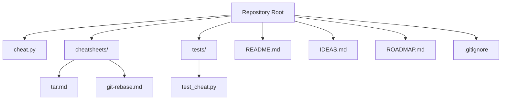

**Diagram sources**
- [cheat.py](file://cheat.py)
- [README.md](file://README.md)
- [tests/test_cheat.py](file://tests/test_cheat.py)
- [cheatsheets/tar.md](file://cheatsheets/tar.md)
- [cheatsheets/git-rebase.md](file://cheatsheets/git-rebase.md)
- [IDEAS.md](file://IDEAS.md)
- [ROADMAP.md](file://ROADMAP.md)
- [.gitignore](file://.gitignore)

**Section sources**
- [cheat.py](file://cheat.py)
- [README.md](file://README.md)
- [tests/test_cheat.py](file://tests/test_cheat.py)
- [cheatsheets/tar.md](file://cheatsheets/tar.md)
- [cheatsheets/git-rebase.md](file://cheatsheets/git-rebase.md)
- [IDEAS.md](file://IDEAS.md)
- [ROADMAP.md](file://ROADMAP.md)
- [.gitignore](file://.gitignore)

## Core Components
- CLI entrypoint and argument parsing: [cheat.py](file://cheat.py)
- Markdown cheatsheet directory: [cheatsheets/](file://cheatsheets/)
- Test suite: [tests/test_cheat.py](file://tests/test_cheat.py)
- Project documentation: [README.md](file://README.md), [IDEAS.md](file://IDEAS.md), [ROADMAP.md](file://ROADMAP.md)
- Version control ignores: [.gitignore](file://.gitignore)

Key responsibilities:
- CLI: parse arguments, route to features (render, search, copy, completion, sync, tags, list, raw).
- Markdown parsing: highlight headings, blockquotes, and code blocks; extract command lines from fenced code blocks.
- Data organization: flat cheatsheet directory keyed by filename (without .md).
- Testing: unit and integration tests for rendering, search, clipboard copy, completion scripts, sync, and tag parsing.

**Section sources**
- [cheat.py](file://cheat.py)
- [README.md](file://README.md)
- [tests/test_cheat.py](file://tests/test_cheat.py)

## Architecture Overview
The CLI is a single-file application leveraging Python’s standard library. It reads Markdown files from a local directory, applies lightweight syntax highlighting, and exposes commands for listing, searching, copying, tagging, completion, and syncing.

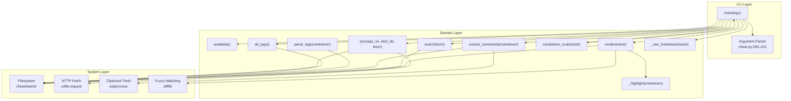

**Diagram sources**
- [cheat.py](file://cheat.py)

## Detailed Component Analysis

### CLI Argument Parsing and Routing
The CLI uses argparse to define subcommands and options. It routes to feature functions and handles errors with helpful messages and suggestions.

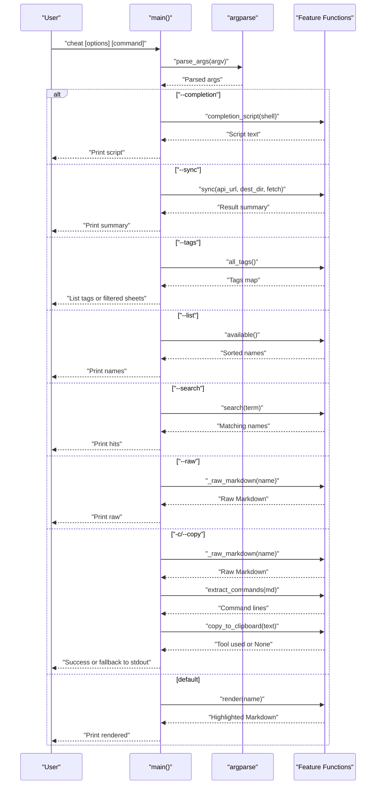

**Diagram sources**
- [cheat.py](file://cheat.py)

**Section sources**
- [cheat.py](file://cheat.py)

### Markdown Rendering and Highlighting
The renderer highlights headings, blockquotes, and code blocks. It preserves indentation and uses ANSI color codes conditionally.

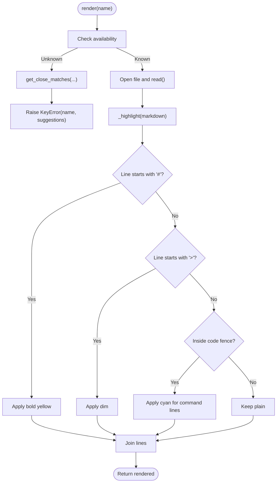

**Diagram sources**
- [cheat.py](file://cheat.py)

**Section sources**
- [cheat.py](file://cheat.py)

### Command Extraction and Clipboard Integration
Command extraction parses fenced code blocks and copies combined commands to the system clipboard using platform-specific tools.

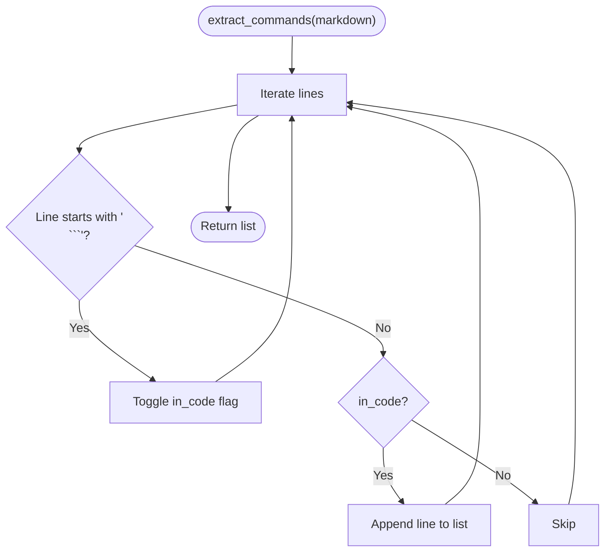

Clipboard tool selection prioritizes platform-specific tools and falls back to stdout when none are available.

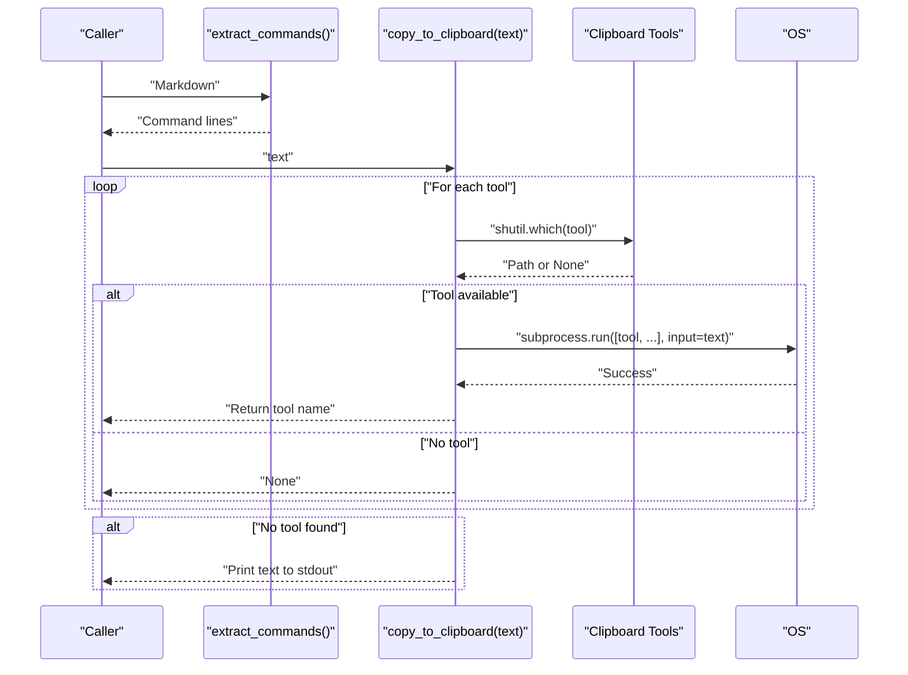

**Diagram sources**
- [cheat.py](file://cheat.py)

**Section sources**
- [cheat.py](file://cheat.py)

### Tag Parsing and Tag Indexing
Tags are parsed from comment lines and indexed by tag name to sheet names.

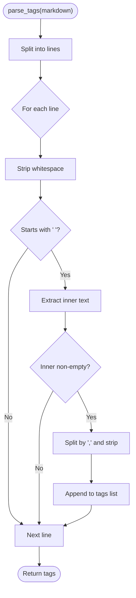

Tag indexing aggregates all tags across sheets.

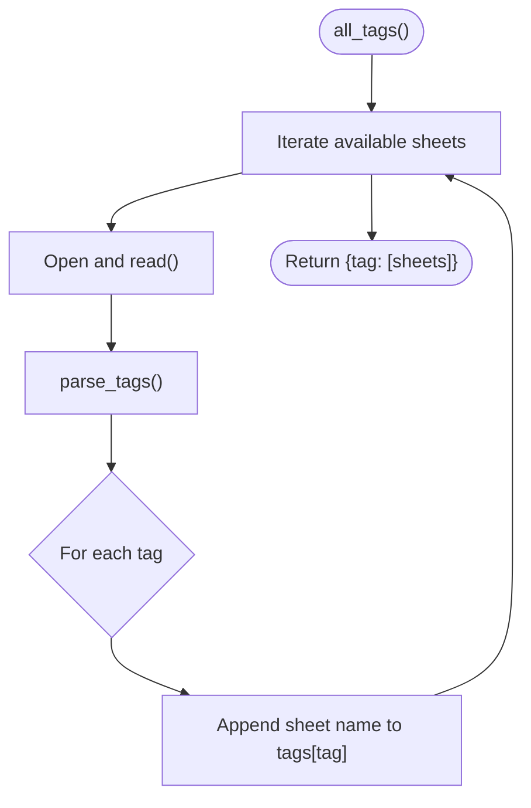

**Diagram sources**
- [cheat.py](file://cheat.py)

**Section sources**
- [cheat.py](file://cheat.py)

### Sync from Community Repository
The sync function fetches a GitHub contents listing, compares local vs remote content byte-for-byte, and writes changes only when needed.

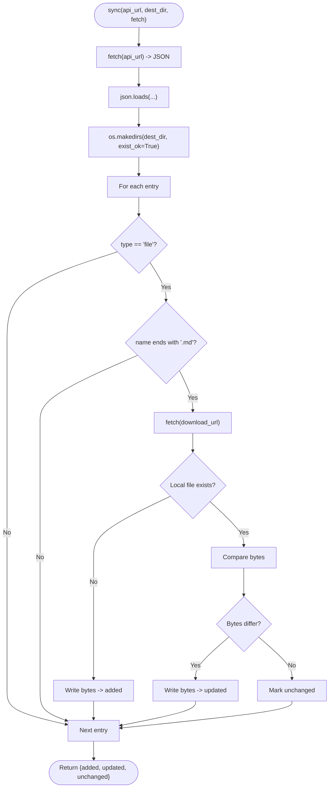

**Diagram sources**
- [cheat.py](file://cheat.py)

**Section sources**
- [cheat.py](file://cheat.py)

### File-Based Cheatsheet Format
Cheatsheets are plain Markdown files placed under the cheatsheets directory. The filename (without .md) becomes the lookup key. Tags are declared via comment lines.

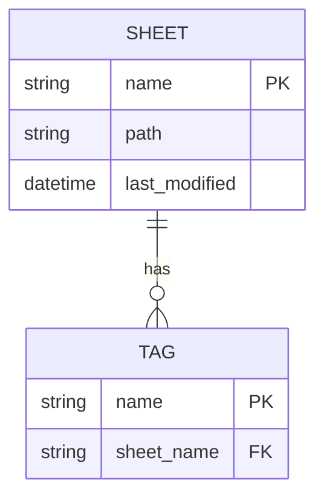

Principles:
- Filename without .md is the command name.
- Tags are declared with a comment line format and parsed into a normalized list.
- Code blocks are treated as executable commands for copy operations.

**Diagram sources**
- [cheat.py](file://cheat.py)
- [cheatsheets/tar.md](file://cheatsheets/tar.md)
- [cheatsheets/git-rebase.md](file://cheatsheets/git-rebase.md)

**Section sources**
- [cheat.py](file://cheat.py)
- [cheatsheets/tar.md](file://cheatsheets/tar.md)
- [cheatsheets/git-rebase.md](file://cheatsheets/git-rebase.md)

## Dependency Analysis
The project relies solely on Python standard library modules. External dependencies are intentionally avoided to ensure portability and ease of installation.

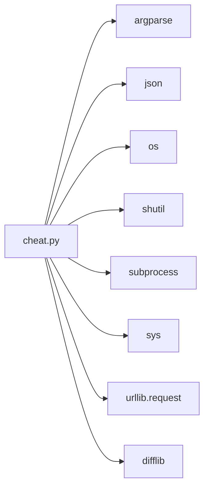

**Diagram sources**
- [cheat.py](file://cheat.py)

**Section sources**
- [cheat.py](file://cheat.py)

## Performance Considerations
- File I/O: Reading all available sheets and iterating through each file during search and tag indexing is linear in the number of sheets. For typical repositories with dozens of sheets, performance is negligible.
- Network I/O: Sync uses a fixed timeout and minimal payload; bandwidth is bounded by the number of files and their sizes.
- CPU: Highlighting and tag parsing are simple string operations; complexity is linear in the number of lines.
- Memory: Entire files are loaded into memory for rendering and search; this is acceptable given the modest size of cheatsheets.

Optimization opportunities:
- Lazy loading: defer reading files until needed.
- Caching: cache parsed tags and rendered content for repeated lookups.
- Streaming: process files in chunks for very large sheets.

[No sources needed since this section provides general guidance]

## Testing Strategy
The project uses a comprehensive test suite that validates both unit and integration scenarios. Tests are designed to run with or without pytest.

Coverage areas:
- Availability and rendering of known cheatsheets.
- Fuzzy suggestion behavior for typos.
- Search functionality across filenames and content.
- Command extraction from fenced code blocks.
- Clipboard copy behavior and fallback to stdout.
- Shell completion script generation for bash and zsh.
- Sync behavior: added, updated, unchanged files.
- Tag parsing and tag indexing.
- Raw output printing and error handling.

Manual verification checklist:
- Run CLI with various commands and options.
- Verify color output on TTY and disablement with NO_COLOR.
- Confirm completion scripts integrate with bash/zsh.
- Validate sync updates and summaries.
- Ensure tag filtering and listing work as expected.

**Section sources**
- [tests/test_cheat.py](file://tests/test_cheat.py)
- [README.md](file://README.md)

## Contribution Guidelines
- Scope: Keep contributions focused and aligned with the zero-dependency philosophy.
- Tests: Add tests for new features and behaviors; ensure they pass locally.
- Documentation: Update README and internal docstrings as needed.
- Style: Follow Python conventions; maintain readability and simplicity.
- Review: Submit PRs with clear descriptions and rationale.

[No sources needed since this section provides general guidance]

## Debugging and Maintenance
Common debugging techniques:
- Enable verbose output by printing intermediate results in feature functions.
- Use NO_COLOR to disable ANSI output when diagnosing color-related issues.
- Temporarily replace network fetch with a mock to isolate network failures.
- Inspect filesystem permissions and paths when encountering I/O errors.

Maintenance procedures:
- Periodically update cheatsheets directory with new content.
- Validate sync behavior against upstream changes.
- Monitor test coverage and add tests for edge cases.

**Section sources**
- [cheat.py](file://cheat.py)

## Troubleshooting Guide
- No cheatsheets found: Ensure the cheatsheets directory exists and contains .md files.
- Unknown command: Verify spelling; the CLI suggests close matches.
- Clipboard copy fails: Install a supported clipboard tool or run without -c to print commands.
- Sync errors: Check network connectivity and API URL correctness; inspect returned error messages.
- Completion not working: Confirm shell type and that the generated script is sourced.

**Section sources**
- [cheat.py](file://cheat.py)
- [README.md](file://README.md)

## Conclusion
The cheat CLI tool exemplifies a minimal, robust design built on Python’s standard library. Its architecture, centered on file-based cheatsheets and simple parsing, enables rapid iteration and broad portability. The comprehensive test suite and clear contribution guidelines support ongoing development and maintenance.

[No sources needed since this section summarizes without analyzing specific files]