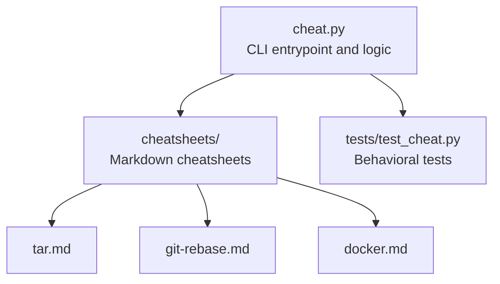
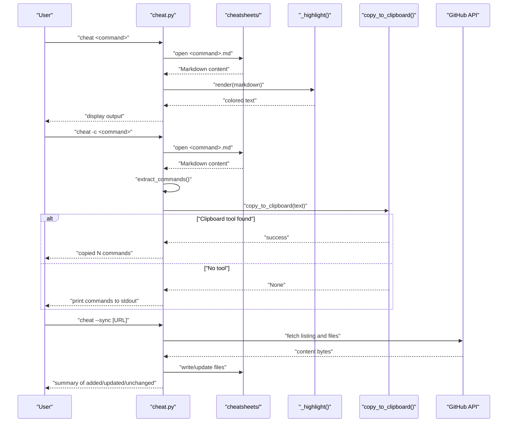
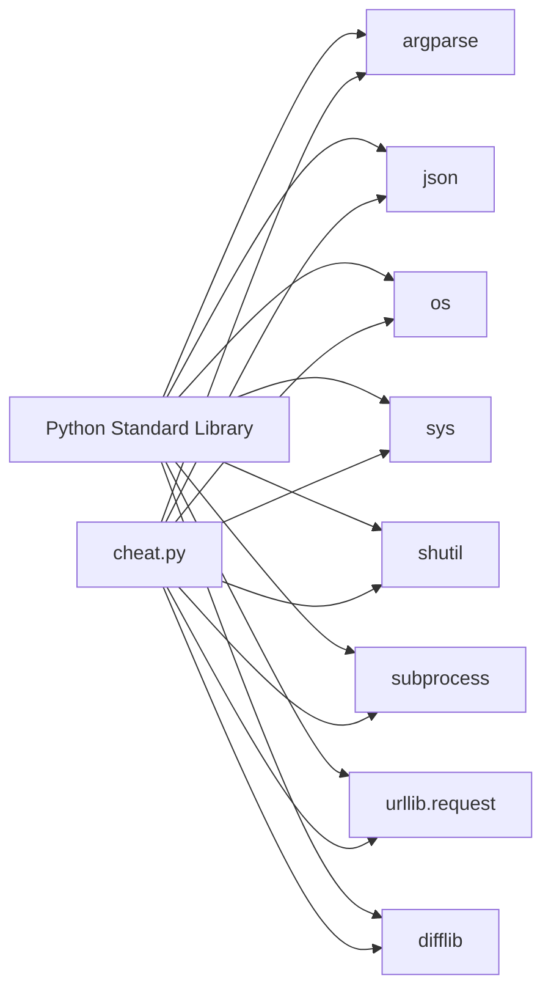

# Getting Started

<cite>
**Referenced Files in This Document**
- [cheat.py](file://cheat.py)
- [README.md](file://README.md)
- [tests/test_cheat.py](file://tests/test_cheat.py)
- [cheatsheets/tar.md](file://cheatsheets/tar.md)
- [cheatsheets/git-rebase.md](file://cheatsheets/git-rebase.md)
- [cheatsheets/docker.md](file://cheatsheets/docker.md)
</cite>

## Table of Contents
1. [Introduction](#introduction)
2. [Project Structure](#project-structure)
3. [Core Components](#core-components)
4. [Architecture Overview](#architecture-overview)
5. [Detailed Component Analysis](#detailed-component-analysis)
6. [Dependency Analysis](#dependency-analysis)
7. [Performance Considerations](#performance-considerations)
8. [Troubleshooting Guide](#troubleshooting-guide)
9. [Conclusion](#conclusion)
10. [Appendices](#appendices)

## Introduction
This guide helps you install and use the cheat CLI tool to quickly look up command-line cheatsheets, copy commands to your clipboard, search across cheatsheets, and manage your own collection. The tool is a single Python 3.8+ script that reads Markdown files from a local folder and renders them with simple highlighting. It requires no installation beyond Python and can optionally be made available as a standalone command.

## Project Structure
The cheat tool consists of:
- A single Python script that implements the CLI and rendering logic
- A folder of Markdown cheatsheets that define the content
- A test suite validating behavior and edge cases

**Diagram sources**
- [cheat.py:29-33](file://cheat.py#L29-L33)
- [README.md:23-34](file://README.md#L23-L34)

**Section sources**
- [cheat.py:18-33](file://cheat.py#L18-L33)
- [README.md:17-34](file://README.md#L17-L34)

## Core Components
- CLI entrypoint and argument parsing
- Cheatsheet discovery and rendering
- Command extraction and clipboard copy
- Search and fuzzy suggestion
- Tag listing and filtering
- Community cheatsheet synchronization
- Shell completion script generation

Key capabilities:
- Lookup a cheatsheet by name
- List available cheatsheets
- Search across names and content
- Copy commands to clipboard
- Print raw Markdown
- Generate shell completion scripts
- Sync community cheatsheets from a GitHub repo

**Section sources**
- [cheat.py:292-411](file://cheat.py#L292-L411)
- [README.md:23-34](file://README.md#L23-L34)

## Architecture Overview
The CLI is a single-file Python program that:
- Parses arguments to decide the operation
- Reads Markdown files from the local cheatsheets directory
- Renders content with simple highlighting
- Optionally copies extracted commands to the system clipboard
- Supports syncing community cheatsheets from a GitHub API

**Diagram sources**
- [cheat.py:292-411](file://cheat.py#L292-L411)
- [cheat.py:125-161](file://cheat.py#L125-L161)
- [cheat.py:212-289](file://cheat.py#L212-L289)

## Detailed Component Analysis

### Installation and First-Time Setup
- Prerequisites: Python 3.8 or newer
- Direct usage: Run the script with the Python interpreter
- Optional installation as a standalone command: Make the script executable and symlink it into your PATH

Step-by-step:
1. Ensure Python 3.8+ is installed on your system
2. Clone or download the repository to a local folder
3. Verify you can run the script directly with the interpreter
4. Optionally, make the script executable and create a symlink into a directory on your PATH so you can run it as a standalone command

Notes:
- The script uses only the Python standard library, so no additional packages are required
- The cheatsheets directory is discovered relative to the script’s location

**Section sources**
- [README.md:19-21](file://README.md#L19-L21)
- [README.md:61-67](file://README.md#L61-L67)
- [cheat.py:29-33](file://cheat.py#L29-L33)

### Basic Usage Examples
- Show a cheatsheet: run the script with the command name
- List available cheatsheets: use the list flag
- Search across names and content: use the search flag with a term
- Copy commands to clipboard: use the copy flag
- Print raw Markdown: use the raw flag
- Generate shell completion: use the completion flag with bash or zsh
- Sync community cheatsheets: use the sync flag

Example commands:
- python3 cheat.py tar
- python3 cheat.py --list
- python3 cheat.py --search tunnel
- python3 cheat.py -c tar
- python3 cheat.py --raw tar
- python3 cheat.py --completion bash
- python3 cheat.py --sync

**Section sources**
- [README.md:23-34](file://README.md#L23-L34)
- [cheat.py:292-411](file://cheat.py#L292-L411)

### Adding Custom Cheatsheets
To add your own cheatsheets:
- Place a Markdown file into the cheatsheets directory
- The filename (without the .md extension) becomes the lookup name
- No registration or configuration is required

Example structure:
- cheatsheets/
  - find.md
  - git-rebase.md
  - ssh.md
  - tar.md

Tip: Use fenced code blocks to include commands, and consider adding tags for easier filtering.

**Section sources**
- [README.md:48-59](file://README.md#L48-L59)
- [cheatsheets/tar.md:1-31](file://cheatsheets/tar.md#L1-L31)
- [cheatsheets/git-rebase.md:1-33](file://cheatsheets/git-rebase.md#L1-L33)
- [cheatsheets/docker.md:1-43](file://cheatsheets/docker.md#L1-L43)

### Shell Completion
Enable tab-completion for cheatsheet names:
- Bash: append the generated script to your shell configuration file
- Zsh: evaluate the generated script in your shell

Completion behavior:
- The completion list dynamically reflects the contents of the cheatsheets directory
- Works for both bash and zsh

**Section sources**
- [README.md:69-81](file://README.md#L69-L81)
- [cheat.py:177-198](file://cheat.py#L177-L198)

### Clipboard Operations
Copy commands from a cheatsheet to the system clipboard:
- Supported platforms: macOS (pbcopy), Linux Wayland (wl-copy), Linux X11 (xclip/xsel), Windows (clip)
- If no clipboard tool is available, the commands are printed to stdout instead

Workflow:
- Run the copy flag with a command name
- The tool extracts commands from fenced code blocks
- Copies the combined commands to the clipboard
- Prints a success or fallback message

**Section sources**
- [README.md:36-47](file://README.md#L36-L47)
- [cheat.py:125-161](file://cheat.py#L125-L161)
- [cheat.py:379-401](file://cheat.py#L379-L401)

### Raw Output Mode
Print the raw Markdown of a cheatsheet without highlighting:
- Useful for piping into other tools or saving content
- Returns the unformatted Markdown content

**Section sources**
- [README.md:31](file://README.md#L31)
- [cheat.py:368-377](file://cheat.py#L368-L377)

### Searching and Suggestions
Search across cheatsheet names and content:
- Case-insensitive search across filenames and Markdown bodies
- Provides fuzzy suggestions when a name is misspelled

**Section sources**
- [README.md:29](file://README.md#L29)
- [cheat.py:89-100](file://cheat.py#L89-L100)
- [cheat.py:61-66](file://cheat.py#L61-L66)

### Tags and Filtering
List and filter cheatsheets by tags:
- Tags are declared inline in Markdown comments
- List all tags with counts
- Filter by a specific tag to see matching cheatsheets

**Section sources**
- [cheat.py:103-122](file://cheat.py#L103-L122)
- [cheat.py:332-346](file://cheat.py#L332-L346)
- [cheatsheets/tar.md:2](file://cheatsheets/tar.md#L2)
- [cheatsheets/docker.md:2](file://cheatsheets/docker.md#L2)

### Community Cheatsheet Sync
Pull the latest community cheatsheets from a GitHub repo:
- Downloads files from a GitHub contents API
- Adds new files, updates changed ones, leaves unchanged files untouched
- Prints a summary of actions performed

Customization:
- Use the default URL or supply your own GitHub contents API URL

**Section sources**
- [README.md:83-97](file://README.md#L83-L97)
- [cheat.py:212-289](file://cheat.py#L212-L289)
- [tests/test_cheat.py:196-247](file://tests/test_cheat.py#L196-L247)

## Dependency Analysis
The tool relies on the Python standard library and a local cheatsheets directory:
- argparse: command-line parsing
- json: parsing GitHub API responses
- os, sys: filesystem and process interaction
- shutil, subprocess: finding and invoking clipboard tools
- urllib.request: fetching remote content during sync
- difflib: fuzzy suggestions for misspelled names

**Diagram sources**
- [cheat.py:20-27](file://cheat.py#L20-L27)
- [cheat.py:292-411](file://cheat.py#L292-L411)

**Section sources**
- [cheat.py:20-27](file://cheat.py#L20-L27)
- [cheat.py:292-411](file://cheat.py#L292-L411)

## Performance Considerations
- Rendering is lightweight and uses simple string processing
- Search scans available cheatsheets and reads Markdown content; performance scales with the number of cheatsheets
- Clipboard operations depend on external tools availability
- Sync downloads files from a remote API; network speed and latency affect performance

[No sources needed since this section provides general guidance]

## Troubleshooting Guide
Common issues and resolutions:
- Python version too low
  - Ensure Python 3.8 or newer is installed
- No cheatsheets found
  - Confirm the cheatsheets directory exists and contains Markdown files
- Unknown command
  - Check spelling and capitalization; the tool provides fuzzy suggestions
- Clipboard copy fails
  - Install a supported clipboard tool for your platform or run without the copy flag
- Network errors during sync
  - Verify connectivity and try again; you can also specify a different GitHub API URL

Platform-specific notes:
- macOS: pbcopy is usually available
- Linux: wl-copy for Wayland, xclip/xsel for X11
- Windows: clip is usually available

**Section sources**
- [README.md:19-21](file://README.md#L19-L21)
- [README.md:36-47](file://README.md#L36-L47)
- [README.md:83-97](file://README.md#L83-L97)
- [cheat.py:125-161](file://cheat.py#L125-L161)
- [cheat.py:61-66](file://cheat.py#L61-L66)

## Conclusion
You can start using the cheat CLI immediately with Python 3.8+ and the included script. Explore built-in cheatsheets, add your own, enable shell completion, and optionally sync community cheatsheets. The tool is designed to be simple, reliable, and easy to integrate into your workflow.

[No sources needed since this section summarizes without analyzing specific files]

## Appendices

### Quick Reference
- Show a cheatsheet: python3 cheat.py <command>
- List cheatsheets: python3 cheat.py --list
- Search: python3 cheat.py --search <term>
- Copy commands: python3 cheat.py -c <command>
- Raw Markdown: python3 cheat.py --raw <command>
- Shell completion: python3 cheat.py --completion bash|zsh
- Sync community cheatsheets: python3 cheat.py --sync [URL]

**Section sources**
- [README.md:23-34](file://README.md#L23-L34)