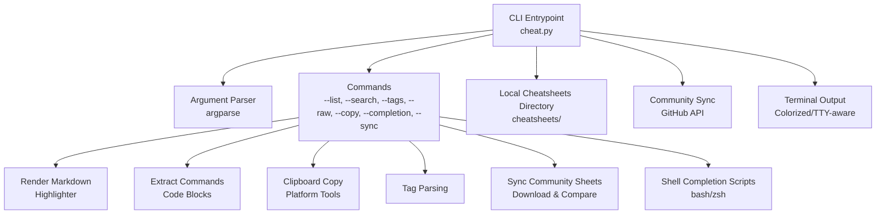
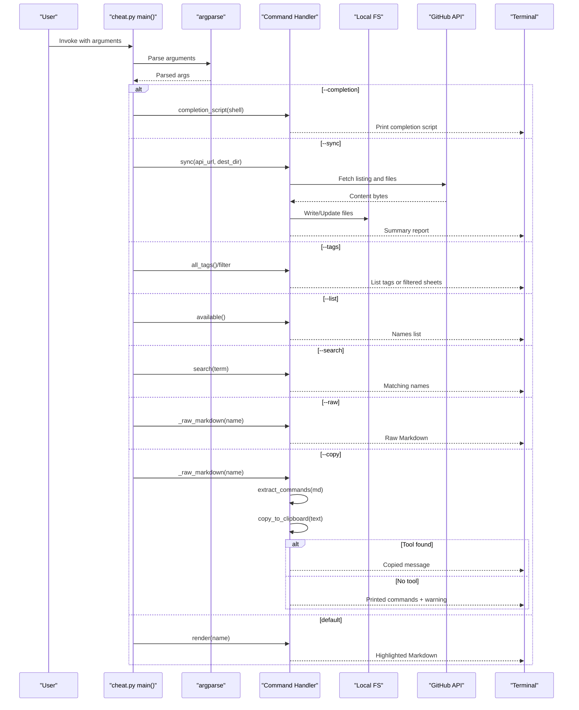

# Troubleshooting & FAQ

<cite>
**Referenced Files in This Document**
- [cheat.py](file://cheat.py)
- [README.md](file://README.md)
- [tests/test_cheat.py](file://tests/test_cheat.py)
- [cheatsheets/tar.md](file://cheatsheets/tar.md)
- [cheatsheets/git-rebase.md](file://cheatsheets/git-rebase.md)
- [cheatsheets/docker.md](file://cheatsheets/docker.md)
</cite>

## Table of Contents
1. [Introduction](#introduction)
2. [Project Structure](#project-structure)
3. [Core Components](#core-components)
4. [Architecture Overview](#architecture-overview)
5. [Detailed Component Analysis](#detailed-component-analysis)
6. [Dependency Analysis](#dependency-analysis)
7. [Performance Considerations](#performance-considerations)
8. [Troubleshooting Guide](#troubleshooting-guide)
9. [Conclusion](#conclusion)
10. [Appendices](#appendices)

## Introduction
This document provides a comprehensive troubleshooting guide for the cheat CLI tool. It focuses on diagnosing and resolving common issues around:
- Platform-specific clipboard tool detection and fallback behavior
- Error handling for missing dependencies, permissions, and file system problems
- Network connectivity issues during community synchronization and alternative access methods
- Shell completion setup problems and environment-specific configurations
- Performance issues with large cheatsheet collections and memory usage optimization
- Common user errors such as incorrect file naming conventions and markdown formatting issues
- Debugging techniques, log interpretation, and diagnostic procedures for various failure modes

## Project Structure
The cheat CLI is a single-file Python application that reads Markdown cheatsheets from a local folder and provides a command-line interface for viewing, copying, syncing, and tagging.

**Diagram sources**
- [cheat.py:292-411](file://cheat.py#L292-L411)
- [cheat.py:43-67](file://cheat.py#L43-L67)
- [cheat.py:134-146](file://cheat.py#L134-L146)
- [cheat.py:148-161](file://cheat.py#L148-L161)
- [cheat.py:103-122](file://cheat.py#L103-L122)
- [cheat.py:212-289](file://cheat.py#L212-L289)
- [cheat.py:177-198](file://cheat.py#L177-L198)

**Section sources**
- [cheat.py:18-416](file://cheat.py#L18-L416)
- [README.md:17-98](file://README.md#L17-L98)

## Core Components
- Argument parsing and routing to subcommands
- Local cheatsheet discovery and rendering
- Command extraction from code blocks
- Clipboard copy with platform tool detection and fallback
- Tag parsing and filtering
- Community synchronization from GitHub
- Shell completion script generation

Key behaviors:
- Colorized output is enabled only when stdout is a TTY and the NO_COLOR environment variable is not set.
- Unknown commands trigger fuzzy suggestion logic.
- Clipboard copy falls back to printing commands to stdout when no platform tool is detected.
- Sync compares remote and local content byte-for-byte and writes only when changed.

**Section sources**
- [cheat.py:292-411](file://cheat.py#L292-L411)
- [cheat.py:43-67](file://cheat.py#L43-L67)
- [cheat.py:134-146](file://cheat.py#L134-L146)
- [cheat.py:148-161](file://cheat.py#L148-L161)
- [cheat.py:103-122](file://cheat.py#L103-L122)
- [cheat.py:212-289](file://cheat.py#L212-L289)
- [cheat.py:177-198](file://cheat.py#L177-L198)

## Architecture Overview
The CLI orchestrates a series of operations depending on the selected subcommand. The flow below maps the main entry point to the relevant handlers.

**Diagram sources**
- [cheat.py:292-411](file://cheat.py#L292-L411)
- [cheat.py:212-289](file://cheat.py#L212-L289)
- [cheat.py:103-122](file://cheat.py#L103-L122)
- [cheat.py:43-67](file://cheat.py#L43-L67)
- [cheat.py:134-146](file://cheat.py#L134-L146)
- [cheat.py:148-161](file://cheat.py#L148-L161)

## Detailed Component Analysis

### Clipboard Copy and Platform Tool Detection
Behavior:
- Detects platform clipboard tools in a predefined order and uses the first available one.
- Falls back to printing commands to stdout when no tool is found.
- Prints a diagnostic message indicating whether a tool was used or not.

Common issues:
- Clipboard tool not installed or not on PATH
- Incorrect shell environment or non-interactive session
- Permission restrictions on clipboard utilities

Diagnostic steps:
- Verify which tools are detected by running a dry-run of copy with a known cheatsheet and checking stderr messages.
- Temporarily disable color output by setting NO_COLOR to bypass color-related issues.
- Confirm that stdout is a TTY when expecting colorized output.

**Section sources**
- [cheat.py:125-161](file://cheat.py#L125-L161)
- [cheat.py:379-401](file://cheat.py#L379-L401)
- [README.md:36-46](file://README.md#L36-L46)

### Community Synchronization
Behavior:
- Fetches a JSON listing from a GitHub contents API endpoint.
- Filters entries for Markdown files and downloads each file.
- Compares local and remote content byte-for-byte and writes only when changed.
- Returns a summary of added, updated, and unchanged files.

Common issues:
- Network timeouts or rate limits
- Invalid or inaccessible API URL
- Missing or malformed download URLs in the listing
- Destination directory permissions or disk space issues

Diagnostic steps:
- Use a custom URL pointing to a fork or mirror to test connectivity and format.
- Manually inspect the JSON response shape expected by the sync routine.
- Run with verbose stderr output to capture detailed error messages.

**Section sources**
- [cheat.py:201-210](file://cheat.py#L201-L210)
- [cheat.py:212-289](file://cheat.py#L212-L289)
- [README.md:83-97](file://README.md#L83-L97)

### Shell Completion Setup
Behavior:
- Generates completion scripts for bash and zsh.
- Bash completion relies on compgen and sourcing the script.
- Zsh completion uses compdef and compadd.

Common issues:
- Unsupported shell type
- Missing shell integration (e.g., sourcing the script)
- Path issues preventing the completion list from updating

Diagnostic steps:
- Verify the shell type and supported options.
- Ensure the generated script is sourced in the shell profile.
- Confirm that the cheatsheets directory is present and readable.

**Section sources**
- [cheat.py:177-198](file://cheat.py#L177-L198)
- [README.md:69-81](file://README.md#L69-L81)

### Tagging and Filtering
Behavior:
- Parses tags from comment lines in the form <!-- tags: ... -->.
- Aggregates tags across all cheatsheets and supports filtering by tag.

Common issues:
- Malformed tag comments
- Case sensitivity and whitespace handling
- Missing or empty tag declarations

Diagnostic steps:
- Review tag comments in individual cheatsheets.
- Use the --tags option to list all tags and counts.
- Filter by a specific tag to confirm presence.

**Section sources**
- [cheat.py:103-122](file://cheat.py#L103-L122)
- [tests/test_cheat.py:265-288](file://tests/test_cheat.py#L265-L288)
- [tests/test_cheat.py:310-339](file://tests/test_cheat.py#L310-L339)

### Rendering and Highlighting
Behavior:
- Highlights headings, code blocks, and blockquotes.
- Disables colorization when stdout is not a TTY or NO_COLOR is set.

Common issues:
- Terminal not recognizing color sequences
- NO_COLOR interfering with expected output
- Large files causing slow rendering

Diagnostic steps:
- Run with NO_COLOR set to reproduce non-colorized output.
- Redirect output to a file to compare raw vs. colored rendering.
- Use --raw to bypass highlighting for piping.

**Section sources**
- [cheat.py:69-87](file://cheat.py#L69-L87)
- [cheat.py:368-411](file://cheat.py#L368-L411)

### File Naming and Markdown Formatting
Behavior:
- Cheatsheet filenames (without .md) become lookup names.
- Commands are extracted from fenced code blocks.
- Tags are parsed from comment lines.

Common issues:
- Filename extensions not .md
- Missing or mismatched code fences
- Incorrect tag comment syntax
- Non-existent cheatsheet names

Diagnostic steps:
- Ensure files are placed under the cheatsheets/ directory with .md extension.
- Verify fenced code blocks surround commands.
- Confirm tag comments are properly formed and terminated.

**Section sources**
- [README.md:48-59](file://README.md#L48-L59)
- [cheat.py:52-54](file://cheat.py#L52-L54)
- [cheat.py:134-146](file://cheat.py#L134-L146)
- [cheat.py:103-112](file://cheat.py#L103-L112)

## Dependency Analysis
The tool relies on the Python standard library only:
- argparse for CLI argument parsing
- json for decoding GitHub API responses
- os, shutil, subprocess for filesystem and process operations
- urllib.request for HTTP requests
- difflib for fuzzy suggestions

External dependencies:
- Platform clipboard tools (e.g., pbcopy, wl-copy, xclip, xsel, clip)
- Shell completion integrations (bash/zsh)

Potential circular dependencies:
- None; the module is structured as a single-file CLI with clear separation of concerns.

**Section sources**
- [cheat.py:20-27](file://cheat.py#L20-L27)
- [cheat.py:125-131](file://cheat.py#L125-L131)
- [cheat.py:177-198](file://cheat.py#L177-L198)

## Performance Considerations
- Memory usage:
  - Rendering highlights loads entire files into memory; large files can increase memory footprint.
  - Command extraction scans all lines; performance scales linearly with file size.
  - Tag parsing aggregates across all files; overhead increases with the number of cheatsheets.

- Recommendations:
  - Keep cheatsheets concise and focused.
  - Use --raw for piping to external tools to avoid highlighting overhead.
  - Limit the number of concurrently running processes when copying commands.
  - Consider splitting large cheatsheets into smaller, topic-specific files.

- Disk I/O:
  - Sync writes only when content differs; this minimizes unnecessary I/O.
  - Ensure sufficient disk space in the destination directory.

[No sources needed since this section provides general guidance]

## Troubleshooting Guide

### Clipboard Tool Detection Failures and Fallbacks
Symptoms:
- Copy operation succeeds but nothing is placed on the clipboard.
- Warning message indicates no clipboard tool was found.

Root causes:
- Clipboard tool not installed or not on PATH.
- Running in a non-interactive environment (e.g., CI, SSH without X11 forwarding).
- Shell completion not sourced, affecting environment detection.

Resolutions:
- Install a platform clipboard tool:
  - macOS: pbcopy (built-in)
  - Linux Wayland: wl-copy
  - Linux X11: xclip or xsel
  - Windows: clip (built-in)
- Verify PATH and shell environment.
- Re-run with stderr captured to confirm which tool was attempted and whether fallback occurred.

Verification:
- Use a known cheatsheet and observe stderr output for the copy operation.
- Temporarily disable color output to eliminate color-related issues.

**Section sources**
- [cheat.py:125-161](file://cheat.py#L125-L161)
- [cheat.py:379-401](file://cheat.py#L379-L401)
- [README.md:36-46](file://README.md#L36-L46)

### Missing Dependencies and Environment Issues
Symptoms:
- Import errors or runtime exceptions when running the CLI.
- Shell completion not working.

Root causes:
- Python interpreter not found or wrong version.
- Missing shell completion integration.
- Environment variables interfering with output (e.g., NO_COLOR).

Resolutions:
- Ensure Python 3.8+ is available and executable.
- Source the completion script in your shell profile.
- Unset NO_COLOR if color output is desired.

**Section sources**
- [README.md:17-21](file://README.md#L17-L21)
- [cheat.py:36](file://cheat.py#L36)
- [cheat.py:177-198](file://cheat.py#L177-L198)

### File System Problems
Symptoms:
- Listing shows no cheatsheets.
- Sync fails with permission errors.
- Copy prints commands instead of placing them on the clipboard.

Root causes:
- Cheatsheets directory missing or unreadable.
- Insufficient permissions on destination directory.
- Incorrect working directory or symlink issues.

Resolutions:
- Place cheatsheet files under the cheatsheets/ directory with .md extension.
- Ensure write permissions for the destination directory.
- Run from the repository root where the cheatsheets/ directory resides.

**Section sources**
- [cheat.py:43-49](file://cheat.py#L43-L49)
- [cheat.py:247](file://cheat.py#L247)
- [README.md:48-59](file://README.md#L48-L59)

### Network Connectivity During Community Sync
Symptoms:
- Sync reports failure fetching listing or downloading files.
- Timeout errors or HTTP errors.

Root causes:
- Network connectivity issues.
- GitHub API rate limits or temporary unavailability.
- Invalid API URL or missing download URLs.

Resolutions:
- Retry later or use a mirror/fork with a custom URL.
- Verify the API URL points to a valid GitHub contents endpoint.
- Reduce concurrent network operations.

**Section sources**
- [cheat.py:201-210](file://cheat.py#L201-L210)
- [cheat.py:240-245](file://cheat.py#L240-L245)
- [README.md:83-97](file://README.md#L83-L97)

### Shell Completion Setup Problems
Symptoms:
- Tab completion does not suggest cheatsheet names.
- Error about unsupported shell.

Root causes:
- Using an unsupported shell or shell type.
- Completion script not sourced.
- Cheatsheets directory not present or unreadable.

Resolutions:
- Use bash or zsh with the --completion option.
- Append or evaluate the printed script in your shell profile.
- Ensure the cheatsheets directory exists and is readable.

**Section sources**
- [cheat.py:177-198](file://cheat.py#L177-L198)
- [README.md:69-81](file://README.md#L69-L81)

### Performance Issues with Large Collections
Symptoms:
- Slow rendering or command extraction.
- High memory usage when viewing large files.

Root causes:
- Very large Markdown files.
- Many cheatsheets causing scanning overhead.

Resolutions:
- Split large cheatsheets into smaller topics.
- Use --raw for piping to external tools to avoid highlighting.
- Limit concurrent operations and avoid unnecessary output redirection.

**Section sources**
- [cheat.py:69-87](file://cheat.py#L69-L87)
- [cheat.py:134-146](file://cheat.py#L134-L146)

### Common User Errors
- Incorrect file naming:
  - Files not placed under the cheatsheets/ directory.
  - Missing .md extension.
- Markdown formatting issues:
  - Missing or mismatched code fences around commands.
  - Incorrect tag comment syntax.

Resolutions:
- Place files under cheatsheets/ with .md extension.
- Surround commands with fenced code blocks.
- Use tag comments in the form <!-- tags: ... -->.

**Section sources**
- [README.md:48-59](file://README.md#L48-L59)
- [cheat.py:134-146](file://cheat.py#L134-L146)
- [cheat.py:103-112](file://cheat.py#L103-L112)

### Debugging Techniques and Log Interpretation
- Enable verbose stderr output to capture detailed error messages during sync and copy operations.
- Use --raw to bypass highlighting and isolate formatting issues.
- Temporarily disable color output by setting NO_COLOR to reproduce non-colorized behavior.
- Capture stderr from copy operations to confirm whether a clipboard tool was used or if fallback occurred.

Diagnostic examples:
- Sync failures: inspect stderr for “Failed to fetch” or “Failed to download” messages.
- Unknown command: stderr includes “No cheatsheet for …” and suggestions.
- Copy fallback: stderr indicates “No clipboard tool found; printed commands to stdout instead.”

**Section sources**
- [cheat.py:317-330](file://cheat.py#L317-L330)
- [cheat.py:379-401](file://cheat.py#L379-L401)
- [cheat.py:368-411](file://cheat.py#L368-L411)
- [cheat.py:36](file://cheat.py#L36)

## Conclusion
This guide consolidates practical troubleshooting steps for the cheat CLI tool, focusing on clipboard detection, synchronization, completion setup, file system and environment issues, performance, and common user errors. By following the diagnostic procedures and applying the recommended resolutions, most issues can be quickly identified and fixed.

## Appendices

### Appendix A: Clipboard Tool Reference
- macOS: pbcopy
- Linux Wayland: wl-copy
- Linux X11: xclip, xsel
- Windows: clip

Fallback behavior:
- If none are found, commands are printed to stdout with a warning.

**Section sources**
- [cheat.py:125-161](file://cheat.py#L125-L161)
- [README.md:36-46](file://README.md#L36-L46)

### Appendix B: Example Cheatsheet Structure
- Headings introduce the command/topic.
- Code blocks contain commands.
- Tag comments define categories.

Examples:
- [cheatsheets/tar.md](file://cheatsheets/tar.md)
- [cheatsheets/git-rebase.md](file://cheatsheets/git-rebase.md)
- [cheatsheets/docker.md](file://cheatsheets/docker.md)

**Section sources**
- [cheatsheets/tar.md:1-31](file://cheatsheets/tar.md#L1-L31)
- [cheatsheets/git-rebase.md:1-33](file://cheatsheets/git-rebase.md#L1-L33)
- [cheatsheets/docker.md:1-43](file://cheatsheets/docker.md#L1-L43)